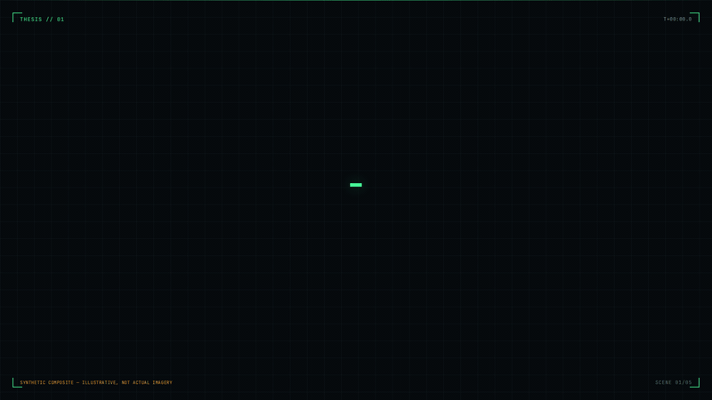

# GeoTwn 

An interactive geospatial-intelligence demo: a navigable 3D reconstruction of a
remote desert site, an animated **Digital Twin Thesis** motion piece, and a paper — all making one argument:

> Commodity graphics pipelines + publicly available imagery ⇒ convincing,
> navigable digital twins of complex infrastructure. Treat this as a baseline
> adversary capability.

## Digital Twin Thesis

<p align="center">
  
</p>

A 35-second looping motion piece in five scenes — **Thesis → Sources →
Pipeline → Twin → Implication** — implemented from the
[claude.ai/design project](https://claude.ai/design/p/d60031e6-8363-475f-ace5-414cc0310065?file=Digital+Twin+Thesis.dc.html)
(`Digital Twin Thesis.dc.html`) as a native React route. A higher-quality MP4
render lives at [`docs/media/digital-twin-thesis.mp4`](docs/media/digital-twin-thesis.mp4).

Watch it live at **`/thesis`**: space plays/pauses, arrow keys step, `0`
rewinds, and the **TWEAKS** panel switches the accent color and toggles the
disclaimer/telemetry overlays. Everything on screen is a synthetic
composite — illustrative, not actual imagery.

| Scene | What it shows |
| --- | --- |
| 01 · Thesis | Commodity graphics pipelines + publicly available imagery ⇒ navigable digital twins |
| 02 · Sources | Satellite tiles, street-level, drone/UGC, open aerial, map vectors, crowd photos being indexed |
| 03 · Pipeline | Ingest → structure-from-motion → point cloud → mesh + texture → navigable twin |
| 04 · Twin | Free navigation through the reconstructed site with waypoints (HANGAR-A, TWR-01, DEPOT) |
| 05 · Implication | Capability confirmed — treat it as a baseline adversary capability |

## Routes

| Route | Description |
| --- | --- |
| `/` | Interactive 3D site reconstruction (free-fly and first-person cameras) |
| `/thesis` | The Digital Twin Thesis motion piece (`?chrome=0` hides the playback bar and tweaks panel) |

## Site viewer

- **Three cameras** — free-fly orbit, first-person walk with collision, and an
  automated cinematic pass (`1` / `2` / `3`).
- **Click-to-inspect** — every structure opens a dossier card with dimensions
  and capacity; **Fly to structure** glides the camera in.
- **Site index** (`I`) — a grouped outliner of every radome, sphere, tank and
  building; click an entry to inspect and fly to it.
- **Clickable minimap** — a schematic generated straight from the layout data,
  with a north arrow and 100 m scale bar; click anywhere on it to fly the
  camera there.
- **Live telemetry** — grid easting/northing, altitude and heading in the HUD,
  streamed imperatively so camera motion never re-renders React.
- **Day / night** (`N`) and adaptive quality that sheds post-processing and
  render resolution under load, then recovers when the frame rate holds.

Press `H` in the viewer for the full shortcut list.

## Getting started

Requires [Bun](https://bun.sh).

```sh
bun install
bun run dev        # start the dev server
bun run build      # production build
bun run preview    # preview the production build
bun run lint       # eslint
bun run format     # prettier
```

## Project structure

```
src/
  routes/               file-based routes (TanStack Start)
    index.tsx           3D site viewer
    thesis.tsx          Digital Twin Thesis motion piece
  components/
    site/               React Three Fiber scene (terrain, structures, HUD, minimap…)
    thesis/             scene engine + the five thesis scenes + tweaks panel
    ui/                 shadcn/ui primitives
paper/
  geotwn_redteam.tex    IEEE-style red-team paper on multiview reconstruction
scripts/
  record-thesis.mjs     headless recorder for the README video
```

## Tech stack

React 19 · TanStack Start / Router · React Three Fiber + drei +
postprocessing · Tailwind CSS 4 · shadcn/ui · Vite 8 · Bun

## Disclaimer

This repository is a defensive-security research demo. Every visual is a
synthetic composite rendered from procedural geometry — no actual imagery of
any real facility is used or distributed. The point is the argument itself:
if a hobby-grade stack can produce a convincing, navigable twin from public
sources, defenders should assume adversaries already have one.
