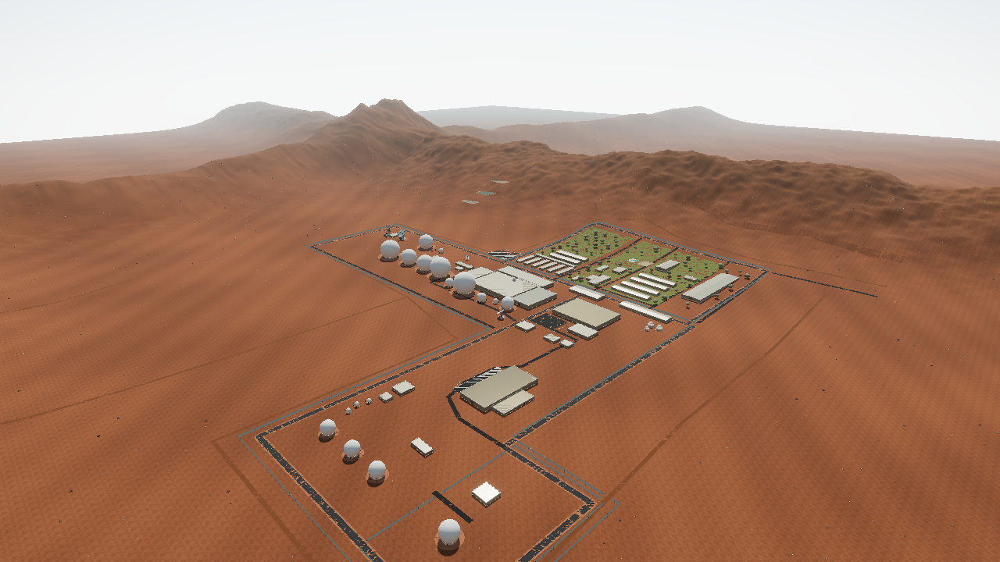
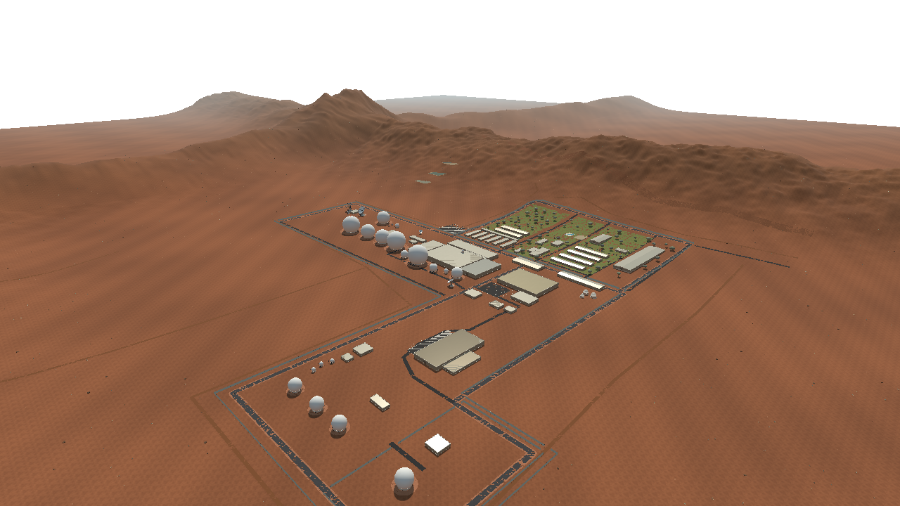
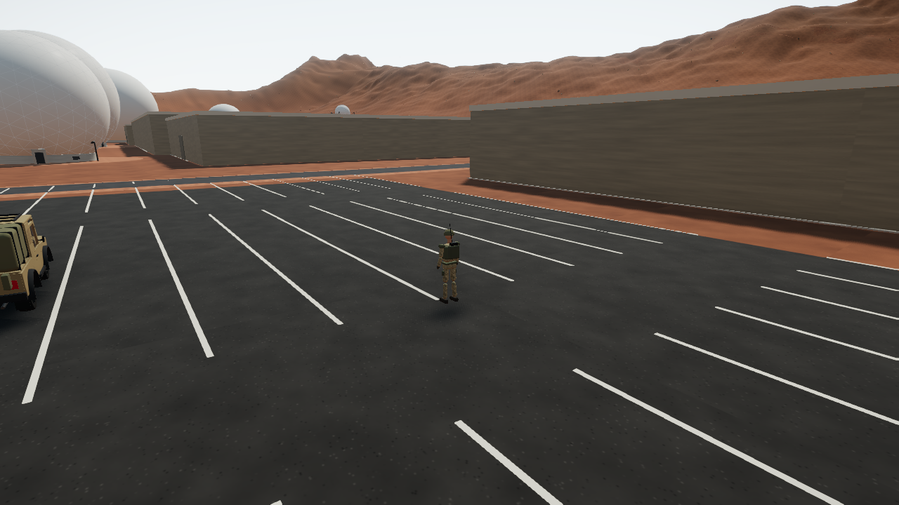
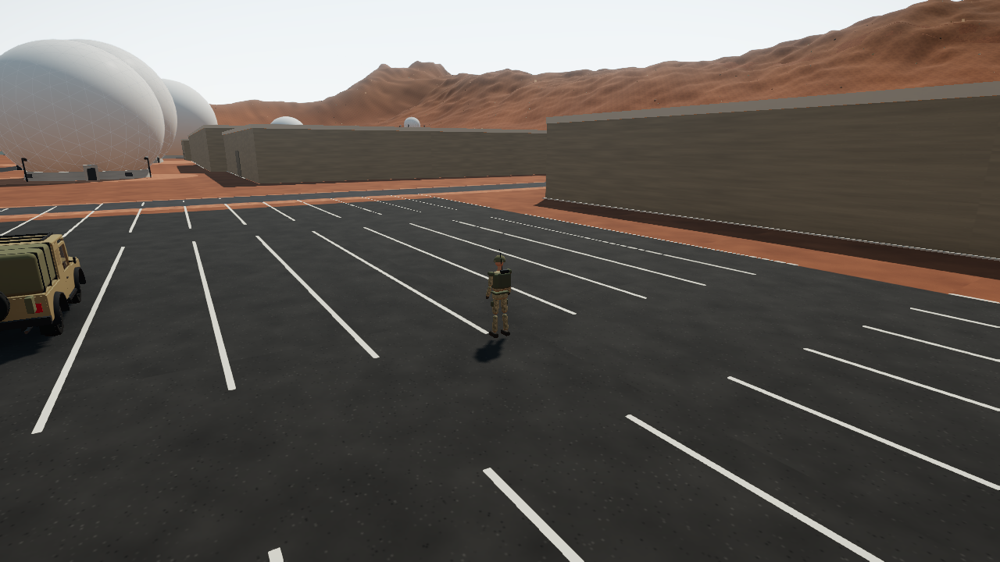

```
   ___  _____  ______  ________   ___
  / _ \/  _/ |/ / __/ / ___/ _ | / _ \
 / ___// //    / _/  / (_ / __ |/ ___/
/_/  /___/_/|_/___/  \___/_/ |_/_/
  S A T E L L I T E   G R O U N D   S T A T I O N
```

# Pine Gap — Open-World Exterior Reconstruction

[](https://react.dev)
[](https://threejs.org)
[](https://docs.pmnd.rs/react-three-fiber)
[](https://www.typescriptlang.org)
[](https://vitejs.dev)
[](https://bun.sh)

> **A playable, browser-based open world set in a real-time 3D exterior reconstruction of the Joint Defence Facility Pine Gap, Central Australia.**
> *Third-person exploration and driving in a fictionalised interpretation built only from publicly observable exterior features.*

---

<p align="center">
  
</p>

<table width="100%">
  <tr>
    <td width="33%" align="center">
      <br />
      <sub><b>On-foot Exploration</b><br />Third-person soldier movement, compound traversal, and interactive barrier gates.</sub>
    </td>
    <td width="33%" align="center">
      <br />
      <sub><b>Atmospheric Dynamic Lighting</b><br />Day / dusk / night cycles with automated vehicle headlights & beacons.</sub>
    </td>
    <td width="33%" align="center">
      <br />
      <sub><b>3D Site Reconstruction</b><br />Free orbital camera & factual antenna source dossiers.</sub>
    </td>
  </tr>
</table>

---

## 🛰️ Overview

Deep in the ochre heart of Australia's Northern Territory, nestled against the MacDonnell Ranges, lies **Pine Gap** — one of the world's most prominent satellite ground stations.

This project started as an interactive exterior reconstruction: the antenna array is positioned from historical open-source survey data (February 2016 survey by Desmond Ball, Bill Robinson and Richard Tanter), set within a deterministically simulated outback landscape with atmospheric lighting and click-to-inspect provenance. It is now also a **playable world**: you deploy as a soldier on foot, walk the compound, take one of the military utility vehicles parked on site and drive the roads, through the barrier gates and out into the surrounding outback — continuously, with no scene loads or separate modes for walking and driving.

> [!NOTE]
> **Evidence boundary.** Published antenna IDs, coordinates and dish diameters are historical factual anchors. Buildings, roads, fences and topography are approximate context traced from public overhead imagery. Gameplay additions — the character, vehicles, barrier gates at road/fence crossings, obstruction beacons — are **fictional** game dressing, and so is everything in the **After Hours** expansion (the technician, the coffee, the radio stations, Frequency 420, the tuning terminals, the signal traces and the concert). No interiors, operational layouts, security procedures or non-public details are modelled or implied.

---

## 🎮 Gameplay

- **On foot** — third-person soldier with camera-relative movement, smooth acceleration, sprint, walk toggle, jumping with gravity, slopes, kerb/pad step-ups and sliding along walls, fences and structures.
- **Vehicles** — three right-hand-drive 4×4 utility vehicles (canvas canopy and hardtop variants). Walk up to either door and press **E**: the character walks to the door, it swings open, they climb (or slide across) into the driver's seat and the camera eases into the chase framing. Press **E** again to brake to a stop, find a clear spot beside a door and step out.
- **Driving** — throttle, braking, automatic reverse, speed-sensitive steering, handbrake slides, drag and rolling resistance per surface, momentum, body squat/dive/roll on a sprung suspension, crests that go light, visibly spinning and steering wheels, working headlights and brake lights, tyre dust on loose ground and impact response that spins the vehicle on glancing hits.
- **World** — boom barriers wherever a road crosses a fence (they lift for an approaching vehicle, lower once the lane is clear and never onto anything beneath them; press **E** at the housing to operate one by hand), wind-driven spinifex and trees, drifting dust and cloud, blinking obstruction beacons, and procedural audio (engine, tyres, footsteps per surface, doors, impacts, barrier motors, wind).
- **Day / dusk / night** — press **N**; headlights come on automatically after dark.

## 🌙 Pine Gap: After Hours

> [!IMPORTANT]
> **Soundtrack.** Original music written by **Christopher Woodyard**, performing as **Indigo People**. Featured album: ***Green Machine***. The recordings and cover art are used in this game with the songwriter's permission; they are **not** covered by this repository's software licence (see [docs/SOUNDTRACK.md](docs/SOUNDTRACK.md)).

An optional, fictional night shift layered on the playable reconstruction. An ordinary shift turns into a small musical mystery:

```text
arrive at dusk → collect coffee → drive with Indigo People on the radio → deliver the coffee
  → the Numbers Station counts to 420 → hold the receiver on 420 → follow the signal
  → tune four antenna terminals → the midnight concert at the listening point
```

**Start it** from the briefing card (**After Hours**, or **Continue After Hours** once there is saved progress) or from the pause menu (**Esc**). It begins at dusk with the night-shift technician (the soldier stays selectable in both menus). **Deploy** still starts the original free exploration, and **Leave After Hours · free roam** (pause → Progress) returns to it at any time. Explore, Tour and Plan stay factual: entering them hides every After Hours prop and effect and pauses the radio.

### The journey

1. **Operation: Last Coffee.** Collect the cup at the canteen cart by the south hall (**E**) and take it to the technician at the north antenna hut (~620 m by road) within **4 minutes**. The coffee is always with you — in your hand on foot, in the cup holder of whichever vehicle you drive — so walking, exiting, re-entering and switching vehicles never disturb the mission. The **coffee meter** responds to braking, launching, cornering and impacts, never to speed alone: smooth driving keeps nearly all of it. Delivery scores time and coffee remaining ("Temperature acceptable. Seventy-three percent of the coffee remains. Promotion unlikely."). If it goes cold or spills, press **Y** (or the **Retry** button) to start again at the cart, or collect a fresh cup there. The mission is replayable; the reward is granted once.
2. **Frequency 420.** The technician suggests leaving the **Numbers Station** on. Its transmission (captioned, with pip patterns: four pips for "four", a long tone for "zero") counts *four, two, zero*. Sweep the receiver dial to **420** with **[ ]** (or the on-screen ◀ ▶) and hold it there for three seconds. This unlocks **Altered Signal** and reveals the terminals.
3. **Four terminals.** Fictional tuning terminals stand beside antennas 11-A, 85-A, 86-A and 98-A (Rhythm, Bass, Harmony, Melody). At each one (**E**), turn the dial (**A D**, the touch stick or ◀ ▶) until your signal matches the reference: a pulse for Rhythm and Melody, a tone for Bass and Harmony. Feedback is audible (a pulse that lands on the beat, a wobble that stops) and always visual too — reference and player waveforms, a dial with the target marked, a *Match* meter and a text status (*Drifting · Close · Aligned — hold · Locked*). Each locked layer joins one shared composition; the radio ducks while you tune. Leave with **E** at any time; completed terminals are saved.
4. **The midnight concert.** With all four layers locked, the listening point among the radomes opens. Start the ~83 s transmission there (**E**): opening signal → rhythm and bass → harmony expands → melody → a release back into desert ambience. Beams at the terminals, rings at four radome bases and a sky band are driven by the concert's musical timeline (the same clock the audio is scheduled on). **V** toggles an optional cinematic camera (moving or looking hands the camera straight back); **X** ends the transmission. It closes with *TRANSMISSION RECEIVED. SOURCE UNKNOWN.*, then returns to your Indigo People selection at the position you left it, with the album credit. The concert can be replayed and Frequency 420 stays on your preset list.

### The vehicle radio

The radio is physical: it lives in one vehicle at a time — the one parked nearest when After Hours starts, then whichever you last entered (the station and position carry over; the previous vehicle falls silent). Inside the cab it is clear; outside it plays from the parked vehicle with distance attenuation and a muffled sound that opens up while a door is open. Controls work in the cab or standing beside the vehicle.

| Key | Radio | Touch / mouse |
| :---: | :--- | :--- |
| `R` | Power (also retries if the browser blocked playback) | ⏻ |
| `,` `.` | Previous · next track (album order; previous restarts after 3 s) | ⏮ ⏭ |
| `T` | Next station | ◉ |
| `[` `]` | Tune the receiver (tap to step, hold to sweep) | ◀ ▶ (hold) |
| `-` `=` | Music volume (independent of effects) | 🔉 🔊 |

Stations (all fictional apart from the recordings): **christopher woodyard (live)** — the default, playing *Green Machine* in album order; **Numbers Station**; and, once found, **Frequency 420** (the procedural score). Track changes and station changes are identified briefly on screen; the cover opens an album view with the songwriting credit and track list.

### Other controls

| Key | Action |
| :---: | :--- |
| `E` | Coffee cart · hand over · terminals · listening point (plus the usual vehicles and barriers) |
| `A` `D` / `←` `→` | Turn a terminal dial (movement is paused while tuning) |
| `V` · `X` | Concert: cinematic view · end the transmission |
| `O` | Altered Signal on / off (immediately) |
| `Y` | Retry the delivery after a failure |

### Accessibility, clean audio and reset

Pause (**Esc**) → **After Hours** → *Settings*:

- **Music volume** and **Effect intensity** sliders; **Altered Signal** on/off (off is immediate).
- **Reduced motion** freezes the colour drift, trace flow, star rotation and cinematic orbit (it defaults to the OS preference).
- **Clean audio** removes the only processing applied to the album (Altered Signal's slow, shallow high-shelf) and the ambient layer. Volume, cabin/outside placement and door muffling still apply, since they are the radio itself.
- **Signal guidance** lists every signal with its distance and direction, so the puzzle never depends on the visual effects.
- Every audio clue has a visual equivalent (captions for radio, numbers and announcements; waveforms and text status at terminals), so the whole journey can be completed muted (**M**).
- Everything is playable with keyboard, mouse or touch (radio buttons, dial buttons, the touch stick for terminal dials, and the Interact button).

*Progress* shows what is done and offers **Reset progress** (with confirmation; preferences are kept). Progress and preferences are stored in versioned, validated `localStorage` (`pine-gap.after-hours`); damaged, outdated or unavailable storage falls back safely, and play resumes at safe checkpoints — a coffee run or a concert is never restored half-way.

### Altered Signal

An optional presentation mode that reveals the mystery: slow teal / violet / amber colour shifts (a post-processing grade, or a CSS wash at the low quality tier), lavender tyre dust, faint star arcs around the south celestial pole at dusk and night, gently breathing terminal beacons, glowing traces from the player towards each untuned terminal and, when appropriate, a restrained non-pitched ambient layer (never while the album or the score is playing). It never flashes, blurs or distorts, and it only touches presentation: movement, vehicle physics, collision and every site coordinate are unchanged.

### Soundtrack and procedural score

- ***Green Machine*** by **Indigo People** — written by **Christopher Woodyard** — five tracks streamed one at a time from `public/music/indigo-people/green-machine/`, byte-identical to the supplied files (no re-encoding). Nothing is downloaded until After Hours starts, and then only the track that plays.
- The **puzzle and concert music is a procedural score generated in-game** for After Hours (A minor, 92 BPM, four layers on one clock). It is not part of *Green Machine*, is not written by Christopher Woodyard, and never plays over the album.

**Adding a track:** copy the file under `public/music/…` with a URL-safe name and append an entry (id, number, title, `src`, measured duration) to `GREEN_MACHINE.tracks` in [`src/game/afterhours/soundtrack.ts`](src/game/afterhours/soundtrack.ts). The radio, credits, album view and HUD all read from that manifest.

---

## ⌨️ Controls

The briefing card lists these on first load; **Esc** pauses and shows them again.

| On foot | | Driving | | General | |
| :---: | :--- | :---: | :--- | :---: | :--- |
| `W A S D` | Move (camera-relative) | `W` / `S` | Accelerate · brake / reverse | `Esc` | Pause · release mouse |
| Mouse | Look | `A` / `D` | Steer | Wheel | Camera distance |
| `Shift` | Sprint | `Space` | Handbrake | `M` | Mute |
| `C` | Toggle walk | `L` | Headlights | `N` | Day / dusk / night |
| `Space` | Jump | `E` | Exit vehicle | `1`–`4` | Play · Explore · Tour · Plan |
| `E` | Enter vehicle · operate barrier | | | `H` / `I` | Shortcuts · asset index |

After Hours adds its own keys (radio `R` `,` `.` `T` `[` `]` `-` `=`, concert `V` `X`, `O`, `Y`) — see [Pine Gap: After Hours](#-pine-gap-after-hours).

Play uses **Pointer Lock**; where the browser refuses it (embedded frames, touch screens) click-drag / touch-drag look is used instead. Touch devices get an on-screen stick plus sprint, jump/handbrake and interact buttons.

### Viewer modes

The original reconstruction viewer is fully preserved alongside Play, and the playable world persists while you switch:

| Key | Mode | Description |
| :---: | :--- | :--- |
| `1` | **Play** | Third-person open world (default) |
| `2` | **Explore** | Free orbit / fly camera; click structures for their source dossier |
| `3` | **Tour** | Automated cinematic pass |
| `4` | **Plan** | North-up orthographic plan to compare with the overhead reference |

---

## 🧱 Architecture

The gameplay layer is plain TypeScript under `src/game/`, independent of React. React Three Fiber mounts its scene graph and calls one method per frame; tests drive the same code headless.

```text
SiteScene (React)                          Game.frame(dt)                     (src/game/Game.ts)
 ├─ <Canvas> … Terrain, Roads, Structures   ├─ InteractionManager.update   state machine, prompts
 │   └─ <GameRuntime>  ── useFrame(-1) ──▶  ├─ fixed 120 Hz steps (accumulator, max 12/frame)
 ├─ HUD (viewer)                            │    ├─ PlayerController.fixedStep
 └─ GameHUD (play) ◀── HudModel ────────────│    ├─ VehicleManager.fixedStep → VehiclePhysics
                                            │    └─ WorldManager.fixedStep  (barriers)
                                            └─ presentation (interpolated between steps)
                                                 vehicles → character pose → world → dust
                                                 → ThirdPersonCamera → audio → HUD readouts
```

### Gameplay states

```text
ON_FOOT ──E near a door──▶ ENTERING_VEHICLE ──seated──▶ DRIVING
   ▲                                                       │
   └──────── stepped out ◀── EXITING_VEHICLE ◀────── E ────┘
```

The `InteractionManager` owns every transition (validated by `canTransition`), decides who has authority over the character (the physics controller or a scripted choreography), which vehicle receives input, and which prompt the HUD shows. There are no scattered `isDriving` flags.

### Modules

| Area | Module | Responsibility |
| :--- | :--- | :--- |
| Core | `game/Game.ts` | Owns and orders all systems; fixed-step loop with render interpolation |
| | `game/config.ts` | Every tunable: speeds, accelerations, camera framing, interaction timings, gate behaviour |
| | `game/core/Input.ts`, `DomInput.ts` | Device-independent actions; keyboard, pointer-lock mouse, drag and touch bindings |
| | `game/core/EventBus.ts`, `events.ts` | Typed gameplay events consumed by audio, HUD and effects |
| | `game/core/MeshBatcher.ts` | Merges static part assemblies per material (vehicles, antennas) |
| World | `game/world/CollisionWorld.ts` | Spatial-hash broadphase, circle/box/sphere narrowphase, sphere-cast raycasts, layers |
| | `game/world/GroundQuery.ts` | Exact rendered-terrain height plus roads, pads, lawns and aprons; surface kinds |
| | `game/world/buildSiteWorld.ts` | Builds gameplay colliders and surfaces from the Pine Gap layout data |
| | `game/world/BarrierGate.ts`, `GateVisuals.ts`, `WorldManager.ts` | Boom barriers: sensors, manual control, safety, instanced visuals |
| | `lib/terrain/mesh-grid.ts` | Shared terrain grid: the render mesh and gameplay ground use identical triangles |
| | `lib/site-fences.ts` | Fence runs and openings where roads cross fences steeply |
| Player | `game/player/PlayerController.ts` | Kinematic capsule: acceleration, sprint, jump buffer/coyote time, slopes, steps, wall sliding |
| | `game/player/CharacterVisual.ts`, `CharacterAnimator.ts` | Procedural soldier rig; distance-driven gait, idle, airborne and seated pose blending |
| Vehicles | `game/vehicles/VehiclePhysics.ts` | Slip-angle tyre model, load transfer, 4WD, brakes, handbrake, drag, sprung body, impulses |
| | `game/vehicles/VehicleVisual.ts`, `VehicleMaterials.ts` | Procedural RHD military 4×4 with doors, interior, lamps, steering and spinning wheels |
| | `game/vehicles/Vehicle.ts`, `VehicleController.ts`, `VehicleManager.ts`, `VehicleSpec.ts` | Entity, input → controls (auto gearbox), fleet + shared headlight, specs and variants |
| Camera | `game/camera/ThirdPersonCamera.ts` | Orbit camera, collision, on-foot/vehicle profile blend, auto-recentre, shake, intro glide |
| Interaction | `game/interaction/InteractionManager.ts` | State machine, door choreography, safe-exit search, barrier use |
| Effects / audio | `game/effects/DustSystem.ts`, `game/audio/GameAudio.ts` | Pooled particles; procedural Web Audio |
| UI | `game/hud/HudModel.ts`, `components/game/GameHUD.tsx` | Discrete HUD state via `useSyncExternalStore`; throttled direct-DOM readouts |
| Bridge | `components/game/GameRuntime.tsx`, `hooks/use-play-session.ts` | R3F mounting and frame driving; pointer-lock session (briefing / running / paused) |
| After Hours | `game/afterhours/AfterHours.ts` | Orchestrator: session lifecycle, interactables, captions, objective, audio/visual/HUD presentation |
| | `game/afterhours/progress.ts` | Progression model, preferences, versioned zod-validated storage with safe fallbacks |
| | `game/afterhours/radio.ts`, `soundtrack.ts`, `numbers.ts` | Radio logic (dial, presets, ownership, 420 hold), album manifest, Numbers Station script |
| | `game/afterhours/coffee.ts` | Mission state machine and frame-rate-independent spill model |
| | `game/afterhours/puzzle.ts`, `composition.ts`, `concert.ts` | Terminal tuning, the procedural score's notes and chord grid, concert timeline and mix |
| | `game/afterhours/AfterHoursVisuals.ts`, `AfterHoursHud.ts` | Fictional props, beacons, traces, concert accents; HUD store and throttled DOM readouts |
| | `game/audio/RadioAudio.ts`, `ProceduralScore.ts`, `AfterHoursAudio.ts` | One streamed media element through the shared context (cabin/exterior paths); score scheduler; cues |
| | `components/game/AfterHoursHUD.tsx`, `SpectralGrade.tsx` | Objective, captions, radio, meters, tuning and settings UI; Altered Signal grade |

### Collision layers

| Layer | Contents | Blocks character | Blocks vehicle | Blocks camera |
| :--- | :--- | :---: | :---: | :---: |
| `Structure` | Buildings, radome plinths and spherical shells, tanks, antenna pedestals | ✓ | ✓ | ✓ |
| `Prop` | Floodlight poles, vestibules, tree trunks, barrier housings | ✓ | ✓ | |
| `Fence` | Fence runs between openings | ✓ | ✓ | |
| `Vehicle` | Vehicle bodies (dynamic) | ✓ | ✓ | ✓ (except the one being driven) |
| `Gate` | Lowered barrier booms (dynamic) | ✓ | ✓ | |

Gameplay collision uses analytic shapes, separate from render meshes. Radome shells are true spheres, so a walker's head meets the bulge and the camera slides round it.

---

## ⚡ Optimisation strategy

Measured with a WebGL draw-call counter in headless Chromium (software rendering in the development container, so draw calls rather than frame time were the comparable metric):

| View | Before | After |
| :--- | ---: | ---: |
| Site overview (Explore) | 1,783 draw calls / frame | 846 |
| Ground level (old walk mode → Play on foot, now with character and vehicles) | 1,157 | 438 |

- **Instancing** — radome vents, vestibules, doors, floodlight poles and heads, building parapets, parking stall lines, fence terminal posts, barrier hardware and beacons are instanced meshes (one draw call per kind).
- **Merged static assemblies** — each dish antenna (≈40 parts) and each vehicle body are merged per material via `MeshBatcher`; only moving parts (doors, wheels, steering wheel) stay separate.
- **Player-following shadows** — in Play the sun's shadow frustum is a 220 m box centred on the player and snapped to whole shadow-map texels (no shimmer); far geometry drops out of the shadow pass.
- **Constant light count** — one shared headlight spot follows whichever vehicle is driven, so toggling lights never triggers shader recompiles.
- **Spatial partitioning** — colliders and ground surfaces live in 16 m hash grids; a query touches only nearby shapes. Parked vehicles sleep; barriers beyond 240 m are not simulated unless moving.
- **No per-frame allocation** in gameplay loops — scratch vectors, pooled contacts and particles, preallocated typed arrays.
- **GPU-side wind** — vegetation sway is a vertex-shader patch driven by one shared uniform; ~7,000 spinifex tufts cost no CPU time.
- **Throttled DOM** — HUD speed/gear write at 12 Hz only when text changes; minimap markers at 10–30 Hz; React re-renders only on discrete state changes. R3F pointer raycasting is disabled during play so mouse-look never raycasts the site.
- Existing adaptive quality (PerformanceMonitor tiers, DPR caps, optional N8AO) is preserved.

**After Hours** was measured the same way, back to back against the previous commit (Bun, headless; Chromium 141 with SwiftShader at 640×360, so draw calls are comparable and frame times are not):

| Measurement | Before | After · free roam | After · After Hours |
| :--- | ---: | ---: | ---: |
| `Game.frame` median, idle / walking / driving | 0.015–0.019 / 0.016–0.017 / 0.029–0.031 ms | 0.018–0.020 / 0.016–0.017 / 0.028–0.030 ms | 0.021–0.030 / 0.018–0.019 / 0.030–0.035 ms |
| Draw calls, Play walking | 449 | 450 | 494 |
| Draw calls, Explore overview | 849 | 849 | 857 (technician rig) |

- Fiction is a bounded set of unlit meshes: no lights, no shadows except the cart, a fixed 144-point trace buffer, ≤320 star arcs (none at the low tier) and four radome accent rings. The grade is one extra effect inside the existing post-processing pass (a CSS wash at the low tier).
- The album streams one track at a time (`preload="none"`); nothing is decoded up front. Score voices are scheduled on the audio clock ~0.3 s ahead and disconnected when they end, with a per-frame sweep as a backstop; persistent nodes are built once.
- HUD state reaches React only when it changes; timers, meters and dials are written straight to the DOM at 12 Hz.

The whole gameplay update (`Game.frame`: input, 120 Hz physics, collision, animation, camera, dust, HUD) measured headless over 600 frames costs a median **0.05 ms** per frame (p95 ≈ 0.12 ms) whether walking or driving — well under 1 % of a 60 fps frame budget, leaving the budget to rendering.

---

## 🧩 Extending the world

- **A new vehicle type** — add a `VehicleSpec` (dimensions, mass, engine, tyres, seats, doors) and a `VehicleVariant` in `VehicleSpec.ts`, then spawn it in `world/spawns.ts`. Physics, interaction, camera and HUD read everything from the spec.
- **A GLTF vehicle or character** — the procedural visuals are replaceable: a class exposing `root`, `update(physics, doorOpen)` / `setLights` / `dispose` (vehicles) or `root`, `applyPose` / `dispose` (character) can wrap a loaded model. Load it asynchronously and hand it to `Vehicle` / `Game` in place of `VehicleVisual` / `CharacterVisual`; physics and gameplay are unaffected.
- **New interactables** — add a finder alongside `nearestGateControl` in `WorldManager` and a branch in `InteractionManager.updateOnFoot` that sets a prompt and acts on `interact`. Solid parts register colliders in `CollisionWorld` with the appropriate layer.
- **Missions / objectives** — subscribe to the typed `EventBus` (`vehicleEnter`, `stateChange`, `impact`, `gateMove`, …) and read `game.focusPoint`; surface objective text through `HudModel.showMessage` or a new HUD field. After Hours is a worked example: it registers an `InteractableProvider` on `InteractionManager.providers`, hooks `Game.frame` / `fixedStep`, holds the player with `Game.lockMovement` and publishes its own HUD store.
- **Audio** — `GameAudio` owns the single `AudioContext`: procedural effects, the vehicle radio and the procedural score have their own buses into a master gain (mute) and a limiter, so music and effects can combine without clipping.
- **Tuning** — all feel parameters are in `game/config.ts` and the vehicle spec.

---

## 🚀 Getting started

This project uses [Bun](https://bun.sh).

```sh
bun install          # install dependencies
bun run dev          # Vite + TanStack Start dev server (add --host 127.0.0.1 where IPv6 is unavailable)
bun run test         # unit + headless gameplay integration tests
bun run typecheck    # TypeScript
bun run lint         # ESLint
bun run build        # production build
bun run preview      # preview the production build
```

The headless integration test (`tests/game-integration.test.ts`) plays the game through the real input path: it walks to a vehicle, enters, drives, steers, reverses, brakes, exits, repeats ten enter/exit cycles checking for leaks, and verifies exits are refused when both doors are walled in. Vehicle dynamics (acceleration, braking, steering direction, reverse, wall and vehicle-to-vehicle collisions) and the collision world have their own suites.

After Hours has two more: `tests/after-hours-logic.test.ts` (saved-state recovery, spill step-size independence, mission transitions and retries, duplicate-reward prevention, radio dial and ownership, terminal locking, score coherence, concert arc) and `tests/after-hours-journey.test.ts`, which plays the whole expansion headless through the real input path — collects the coffee, drives the 620 m route with an analog autopilot, exits, delivers, tunes 420, locks four terminals, interrupts, completes and replays the concert, reloads, fails and retries. In the browser, `node scripts/verify-after-hours.mjs` (with the dev server running) checks the same journey in Chromium against the real media element and Web Audio graph; `scripts/perf-gameplay.ts` and `scripts/perf-browser.mjs` measure CPU cost and draw calls.

## 📂 Project structure

```text
├── docs/                   # Spatial reference notes, provenance, terrain architecture
├── public/music/           # Indigo People — Green Machine (streamed; not under the software licence)
├── scripts/                # Thesis recorder, artifact builders, After Hours verification and perf scripts
├── src/
│   ├── game/               # Gameplay: core, world, player, vehicles, camera, interaction, effects, audio, hud, afterhours
│   ├── components/game/    # R3F bridge (GameRuntime) and play-mode HUD
│   ├── components/site/    # Scene components (terrain, structures, roads, lighting, viewer HUD)
│   ├── hooks/              # use-play-session (pointer lock lifecycle), use-mobile
│   ├── lib/                # Pine Gap manifest, layout traces, fences, terrain, textures, wind
│   └── routes/             # `/` (world) and `/thesis`
└── tests/                  # bun:test suites
```

## 🏗️ Evidence & reference boundary

```text
┌─────────────────────────────────────────────────────────────────────────────┐
│                       PUBLIC HISTORICAL REFERENCE                           │
│     Factual anchor: 2016 Ball, Robinson & Tanter antenna coordinates        │
└──────────────────────────────────────┬──────────────────────────────────────┘
                                       ▼
┌─────────────────────────────────────────────────────────────────────────────┐
│                        CONTEXT RECONSTRUCTION                               │
│   Approximate footprints, roads, fences and synthetic relief traced from    │
│   public overhead imagery                                                   │
└──────────────────────────────────────┬──────────────────────────────────────┘
                                       ▼
┌─────────────────────────────────────────────────────────────────────────────┐
│                        FICTIONAL GAME LAYER                                 │
│   Character, vehicles, barrier gates at road/fence crossings, beacons;      │
│   all of After Hours (technician, coffee, radio stations, 420, terminals,   │
│   signal traces, concert)                                                   │
└─────────────────────────────────────────────────────────────────────────────┘
```

The historical survey records antenna `98-A` longitude as `33.732769`; the model restores it to `133.732769` and flags the correction in the asset dossier. Further notes:
[Pine Gap reference](docs/PINE_GAP_REFERENCE.md) · [Terrain architecture](docs/TERRAIN_ARCHITECTURE.md) · [Vertical datums](docs/VERTICAL_DATUMS.md) · [Provenance](docs/PROVENANCE.md) · [Layer providers](docs/LAYER_PROVIDERS.md) · [Offline terrain pipeline](docs/OFFLINE_TERRAIN_PIPELINE.md)

## 🎬 Digital twin thesis (`/thesis`)

A 35-second motion piece arguing that modern web graphics plus public OSINT can render high-fidelity interactive digital twins without classified data. Append `?chrome=0` to hide UI for capture.

## ⚠️ Known limitations

- Exterior only: buildings have no interiors, and doors on structures are not enterable.
- Vehicle dynamics are a single-track model with a sprung body rather than a full rigid-body simulation; body pitch and roll are limited, so vehicles cannot roll over.
- Collision shapes are vertical extrusions plus spheres; characters cannot climb onto roofs or structures.
- There are no other people or traffic; the world has one controllable character.
- Frame rate on real GPUs was not measurable in the development container (software rendering only); optimisation work was verified with draw-call counts and CPU timing of the gameplay update.
- After Hours' fictional props have no colliders (by design, so collision geometry is unchanged): you can walk through the coffee cart, the terminals and the waiting technician.
- The procedural score schedules notes from the render loop about 0.3 s ahead; on a device rendering at only a few frames per second, beats can be skipped (the timeline and visuals stay in sync with the audio clock regardless).
- Spatial radio uses equal-power panning (no HRTF) and a simple door-dependent low-pass; it is a stylised cab, not an acoustic simulation.

## 🛠️ Tech stack

- **Framework**: React 19 + TanStack Start / Router
- **3D**: Three.js + React Three Fiber + Drei; post-processing via @react-three/postprocessing
- **Styling**: Tailwind CSS v4
- **Tooling**: Vite 8, Bun, TypeScript

## 🛡️ Disclaimer

> [!WARNING]
> This project is an independent public-source visualisation and a fictionalised game interpretation. It is built strictly from published 2016 academic surveys, public overhead imagery, synthetic relief and approximate geometric modelling. Gameplay elements are invented and do not depict real procedures, access arrangements or operations.
>
> **No private, operational, security-restricted, classified or current operational data was used, inferred or distributed.**
