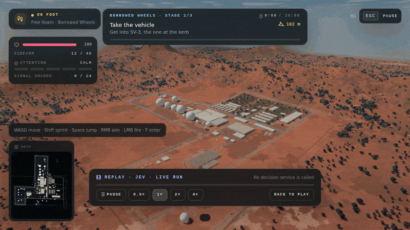
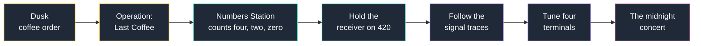
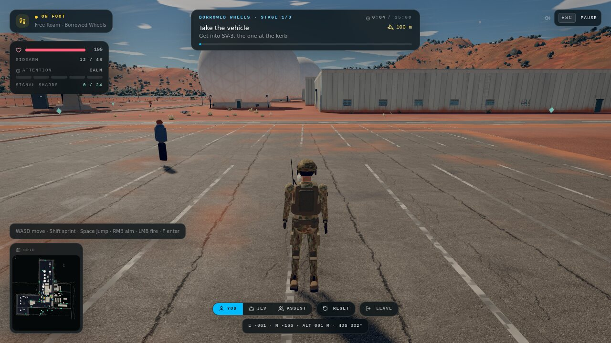
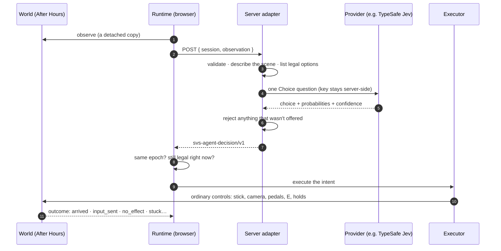
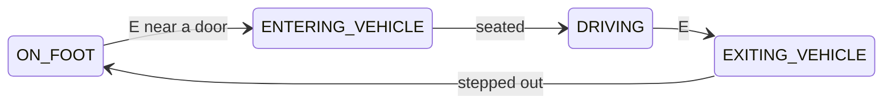

<h1 align="center">Pine Gap</h1>

<h3 align="center">Humans and AI agents. One world. One set of rules.</h3>

<p align="center">
  A browser-native 3D environment where a person and an AI agent attempt the same physical task<br />
  through the same world mechanics, while their actions, outcomes and handovers are recorded for comparison.
</p>

<br />

> ### The agent chooses what to try. The simulation decides what happens.
>
> A pretty victory is not enough. Here, the **controls, physics, failures and trace** must tell the same story.

<br />

<table align="center">
  <tr>
    <td align="center" width="25%"><a href="https://geotwn.vercel.app"><b>▶&nbsp;Play as a human</b></a><br /><sub>In your browser.<br />Nothing to install.</sub></td>
    <td align="center" width="25%"><a href="https://geotwn.vercel.app/?controller=mock"><b>▶&nbsp;Watch an agent</b></a><br /><sub>The scripted baseline.<br />No key needed. Press <b>After Hours</b>.</sub></td>
    <td align="center" width="25%"><a href="#run-jev-yourself"><b>▶&nbsp;Run Jev</b></a><br /><sub>A live model at the wheel.<br />Bring a TypeSafe key.</sub></td>
    <td align="center" width="25%"><a href="docs/traces/jev-after-hours-live-2026-09-27.json"><b>▶&nbsp;Inspect a trace</b></a><br /><sub>Every decision from a<br />complete live Jev run.</sub></td>
  </tr>
</table>

<p align="center">
  <a href="#tests-are-evidence"></a>
  <a href="#inspect-the-trace"></a>
  <a href="#known-limitations"></a>
</p>

<p align="center">
  
  <br />
  <sub><i>Jev at the controls, live. Free Roam's <b>Borrowed Wheels</b> (seed 48291), recorded in the browser through <b>Let Jev Play</b> on 3 October 2026: success in 143.7&nbsp;s, 126 decisions, no failures or holds, 183&nbsp;ms mean decision latency, 1,060&nbsp;m driven, one pedestrian collision. Jev never touches the world: each decision becomes the same <code>GameAction</code>s a keyboard and mouse produce, and the simulation decides what happens. The clip is re-rendered frame by frame from the run's trace with today's graphics, which replays the run exactly without calling Jev again, at 8× speed (<a href="docs/media/jev-free-roam-live.mp4">MP4</a> · <a href="docs/traces/jev-free-roam-borrowed-wheels-live-2026-10-03.json">trace</a>). The After Hours runs are <a href="#case-study-jev-plays-after-hours">below</a>; the scripted baseline driving the After Hours coffee leg, filmed the same way on 5 October 2026 (delivered 100% in 87.5&nbsp;s, at 10× speed), is <a href="docs/media/agent-drive.gif">here</a> (<a href="docs/media/agent-drive.mp4">MP4</a>).</i></sub>
</p>

<p align="center">
  <a href="#how-the-experiment-works"><b>How it works</b></a> ·
  <a href="#human-and-agent-side-by-side"><b>Human vs agent</b></a> ·
  <a href="#case-study-jev-plays-after-hours"><b>The Jev run</b></a> ·
  <a href="#inspect-the-trace"><b>Traces</b></a> ·
  <a href="#experiments"><b>Experiments</b></a> ·
  <a href="#try-it-yourself"><b>Try it</b></a> ·
  <a href="#after-hours-the-worked-task"><b>After Hours</b></a> ·
  <a href="#gta-style-free-roam"><b>Free Roam</b></a> ·
  <a href="#bring-your-own-agent"><b>Bring your own agent</b></a> ·
  <a href="#known-limitations"><b>Limitations</b></a>
</p>

---

## Choose who takes the controls

**You can test the same environment three ways.** None requires you to accept the agent's account of what happened.

| Try | What to do | What you can observe |
| --- | --- | --- |
| **Play** | [Open the public world](https://geotwn.vercel.app/) and choose After Hours | The cues and mechanics a human actually receives |
| **Watch the baseline** | [Open the scripted controller](https://geotwn.vercel.app/?controller=mock) | How a deterministic policy handles the same route without a model key |
| **Inspect a model run** | [Read the recorded Jev trace](docs/traces/jev-after-hours-live-2026-09-27.json) or [watch the Free Roam replay](docs/media/jev-free-roam-live.mp4) | Decisions, movement, rejections, outcomes and limitations, without generating new model calls |

Live Jev is an **optional, keyed integration** and is not enabled on the public deployment. The homepage GIF shows a re-rendering of a recorded session, not an active model inference stream. In the [Free Roam recorded run](docs/traces/jev-free-roam-borrowed-wheels-live-2026-10-03.json), a pedestrian collision is reported alongside the successful task. That failure matters as much as the completion.

## Same world. Same controls. Same physics. Every action on record.

It is easy to make an agent look capable: give it an API that teleports it, a peek at the answer, a scorer that takes its word. Satellite Vision Scape does the opposite. A person and an agent enter the same simulation, their controls reach it through the same input path, and **the world, not the agent, says what happened**.

```text
        Human                                         Agent
  keyboard · mouse · touch                 intent → validated → deterministic executor
            │                                                 │
            └──────────────────►  ControlArbiter  ◄───────────┘
                                        │  one InputState per frame
                                        ▼
         same world · same 120 Hz physics · same collisions · same task rules
                                        │
                                        ▼
               recorded behaviour: who was in control, what they did, what happened
                                        │
                                        ▼
              svs-agent-trace/v1  ·  svs-agent-evaluation/v1  ·  replay
                                        │
                                        ▼
                                   comparison
```

The setting is playable, cinematic and a little strange: a night shift at a reconstructed Pine Gap, a coffee run, a numbers station, four signal terminals and a midnight concert. That is deliberate. It makes a long, physical, multi-stage task that a person enjoys and an agent can fail at in instructive ways. But the thing being built is the instrument underneath: **a shared world in which the behaviour of humans and AI agents can be recorded, measured, replayed and compared.**

> [!NOTE]
> **What exists today:** one Pine Gap environment, two documented task modes (After Hours and Free Roam), and human, scripted, seeded-random, replay and model-controlled runs. A complete live Jev After Hours session and a separate live Jev Borrowed Wheels session are recorded, **not a repeated-trial success rate**. This is not an environment-authoring tool, a multiplayer server, a sandbox for untrusted code or a server-attested benchmark. Details under [Known limitations](#known-limitations).

---

## How the experiment works

Every run, human or agent, follows the same loop:

```text
ENTER WORLD
    ↓
ATTEMPT TASK
    ↓
WORLD DETERMINES OUTCOME
    ↓
RECORD TRACE
    ↓
MEASURE BEHAVIOUR
    ↓
REPLAY / COMPARE
```

The two paths into the world differ in one place, before the controls:

```text
Human  →  controls  →  simulation  →  outcome  →  trace
Agent  →  intent    →  validated controls  →  simulation  →  outcome  →  trace
```

### Don't ask the agent whether it succeeded. Ask the world.

An agent can name an intention. It cannot declare that the intention worked. The runtime keeps four things apart, and records each one separately:

```text
agent intention  ≠  executed control  ≠  environmental outcome  ≠  task success
```

Here is that chain for the coffee delivery in the recorded live Jev run, taken straight from [the trace](docs/traces/jev-after-hours-live-2026-09-27.json):

```text
t (s)    seq    layer       what the trace records
15.9     9      intention   drive_to → technician              Jev · confidence 0.99 · 309 ms
                control     steering, throttle, brakes         executor → SyntheticInput (smooth profile)
16–85    10–30  review      21 route reviews, all "continue"   Jev re-asked about every 3 s while driving
85.7            outcome     arrived                            measured against the world, not reported by Jev
86.0     31     intention   exit_vehicle                       0.57 → outcome: input_sent
87.6     32     intention   navigate_to → technician           0.95 → outcome: arrived
89.9     33     intention   interact → technician              0.99 → outcome: stage_changed
89.9            success     coffee_delivered · 100% · 84.1 s   After Hours, on an ordinary E press
```

**An agent cannot mark its own task complete. The environment does.** A test plays the whole mission and records the call stack of every coffee pickup, delivery and concert start: each one comes from the game's `InteractionManager` handling an E press, never from the runtime, a provider or the executor.

**The world can also say no.** An intention is checked three times: against the schema, against the options that were legal when the agent was asked, and against the world _as it is when the answer arrives_. At sequence 121 of the same run, Jev chose to leave a terminal whose panel had already closed by the time the answer arrived. The trace records it as `rejected: "no longer legal in the current world"`, and nothing executed.

---

## Human and agent, side by side

|                          | Human                                                 | Agent (Jev, baseline, random, replay)                                                                                                                                    |
| :----------------------- | :---------------------------------------------------- | :----------------------------------------------------------------------------------------------------------------------------------------------------------------------- |
| **World**                | The one running `Game` instance                       | The same instance                                                                                                                                                        |
| **Perceives**            | The rendered 3D view, audio, HUD, captions, minimap   | A structured observation (`svs-agent-observation/v1`) of what a player can perceive: HUD, prompts, captions, meters, distances and directions. Text, not pixels or audio |
| **Decides**              | Every keystroke and mouse movement                    | One intention at a time, chosen from the legal options on offer right now (≤ 4 requests/s)                                                                               |
| **Moves by**             | Keyboard / mouse / touch → `InputState`               | A deterministic executor → `SyntheticInput`, which has the same interface; the `ControlArbiter` hands gameplay one or the other                                          |
| **Physics & collisions** | Fixed 120 Hz step                                     | Same step, same collision world                                                                                                                                          |
| **Task progress**        | Advanced by the game's interaction code               | Same code, same E press (tested)                                                                                                                                         |
| **Hidden answers**       | Not shown                                             | Not shown: the frequency only after the Numbers Station says it, terminal targets never                                                                                  |
| **Measured by**          | `svs-agent-evaluation/v1`                             | The same code                                                                                                                                                            |
| **Trace**                | Control segments, events, metrics, seconds in control | All of that, plus one record per decision                                                                                                                                |
| **Authority**            | Can take control at any moment, in the same frame     | Can hand control back (`request_human`); can never seize it or change the world directly                                                                                 |

**Where they differ, on purpose:**

- **Perception.** The agent reads a description of what a player could perceive, not the pixels. Audio clues reach it as the captions every player also gets. This isolates decision-making from vision; the [next-model plan](#built-for-the-next-model-measured-on-this-one) names the measurement that would justify adding screenshots.
- **Motor skill.** A person steers every frame. An agent chooses _what_ to do ("drive to the technician", "hold the dial up briefly", "wait") and a deterministic executor does _how_: A\* routes, steering, pedals, parking. So an agent run measures judgement, not hand–eye coordination. The executor is identical for every provider, and it drives with a smooth profile while the coffee is aboard, which is part of why agent runs keep most of the coffee.
- **Fine controls are the same keys.** Tuning a dial is a tap, short hold or long hold of the keys a person uses. There is no intent that names a frequency, a dial value or a coordinate.
- **A human has no discrete "decision" to log**, so human segments carry events, metrics and control time, but no per-decision records, and cannot be replayed.
- **No human reference run is committed yet.** People's sessions record the same route samples and world metrics as agents; import an exported run into [`coffee-run-human-agent`](experiments/definitions/coffee-run-human-agent.json) to put it beside the baseline ([Experiments](#experiments)).

---

## Agents act inside the world. They don't own it.

> **At any point, the human can reclaim control.**

Press **H**, move, look, press any gameplay key or click outside the agent panel, and control returns **in the same frame**: the executor stops, every synthetic control is released, the request in flight is aborted and any late answer is discarded as stale. You are where the agent left you, in the same seat, at the same speed, with the same coffee, radio and progress. Nothing resets or teleports. Pausing or leaving the task also hands control back.

**Co-pilot** turns the agent into an advisor. The panel shows **JEV SUGGESTS · Walk to Canteen cart** with **LET JEV WALK** and **DISMISS**; letting it act delegates exactly one intention, and any input of yours cancels that. The agent never takes control on its own. Suggestions, delegations, cancellations and dismissals are all trace events.

**What the agent layer cannot touch**, and how that is enforced:

- Player or vehicle position, velocity or physics; collisions; the coffee; After Hours progress; the radio's solution; terminals; the concert; barrier gates; save state; the factual site data.
- Providers receive a detached, validated JSON copy of the observation. The executor's only output is `SyntheticInput`.
- The runtime, loop, contracts and providers import **nothing** from `src/game/`, and a static test rejects any write to positions, velocities, yaw, physics or collision state anywhere under `src/agent/`.
- Only two modules read the game (the environment bridge and the task adapter), and a test checks that neither assigns to world, task or save state.

This is an architecture boundary for first-party code, not a security sandbox for arbitrary JavaScript in the page. Full detail: [docs/AGENT_RUNTIME.md §7–8](docs/AGENT_RUNTIME.md#7-control-arbitration-and-takeover).

---

## Case study: Jev plays After Hours

**Jev** is an agent from TypeSafe. It is the first external agent run through the environment, not the point of it: the runtime talks to it through the same provider interface as the scripted baseline, the random agent and replay.

In a recorded live run, Jev played **Pine Gap: After Hours** from the first step to the last with no human help: it collected the coffee, drove it across the site, decoded a frequency from a numbers station, tuned four terminals and started the midnight concert.

<p align="center">
  
</p>

While Jev plays, the agent panel shows the intention, Jev's own confidence, the round-trip latency and the **measured** outcome. It never shows or invents hidden reasoning:

```text
JEV · AUTONOMOUS                            ACTING · THINKING
OBSERVE   Technician · North antenna hut · 438 m · Vehicle · 34 km/h · Coffee · 91%
CHOOSE    Drive to Technician · North antenna hut · 93% · 296 ms
ACT       Drive to Technician · North antenna hut
OUTCOME   Get into UV-1 · Done
[ H · TAKE CONTROL ]  [ EXPORT TRACE ]
```

| Live run B · `jev-latest`, which reported `jev-1.13.0`                  |                                                                        Result |
| :---------------------------------------------------------------------- | ----------------------------------------------------------------------------: |
| Completion                                                              |         coffee → vehicle → delivery → clue → receiver → 4 terminals → concert |
| Wall-clock / simulated time                                             |                                                               458 s / 457.8 s |
| Decisions                                                               | 212 (133 executed · 79 route reviews continued), plus 1 stale answer rejected |
| Decision latency, median / p95 (TypeSafe round trip via the server)     |                                                               289 ms / 397 ms |
| Jev's own confidence, median                                            |                                                                          0.76 |
| Coffee delivered                                                        |                                     **100%** in 84.1 s (1 hard-braking event) |
| Distance driven / walked                                                |                                                               785 m / 1,114 m |
| Collisions · stuck recoveries · provider failures · human interventions |                                                             **0 · 0 · 0 · 0** |
| Presses with no effect                                                  |      2 (leaving a terminal panel that was already closing; no longer offered) |

|                         t (s) | What the world recorded               |
| ----------------------------: | :------------------------------------ |
|                           5.8 | coffee collected at the cart          |
|                          15.5 | got into UV-1                         |
|                          89.9 | coffee delivered: 100%, 84.1 s        |
|                          99.4 | Numbers Station clue heard            |
|                         141.1 | receiver locked on the hidden channel |
| 180.5 · 204.7 · 248.2 · 305.6 | terminals 1–4 locked                  |
|                         374.4 | midnight transmission begins          |
|                         457.8 | transmission received: task complete  |

### The failure that came first

Run B was not the first attempt, and the first attempt is part of the evidence.

```text
Agent attempts task          Run A: coffee delivered, 420 found, then 473 decisions at the Harmony terminal
        ↓                           alternating "dial up" / "dial down". Stopped by hand.
Failure becomes observable   The decision log showed it: a short hold was wider than the aligned zone, and at
        ↓                           ALIGNED Jev kept turning instead of waiting.
Failure is diagnosed         The meters were facts Jev had; the conclusions a player draws from them were not.
        ↓
Instructions change          The terminal panel now says what the last turn did ("Turning the dial up lowered
        ↓                           the match from 99% to 86%: the reference lies the other way, down; you turned
        ↓                           past it"), that an aligned dial locks if left alone, and how big each control is.
Agent is tested again        Targeted live checks: Wait at ALIGNED 4/4, turned back after overshooting 3/3.
        ↓
Result is recorded           Run B: the complete journey above, committed as a trace.
```

**The fix changed what Jev is told, not what it is allowed to do.** No intent was added, no control got bigger, and nothing was scored differently.

> **One run is an existence proof, not a success rate.** Latency and Jev's choices vary between runs; the simulation itself is deterministic. The scripted baseline says nothing about Jev's ability. It proves the runtime can finish the task through ordinary controls (≈ 426 s, 100% coffee, 0 collisions on this build).

Full walkthrough, configuration and how to re-run it: [docs/JEV_AFTER_HOURS.md](docs/JEV_AFTER_HOURS.md#live-jev).

<p align="center">
  <a href="docs/media/jev-after-hours-flier.svg"></a>
</p>

---

## Inspect the trace

You don't have to trust the GIF, or the table above. **Every session records a trace**; **Export trace** in the agent panel downloads it as `svs-agent-trace/v1` JSON. The Jev run is committed at [`docs/traces/jev-after-hours-live-2026-09-27.json`](docs/traces/jev-after-hours-live-2026-09-27.json).

A trace answers, per decision:

| Question                                 | Where it is in the trace                                                                                                                                             |
| :--------------------------------------- | :------------------------------------------------------------------------------------------------------------------------------------------------------------------- |
| What did the agent observe?              | `observationHash`, with the last 40 distinct observations stored under `observations`                                                                                |
| What could it have chosen?               | `legal`: every option on offer at that moment                                                                                                                        |
| What did it choose, and how sure was it? | `intent`, `confidence`, `alternatives` with their probabilities                                                                                                      |
| How long did the decision take?          | `latencyMs` (round trip) and `serverLatencyMs`                                                                                                                       |
| Was it executed?                         | `disposition`: executed · continued · suggested · delegated · rejected, plus `rejection`                                                                             |
| What actually happened?                  | `outcome`: arrived · input_sent · waited · stage_changed · no_effect · stuck…, with `actionStart` / `actionEnd`                                                      |
| Where was it, and in what state?         | `actor`, `vehicle`, `task` (coffee %, station, frequency, terminals, concert)                                                                                        |
| Did a human intervene?                   | `segments` (every change of controller) and `human_takeover` / `human_input` events                                                                                  |
| What did the world report?               | 30+ event types: `collision`, `coffee_delivered`, `receiver_locked`, `terminal_completed`, `stale_response`, `stuck_recovery`… each tagged with the control `source` |
| Was the task completed, and how well?    | `evaluation`: the `svs-agent-evaluation/v1` block                                                                                                                    |

Check the headline numbers yourself:

```sh
T=docs/traces/jev-after-hours-live-2026-09-27.json
jq '.evaluation.generic | {taskCompletion, collisions, humanInterventions, medianDecisionLatencyMs}' $T
jq '[.decisions[].disposition] | group_by(.) | map({(.[0]): length}) | add' $T
jq '.decisions[] | select(.disposition == "rejected") | {sequence, intent, rejection}' $T
```

Traces are bounded (4,000 decisions, 6,000 events; overflow is counted), stay in memory until you export them, and contain **no credentials, prompts or provider reasoning**. Human play records the same events and metrics under `source: "human"`; add `?agentHud=1` to show the panel (and its **Export trace** button) while you play yourself.

**Replay** (`?controller=replay`, or **Replay** in the panel) re-issues a trace's intentions through the same validation, against the current world. It is not a state restore: if timing or the world differs, a replayed intention can become illegal, and it is then rejected, not forced.

---

## Experiments

**A question about behaviour becomes a reproducible set of runs.** Write the hypothesis and the one thing you will change, and `bun run experiment <id>` plays paired episodes through the real runtime, keeps one trace per run and rebuilds the report from those traces. The world decides what happened; fixed rules decide whether the prediction held, and _NOT SUPPORTED_ is a normal answer.

```sh
bun run experiment list                        # every question, and whether it has been run
bun run experiment tuning-control-magnitude    # 30 episodes, ~20 s, free
bun run trace <run>.trace.json.gz              # one run, with a diagnosis and where to look
bun run compare <trace|result-dir>...          # people vs agents, or before vs after
```

A real one, committed with its raw runs ([report](experiments/results/tuning-control-magnitude/report.md)):

|                  |                                                                                                                                                                                            |
| :--------------- | :----------------------------------------------------------------------------------------------------------------------------------------------------------------------------------------- |
| **Question**     | Jev oscillated for 473 decisions at a terminal in run A. Does a control bigger than the target zone produce that on its own, even for an agent that reads the meter perfectly?             |
| **Hypothesis**   | A policy with a perfect direction rule but always a long hold (≈ 20% of the dial; the aligned zone is ≈ 7%) will fail to lock the terminals; graded turns will lock all four.              |
| **Conditions**   | `graded` · `long` · `tap` (the scripted baseline's turn size; everything else held fixed, latency resampled from run B)                                                                    |
| **Runs**         | 10 per condition, paired by seed: run _i_ of each condition shares seed _i_                                                                                                                |
| **Measurements** | terminals locked · tuning inputs · overshoots (the panel read ALIGNED, then stopped reading it without locking) · time at panels · requests                                                |
| **Result**       | `graded` 4/4 terminals, 20 inputs, 0 overshoots · `long` **0/4 in 10 of 10 runs, 153 overshoots** in 433 s · `tap` 4/4 but 104 inputs. Predictions **SUPPORTED** (sign test, 10/10 pairs). |
| **Raw traces**   | [`experiments/results/tuning-control-magnitude/runs/`](experiments/results/tuning-control-magnitude/runs/): `bun run trace …/long-01.trace.json.gz` points at seq 66–382                   |
| **Limitations**  | A scripted policy, not a model: it shows what the task does to a habit, not whether Jev has it. One build, one task.                                                                       |

**The world disagrees with us, and that is the point.** Of the 15 predictions in the free experiments, 11 held and 4 did not ([backlog](experiments/HYPOTHESES.md)). And the first experiment meant to ask whether latency hurts found two environment bugs instead: at run B's latency the baseline finished only 4 of 10 journeys, because a parked car's "Enter vehicle" prompt hid "Begin the midnight transmission" and, later, because the route planner treated a player pressed against a car as unable to move. Both are fixed; the same seeds now finish 10/10 at every latency up to 10×, and the before-results are [archived](experiments/archive/) for `bun run compare`.

People are part of it: record a run with `?agentHud=1` → **Export trace**, then `bun run experiment import coffee-run-human-agent human <file>`. Metrics that exist only for agents (latency, requests, provider failures) read _n/a_ for a person, never zero, and there is no overall score. Live, billable conditions need `"live": true`, `--live` and `AGENT_LIVE_TEST=1`; CI never makes a model call. Method, verdict rules and evidence levels: [docs/EXPERIMENTS.md](docs/EXPERIMENTS.md).

---

## Try it yourself

**In your browser, nothing to install:** open **[geotwn.vercel.app](https://geotwn.vercel.app)** and press **Deploy** or **After Hours**. To watch an agent instead, open **[geotwn.vercel.app/?controller=mock](https://geotwn.vercel.app/?controller=mock)** and press **After Hours**.

**On your machine, in about a minute:**

```sh
git clone https://github.com/topherchris420/satellite-vision-scape.git
cd satellite-vision-scape
bun install && bun run dev      # then open the URL Vite prints
```

<sub>Needs [Bun](https://bun.sh) 1.3+ and Node 20.19+ or 22.12+ (Vite 8 runs on Node). Where IPv6 is unavailable, use <code>bun run dev --host 127.0.0.1</code>.</sub>

| I want to…                          | Do this                                                                                                                                   |
| :---------------------------------- | :---------------------------------------------------------------------------------------------------------------------------------------- |
| **Play the task myself**            | Press **After Hours**. It starts at dusk with a coffee order.                                                                             |
| **Explore the world freely**        | Press **Deploy** on the briefing card. `WASD`, mouse, `E` to get into a vehicle.                                                          |
| **Watch an agent play, no API key** | Open `/?controller=mock` and press **After Hours**. The clearly labelled scripted baseline drives the whole journey.                      |
| **Watch a random agent**            | Open `/?controller=random&seed=42` and press **After Hours**. Seeded uniform choice among the legal options: the chance floor, in motion. |
| **Record my own run**               | Open `/?agentHud=1`, play **After Hours**, then press **Export trace** in the agent panel.                                                |
| **Replay a trace**                  | Open `/?controller=replay` and choose a trace file.                                                                                       |
| **Hand the controls to Jev**        | See [Run Jev yourself](#run-jev-yourself), then press **Jev After Hours** (or **Co-pilot**).                                              |
| **Fly over the site**               | Keys `2` Explore · `3` Tour · `4` Plan. Click any structure for its source dossier.                                                       |

### Run Jev yourself

Jev needs a TypeSafe key, and the key stays on the server. The public demo has none, so its Jev buttons say **Unavailable on this deployment** and nothing else changes.

```sh
TYPESAFE_API_KEY=… bun run dev                   # or set it in your deployment's server environment
# optional: TYPESAFE_MODEL=jev-1.13.0            (defaults to jev-latest)
# optional: JEV_ASSISTS=full | lean | none       (see "Built for the next model" below)

# Headless and billable, no browser: the real handler and runtime, paced to wall-clock time
AGENT_LIVE_TEST=1 TYPESAFE_API_KEY=… bun scripts/verify-agent-live.ts --journey --minutes 30 --trace run.json
```

Never prefix these with `VITE_`. Then compare your `run.json` evaluation block with run B's.

**No GPU needed.** Any WebGL browser will do: every screenshot here was captured in headless Chromium on software rendering (`node scripts/capture-readme-shots.mjs` refilms them from a dev server). Quality adapts automatically, and touch is supported.

---

## After Hours: the worked task

**Pine Gap: After Hours** is the repository's current worked behavioural task. It is an ordinary night shift that turns into a small musical mystery, and it asks a lot of whoever plays it:

<table>
  <tr>
    <td width="33%" valign="top"><b>Move</b><br />navigation on foot · driving · smooth control under a spill model · recovery when stuck</td>
    <td width="33%" valign="top"><b>Understand</b><br />reading prompts · remembering a spoken clue · following signal traces · recognising completion</td>
    <td width="33%" valign="top"><b>Act in order</b><br />multi-stage planning · fine tuning by feedback · knowing when to <i>wait</i> · a timed delivery</td>
  </tr>
</table>

> [!IMPORTANT]
> **Soundtrack.** Original music written by **Christopher Woodyard**, performing as **Indigo People**. Featured album: **_Green Machine_**. The recordings and cover art are used with the songwriter's permission and are **not** covered by this repository's software licence ([docs/SOUNDTRACK.md](docs/SOUNDTRACK.md)).


```mermaid
flowchart LR
  A["Dusk<br/>coffee order"] --> B["Operation:<br/>Last Coffee"]
  B --> C["Numbers Station<br/>counts four, two, zero"]
  C --> D["Hold the<br/>receiver on 420"]
  D --> E["Follow the<br/>signal traces"]
  E --> F["Tune four<br/>terminals"]
  F --> G["The midnight<br/>concert"]
  style A fill:#1f2937,stroke:#fbbf24,color:#fff
  style B fill:#1f2937,stroke:#fbbf24,color:#fff
  style C fill:#1f2937,stroke:#5eead4,color:#fff
  style D fill:#1f2937,stroke:#5eead4,color:#fff
  style E fill:#1f2937,stroke:#a78bfa,color:#fff
  style F fill:#1f2937,stroke:#a78bfa,color:#fff
  style G fill:#1f2937,stroke:#f472b6,color:#fff
```

<table>
  <tr>
    <td width="50%"></td>
    <td width="50%"></td>
  </tr>
  <tr>
    <td align="center"><sub><b>Frequency 420.</b> Sweep the dial with <code>[</code> <code>]</code> and hold it still for three seconds.</sub></td>
    <td align="center"><sub><b>The terminals.</b> Match your signal to the reference; follow the traces to the next one.</sub></td>
  </tr>
</table>

1. **Operation: Last Coffee.** Pick up the cup at the canteen cart by the south hall and get it to the technician at the north antenna hut, about 620 m by road, within **4 minutes**. The coffee meter reacts to braking, launching, cornering and impacts, but never to speed alone, so smooth driving keeps nearly all of it. Delivery is scored on time and coffee remaining: _"Temperature acceptable. Seventy-three percent of the coffee remains. Promotion unlikely."_
2. **Frequency 420.** Leave the **Numbers Station** on. Its captioned transmission counts _four, two, zero_ (four pips, two pips, a long tone). Sweep the receiver to **420** and hold it there. That unlocks **Altered Signal** and reveals the terminals.
3. **Four terminals.** Rhythm, Bass, Harmony and Melody stand beside antennas 11-A, 85-A, 86-A and 98-A. Turn each dial until your signal matches the reference. Every cue is audible _and_ visual: waveforms, a dial with the target marked, a Match meter and a plain-text status (_Drifting · Close · Aligned, hold · Locked_). Each locked layer joins one shared composition.
4. **The midnight concert.** With all four locked, the listening point among the radomes opens for an ~83 s transmission: opening signal, rhythm and bass, harmony, melody, then a release back into the desert. **V** toggles a cinematic camera. It ends on _TRANSMISSION RECEIVED. SOURCE UNKNOWN._

The waypoints stop there. The night doesn't, quite.

<p align="center">
  
  <br />
  <sub><b>The midnight concert.</b> Rings, beams and a sky band driven by the score's own musical clock, here as the melody arrives (<code>V</code> for the cinematic view).</sub>
</p>

Why this task works as an instrument: each stage has an unambiguous, world-determined outcome (delivered or not, locked or not), the hard parts are _judgement_ (which way to turn, when to stop, when to wait), and the tempting shortcuts (naming the frequency, reading the terminal target) are exactly what the agent contract withholds.

<details>
<summary><b>The vehicle radio</b></summary>
<br />

The radio is physical: it lives in one vehicle at a time (the one parked nearest when After Hours starts, then whichever you last entered; the station and position carry over). Inside the cab it is clear; outside it plays from the parked vehicle with distance attenuation and a muffled sound that opens up while a door is open. Controls work in the cab or standing beside the vehicle.

|   Key   | Radio                                                            | Touch / mouse |
| :-----: | :--------------------------------------------------------------- | :------------ |
|   `R`   | Power (also retries if the browser blocked playback)             | ⏻             |
| `,` `.` | Previous · next track (album order; previous restarts after 3 s) | ⏮ ⏭         |
|   `T`   | Next station                                                     | ◉             |
| `[` `]` | Tune the receiver (tap to step, hold to sweep)                   | ◀ ▶ (hold)    |
| `-` `=` | Music volume (independent of effects)                            | 🔉 🔊         |

Stations (all fictional apart from the recordings): **christopher woodyard (live)**, the default, playing _Green Machine_ in album order; **Numbers Station**; and, once found, **Frequency 420** (the procedural score). The cover opens an album view with the songwriting credit and track list.

</details>

<details>
<summary><b>Mission details: retries, saving, replay</b></summary>
<br />

- **Start** from the briefing card (**After Hours**, or **Continue After Hours** once there is saved progress) or from the pause menu (**Esc**). **Deploy** still starts free exploration, and **Leave After Hours · free roam** (pause → Progress) returns to it at any time. Explore, Tour and Plan stay factual: entering them hides every After Hours prop and effect and pauses the radio.
- **The coffee is always with you:** in your hand on foot, in the cup holder of whichever vehicle you drive. Walking, exiting, re-entering and switching vehicles never disturb the mission.
- **If it goes cold or spills,** press **Y** (or **Retry**) to start again at the cart, or collect a fresh cup there. The mission is replayable; the reward is granted once.
- **Terminals:** leave with **E** at any time; completed terminals are saved. The radio ducks while you tune.
- **Concert:** **X** ends the transmission early. Afterwards the radio returns to your Indigo People selection at the position you left it. The concert can be replayed and Frequency 420 stays on your presets.
- **Saving:** progress and preferences live in versioned, zod-validated `localStorage` (`pine-gap.after-hours`). Damaged, outdated or unavailable storage falls back safely, and play resumes at safe checkpoints: a coffee run or a concert is never restored half-way. _Progress → Reset progress_ clears it (with confirmation; preferences are kept).

</details>

<details>
<summary><b>Accessibility, clean audio and Altered Signal</b></summary>
<br />

Pause (**Esc**) → **After Hours** → _Settings_:

- **Music volume** and **Effect intensity** sliders; **Altered Signal** on/off (off is immediate).
- **Reduced motion** freezes the colour drift, trace flow, star rotation and cinematic orbit (it defaults to the OS preference).
- **Clean audio** removes the only processing applied to the album (Altered Signal's slow, shallow high-shelf) and the ambient layer. Volume, cabin/outside placement and door muffling still apply, since they are the radio itself.
- **Signal guidance** lists every signal with its distance and direction, so the puzzle never depends on the visual effects.
- Every audio clue has a visual equivalent (captions for radio, numbers and announcements; waveforms and text status at terminals), so **the whole journey can be completed muted** (**M**).
- Everything is playable with keyboard, mouse or touch.

**Altered Signal** is an optional presentation mode: slow teal / violet / amber colour shifts, lavender tyre dust, faint star arcs around the south celestial pole, breathing terminal beacons, glowing traces towards each untuned terminal and a restrained ambient layer (never while the album or the score is playing). It never flashes, blurs or distorts, and it only touches presentation: movement, physics, collision and every site coordinate are unchanged.

</details>

<details>
<summary><b>Soundtrack and procedural score</b></summary>
<br />

<p align="center"></p>

- **_Green Machine_** by **Indigo People**, written by **Christopher Woodyard**: five tracks streamed one at a time from `public/music/indigo-people/green-machine/`, byte-identical to the supplied files (no re-encoding). Nothing is downloaded until After Hours starts, and then only the track that plays.
- The **puzzle and concert music is a procedural score generated in-game** (A minor, 92 BPM, four layers on one clock). It is not part of _Green Machine_, is not written by Christopher Woodyard, and never plays over the album.
- **Adding a track:** copy the file under `public/music/…` with a URL-safe name and append an entry (id, number, title, `src`, measured duration) to `GREEN_MACHINE.tracks` in [`src/game/afterhours/soundtrack.ts`](src/game/afterhours/soundtrack.ts). The radio, credits, album view and HUD all read from that manifest.

</details>

---

## GTA-Style Free Roam

An optional second environment on the same site: a **third-person open world** in which **a person and Jev play the same game**. Walk, aim and shoot, take any vehicle, drive, keep a crowd and the site's attention in mind, and work through one of fourteen seeded challenges. Press **Let Jev Play** and watch Jev control the *same avatar* (walk, get into a real vehicle, drive, aim through the ordinary sights, react to pedestrians and traffic, evade pursuit); press **H** and it is yours again, instantly. Then reset the seed, play it yourself, and compare the two runs side by side, or replay either.

<p align="center">
  
  <br />
  <sub><b>Borrowed Wheels, stage 1 of 3.</b> The person has the controls. <b>Jev</b> or <b>Assist</b> on the bar hands the same avatar over, and <b>H</b> takes it back.</sub>
</p>

"GTA-style" describes gameplay grammar only. Nothing here uses any commercial game's assets, names, maps, dialogue or music.

- **One action interface.** A person's keyboard and mouse and Jev's local controllers both produce `GameAction`s (`MOVE LOOK SPRINT JUMP AIM FIRE INTERACT ENTER_VEHICLE EXIT_VEHICLE ACCELERATE BRAKE STEER HANDBRAKE HEADLIGHTS WAIT`) on one bus, to one controller, into the input channel the keyboard always wrote. There is no teleport, no position setter, no AI-only physics, and `FIRE` names no target: the sights turn, the trigger is pulled, and the raycast decides.
- **Jev is not called per frame.** It sees a bounded observation of what the player could see and hear, and answers with a typed decision from a small, derived set (`CONTINUE_OBJECTIVE`, `ENTER_VEHICLE`, `PURSUE_TARGET`, `ENGAGE_TARGET`, `AVOID_OBSTACLE`…) at a cadence set by its measured latency; local controllers steer, brake, follow the road, aim and fire in between.
- **If Jev goes away, nothing crashes.** `JEV ACTIVE → API unavailable → safe HOLD → the person may retake control`. The key stays on the server.
- **Same rules, same measurements.** Modes are `HUMAN`, `JEV` and `ASSIST` (the person plays; Jev advises within hard bounds). Every run is recorded as `svs-freeroam-trace/v1`, keeping *decision*, *action executed* and *outcome* apart, replays exactly without calling anyone, and is measured the same way whoever played it. The comparison prints numbers and their difference, never a winner.

Pick it on the briefing card. Full detail (controls, the observation and decision schemas, cadence, failure behaviour, trace format, tests, limitations): **[docs/FREE_ROAM.md](docs/FREE_ROAM.md)**.

```bash
bun run test:freeroam                    # the Free Roam suites
# headless, billable, wall-clock-paced, against the real decision service:
FREEROAM_LIVE_TEST=1 TYPESAFE_API_KEY=… bun scripts/verify-freeroam-live.ts --challenge shooting-range
# in the browser (dev server with the key), then film the trace frame by frame
# (Playwright is a dev dependency; fetch its browser once: bunx playwright install chromium):
node scripts/record-live-freeroam.mjs --out run.json --challenge borrowed-wheels
node scripts/record-replay.mjs --trace run.json --out frames --fps 8 --speed 8
```

---

## Pine Gap: the first environment

<p align="center">
  
</p>

The first world is a playable reconstruction of the Pine Gap site in Australia's Northern Territory, built from public sources. It was chosen because it gives a large, open, navigable space with real physical constraints (roads, fences, slopes, barrier gates, structures) and room for a task that combines walking, driving, interaction, audio and timing. It is a setting, not a subject: nothing here models or implies what happens at the real facility.

<table>
  <tr>
    <td width="50%"></td>
    <td width="50%"></td>
  </tr>
  <tr>
    <td align="center"><sub><b>Explore.</b> Orbit the whole site. The data-confidence panel says what is image-traced, what is surveyed and what is live.</sub></td>
    <td align="center"><sub><b>The shift begins.</b> Objective, captions, minimap and a physical vehicle radio, all live HUD.</sub></td>
  </tr>
  <tr>
    <td width="50%"></td>
    <td width="50%"></td>
  </tr>
  <tr>
    <td align="center"><sub><b>Behind the wheel.</b> The coffee rides in the cup holder; smooth braking keeps it there.</sub></td>
    <td align="center"><sub><b>The briefing card.</b> Free Roam or the night shift; play yourself, or hand it to Jev.</sub></td>
  </tr>
</table>

Walk out of the car park, climb into one of three right-hand-drive 4×4s and head out to the fence line without a loading screen:

- **On foot:** a third-person character with smooth acceleration, sprint, walk toggle, jump with coyote time, slopes, kerb and pad step-ups, and sliding along walls, fences and structures.
- **Vehicles:** walk to either door and press **E**. The door swings open, you climb (or slide across) into the driver's seat and the camera eases into the chase view. Press **E** again to brake, find a clear spot beside a door and step out.
- **Driving:** throttle, braking, automatic reverse, speed-sensitive steering, handbrake slides, drag and rolling resistance per surface, body squat / dive / roll on sprung suspension, crests that go light, working headlights and brake lights, dust on loose ground, and glancing hits that spin you.
- **A living site:** boom barriers that lift for an approaching vehicle and never drop onto anything beneath them, wind in the spinifex and trees, drifting dust and cloud, blinking obstruction beacons, and fully procedural audio (engine, tyres, footsteps per surface, doors, impacts, barrier motors, wind).
- **Day / dusk / night:** press **N**. Headlights come on by themselves after dark.
- **The original viewer, still here:** **Explore** (free orbit, click anything for its source dossier), **Tour** (a cinematic pass) and **Plan** (north-up orthographic to compare with the overhead reference). The playable world persists while you switch.

> [!NOTE]
> **What's real and what isn't.** Published antenna IDs, coordinates and dish diameters from a 2016 academic survey are the factual anchors. Buildings, roads, fences and topography are approximate context traced from public overhead imagery. The character, vehicles, barrier gates and beacons are **fictional** game dressing, and so is everything in **After Hours**. No interiors, operational layouts, security procedures, or private, classified or current operational information are modelled or implied. See [Evidence and reference boundary](#evidence-and-reference-boundary).

**Other environments.** The runtime was built so the world is swappable: a second environment needs its own bridge (observation builder, motor sensors, legal intents) and a task adapter with its schema, while the runtime, contracts, decision loop, providers, traces and evaluation stay as they are. That boundary exists in the code today; a second environment and any authoring tooling do not.

---

## Agent architecture


```mermaid
sequenceDiagram
  autonumber
  participant W as World (After Hours)
  participant R as Runtime (browser)
  participant S as Server adapter
  participant J as Provider (e.g. TypeSafe Jev)
  participant X as Executor
  R->>W: observe (a detached copy)
  R->>S: POST { session, observation }
  S->>S: validate · describe the scene · list legal options
  S->>J: one Choice question (key stays server-side)
  J-->>S: choice + probabilities + confidence
  S->>S: reject anything that wasn't offered
  S-->>R: svs-agent-decision/v1
  R->>R: same epoch? still legal right now?
  R->>X: execute the intent
  X->>W: ordinary controls: stick, camera, pedals, E, holds
  W-->>R: outcome: arrived · input_sent · no_effect · stuck…
```

<sub>The server hop is Jev's. Local providers (baseline, random, replay) answer in the browser and go through the same runtime validation.</sub>

**Two speeds.** Slow intelligence chooses; fast deterministic control executes; the world decides.

| Loop     | Rate                                                     | Decides                                           |
| :------- | :------------------------------------------------------- | :------------------------------------------------ |
| Semantic | ≤ 4 requests/s, one in flight, travel reviewed every 3 s | _what_ next: the technician, the receiver, a dial |
| Motor    | every rendered frame, before gameplay reads input        | _how_: stick, camera, pedals, keys                |
| World    | fixed 120 Hz physics step                                | _what actually happened_                          |

**What the agent is shown.** What a player can perceive, as structured data (and, for Jev, rendered by the server into plain language): the on-screen objective, captions it has heard, meters, dial position, distances and directions relative to its facing. It is **never told a hidden answer**. It doesn't learn "420" until the Numbers Station has said it, it never learns a terminal's target, only the panel's status, and terminals don't exist in its world until the game reveals them. Tests check all three.

**What the agent can do.** Pick exactly one option from the legal intents on offer at that moment. Options follow the world: interactions only where the game's own prompt offers them, driving only while driving, terminal controls only while a panel is open, and nothing but waiting while the task plays itself out (which costs no model call). For example:

```text
NAVIGATE_TO__COFFEE_CART  "Walk to Canteen cart · south hall (38 m ahead and to the left)…"
DRIVE_TO__TECHNICIAN      "Drive this vehicle to Technician · North antenna hut (438 m ahead)…"
TUNE_RECEIVER__UP__LONG   "A long hold turning the radio receiver dial up: about 40 on the dial."
WAIT                      "Do nothing for about 1.5 seconds and watch…"
```

<details>
<summary><b>The full action contract (<code>svs-agent-action/v1</code>)</b></summary>
<br />

| Intent                                                                             | Arguments                                               | Executed as                                                                                                 |
| :--------------------------------------------------------------------------------- | :------------------------------------------------------ | :---------------------------------------------------------------------------------------------------------- |
| `wait`                                                                             | —                                                       | Hold still ~1.5 s (brake gently if driving); ends early when something observable changes                   |
| `request_human`                                                                    | —                                                       | Hand control back to the person                                                                             |
| `navigate_to`                                                                      | `target`                                                | Walk a planned route to a known target and stop within reach                                                |
| `drive_to`                                                                         | `target`                                                | Drive a planned route, park near the target                                                                 |
| `stop_vehicle`                                                                     | —                                                       | Brake to a standstill                                                                                       |
| `enter_vehicle`                                                                    | `target`                                                | Press E at that vehicle's door (only offered when the prompt is for it)                                     |
| `exit_vehicle`                                                                     | —                                                       | Press E while driving (the game brakes and steps out); with the coffee aboard, brake gently to a stop first |
| `interact`                                                                         | `target`                                                | Press E (only offered when the on-screen prompt is for that target)                                         |
| `start_concert`                                                                    | —                                                       | Press E at the listening point                                                                              |
| `radio_power` · `radio_next_station` · `radio_next_track` · `radio_previous_track` | —                                                       | The radio keys                                                                                              |
| `tune_receiver`                                                                    | `direction: up \| down`, `amount: tap \| short \| long` | Tap or hold `[` / `]` (0.8 s or 2.5 s)                                                                      |
| `tune_terminal`                                                                    | `direction`, `amount`                                   | Tap or hold A / D on the terminal dial (0.35 s or 0.9 s)                                                    |
| `leave_terminal`                                                                   | —                                                       | X                                                                                                           |
| `retry`                                                                            | —                                                       | Y after a failed delivery                                                                                   |

Least privilege: navigation takes a target id from the observation's list, never coordinates; tuning is a tap or a hold of the same keys a player uses. The executor plans with A\* over the collision world, steers the camera and stick as a player would, recovers from being stuck with a bounded back-off, and after four failed recoveries ends the intent as `stuck` so the agent decides what next. It never teleports, never writes a velocity and never chooses a destination.

</details>

<details>
<summary><b>Security and the credential boundary</b></summary>
<br />

`TYPESAFE_API_KEY` / `TYPESAFE_MODEL` are server-only (never `VITE_`). The browser sends `{ session, observation }` and nothing else; the server writes every word of the question, quotes game text as data, and accepts only an offered option with valid probabilities, otherwise a 502, never a decision. Requests are same-origin, JSON-only, size-capped and rate-limited per instance; the upstream body is never relayed. `bun run verify:secrets` builds production with a canary key and fails if it, or anything key-shaped, reaches client assets.

Observations are client-reported: a modified client can send any valid observation. Nothing here is a server-attested benchmark.

</details>

Full detail: [docs/AGENT_RUNTIME.md](docs/AGENT_RUNTIME.md).

---

## Bring your own agent

Jev is not hard-coded. The runtime talks to every controller through one interface:

```ts
interface AgentProvider {
  readonly id: string; // "jev", "mock", "random", "replay", or yours
  readonly label: string; // shown to people; never another provider's name
  readonly source: "agent" | "replay" | "test";
  decide(request: {
    sequence: number;
    observation: WorldObservation; // a detached, validated copy
    signal: AbortSignal;
  }): Promise<ProviderResult>; // an intent + confidence, or a typed failure
}
```

**Implement `decide()`. The environment handles the rest:** validating your answer against what is legal right now, executing it through ordinary controls, physics, stale-answer handling, backoff on failure, human takeover, co-pilot, traces, evaluation and replay. Your agent is then measured by the same code, in the same world, as Jev, the baseline and a person.

| Provider         | Try it                       | What it is                                                                                        |
| :--------------- | :--------------------------- | :------------------------------------------------------------------------------------------------ |
| `JevProvider`    | `?controller=jev`            | TypeSafe Jev through `/api/agent/jev/decision` on the same origin                                 |
| `MockProvider`   | `?controller=mock`           | A policy function. In the app: the labelled **scripted After Hours baseline**, never shown as Jev |
| `RandomProvider` | `?controller=random&seed=42` | Seeded uniform choice among legal intents: the chance floor                                       |
| `ReplayProvider` | `?controller=replay`         | Re-issues a trace's intents, in order, through the same validation                                |

Providers never throw at the runtime and never receive the game; whatever they return is untrusted until validated. For a hosted model, keep the credential and the question on the server, as the Jev adapter (`src/server/agent/`) does. Add `&copilot=1` to run Jev, the baseline or the random agent as a co-pilot. Start at [docs/AGENT_RUNTIME.md §3](docs/AGENT_RUNTIME.md#3-provider-interface).

---

## Evaluation and replay

Every trace carries an `svs-agent-evaluation/v1` block, computed by the same code for people and agents:

- **Generic** (any task, any controller): completion, elapsed time, distance travelled / walked / driven, collisions (vehicle impacts above 1.2 m/s), stuck recoveries, human interventions, decisions, mean / median / p95 decision latency, provider failures, stale and invalid responses, interactions with no effect, hard braking and acceleration events, and seconds under each control source.
- **After Hours:** coffee delivered and remaining, mission time, collections and failures, radio commands, receiver and terminal tuning inputs (counted from the input gameplay actually read, so identical for people and agents), frequency found, terminals completed, concert reached and completed.
- **Episode windows:** `last_coffee` records the latest delivery attempt (time, coffee, distance, collisions, hard braking, interventions) and which source was in control.

There is no score and no winner. To compare two runs, export both and put their evaluation blocks side by side, or re-issue one with `?controller=replay`. Metrics are session-local and client-reported.

---

## Built for the next model, measured on this one

Agent products age with the model underneath them. Build around today's weaknesses and the product is stale by the next release. Build for a model nobody has yet and it is broken today. This repo does neither: **it ships the question today's model needs, keeps the question the next model should need ready beside it, and lets measurements decide when to switch.** The world, the controls and the evaluation don't change between them; only how much the agent is told.

Run A → run B was already one such upgrade. The sentences that fixed run A are real help, and also a bet on today's model, so each one is now a **named, switchable assist**, stored with the failure that justified it and the probes that can retire it:

| `JEV_ASSISTS`    | Jev is told                                                                          | Role                                                         | Question size |
| :--------------- | :----------------------------------------------------------------------------------- | :----------------------------------------------------------- | ------------: |
| `full` (default) | Run B's question, plus one fact about the radio's reach (2026-09-29)                 | What today's model needs                                     |       4,917 B |
| `lean`           | Facts, not conclusions: what's on screen, how the controls feel, directions in words | **The bet** on the next model                                |         −5.7% |
| `none`           | Raw numbers only                                                                     | A ceiling probe to show where the frontier is; never shipped |         −9.9% |

**Ten probes measure the gap instead of guessing it.** Each is one decision captured deterministically from the real game, with an answer any player would agree on: "ALIGNED, lock meter 16%: do you keep still?", "that long turn took the match from 86% to 25%: which way now?". Each has a chance floor (5–33%, confirmed over 1,000 seeded random trials), and the scripted baseline passes 9 of 10 cold. An assist is retired only when its probes clear a **Wilson 95% lower bound of 0.80** without it, over at least 10 trials, and lose no more than 5 points. 19/20 doesn't qualify; 20/20 does.

```sh
bun run probes -- --provider random --repeats 1000                           # chance floor, free
AGENT_LIVE_TEST=1 bun run probes -- --provider jev --profiles full,lean,none # 300 billable calls, ~3 min
AGENT_LIVE_TEST=1 bun run probes -- --provider jev --ablate                  # full vs full-minus-each assist
```

**The trace showed where the calls went, so we fixed what it showed.** In run B, 37% of Jev's calls were mid-route reviews (0 of 79 changed the plan) and 23% were Wait in the concert stage. A task can now declare that it is playing itself out, and the runtime waits without asking: on the scripted baseline, **212 → 155 calls (−27%)** for the same 411.9 s mission, 93% coffee and 0 collisions.

**Bigger bets wait for their tripwire.** We have not built them, and each one names the number that would change that:

| Not built yet                  | Build when                                                                                |
| :----------------------------- | :---------------------------------------------------------------------------------------- |
| `lean` as the default          | Every assist it drops gets `retire` on the live model, and a `lean` journey matches run B |
| Reviews every 6 s, not 3 s     | Reviews change the plan < 1% over ≥ 5 live runs (run B: 0/79)                             |
| Several intents per call       | Every probe ≥ 95% at `lean`                                                               |
| Screenshots instead of text    | Text probes ≥ 95% at `none`, so the remaining gap is perception                           |
| Coordinates, exact dial values | Never. It's a design boundary, not a capability gap                                       |

**The live probe matrix has now been run** (`jev-1.13.0`, 600 calls). Jev on `full` passes **all ten probes** (after one fact about the radio's reach was added: it had been getting into the car to tune). `hold_still_rule` is still needed: without it Jev fails both hold probes 0/10, so `lean` stays the bet, not the default. `trend_inference`, `spill_advice` and `semantic_bearings` each pass their probes 20/20 without help, which makes them _eligible_ for retirement; because a probe repeats one observation, removal waits for an in-flow experiment to agree. The first one has: without `semantic_bearings`, five paired live coffee runs made exactly the same choices as with it (−0.3 s); the terminal stage is next. Method, numbers and ledger: [docs/NEXT_MODEL.md](docs/NEXT_MODEL.md).

---

## Tests are evidence

The claim this project rests on is that **the environment, not the model, determines what happened**. The test suite is where that claim is checked, and it doesn't mock the game. It **plays** it.

```sh
bun run test            # 385 tests · 29 suites · 122,961 assertions · ~25 s, headless
bun run test:agent      # the 9 agent suites (99 tests)
bun run test:experiments  # the 2 experiment suites (43 tests), no network
bun run test:freeroam   # the 7 Free Roam suites (125 tests), no network
bun run typecheck       # TypeScript
bun run lint            # ESLint
bun run build           # production build (bun run preview to serve it)
bun run verify:secrets  # production build with a canary key, scanned for leaks
```

| Claim                                                      | Checked by                                                                                                                                                                                                                                                                                                                                                                                   |
| :--------------------------------------------------------- | :------------------------------------------------------------------------------------------------------------------------------------------------------------------------------------------------------------------------------------------------------------------------------------------------------------------------------------------------------------------------------------------- |
| The world behaves like a world                             | **`game-integration`**, **`game-vehicle`**, **`game-world`**, **`game-gates`**: walk to a vehicle, enter, drive, steer, reverse, brake, exit; stop against walls instead of passing through; no tunnelling through fences; booms never lower onto a person                                                                                                                                   |
| The task can be completed through ordinary input           | **`after-hours-journey`** plays the whole expansion through the real input path: coffee, a 620 m drive, delivery, 420, four terminals, the concert, reload, fail and retry                                                                                                                                                                                                                   |
| An agent can complete it through the same world            | **`agent-journey`** runs the full mission through the real runtime and vehicle physics (≈ 426 s simulated, 100% coffee, 0 collisions); the agent learns 420 from the captions a player heard; taking over mid-drive keeps vehicle, coffee and momentum; a recorded trace replays through the same validation                                                                                 |
| Only the world completes the task                          | **`agent-authority`**: every coffee pickup, delivery and concert start comes from an E press in `InteractionManager`; the agent core imports nothing from the game; providers get detached copies                                                                                                                                                                                            |
| Agents move through physics, not around it                 | **`agent-motor`**: no teleports, bounded steps, stuck recovery that gives up and releases every control, and a static check that no agent module writes positions, velocities or physics. Smooth vs aggressive driving on the same coffee run: **100% vs 11%** coffee, **2 vs 16** abrupt control changes                                                                                    |
| The agent sees what a player sees, and no more             | **`agent-contract`**: the frequency is hidden until heard, terminal targets never appear, interactions are offered only where the prompt offers them, observations are strict and bounded                                                                                                                                                                                                    |
| The human stays in charge                                  | **`agent-runtime`**: H, movement, look and touch take over in the same frame; late answers become stale; unoffered intents never execute; co-pilot moves only when delegated                                                                                                                                                                                                                 |
| The decision loop is honest about time and failure         | **`agent-loop`**: one request in flight, epochs, timeouts, deterministic backoff; a provider that throws is a failure, never a decision                                                                                                                                                                                                                                                      |
| The model can't be talked into acting outside the contract | **`agent-server`**, **`agent-secret-boundary`**: server-owned questions, game text quoted as data, unoffered or malformed answers rejected, the key never reaches the browser                                                                                                                                                                                                                |
| The next-model machinery is sound                          | **`agent-assists`**: the default question is the full profile; `none` keeps every on-screen fact; zero model calls while the transmission plays                                                                                                                                                                                                                                              |
| An experiment measures what it says it does                | **`experiment-definition`**, **`experiment-runs`**: confounded, malformed or unacknowledged-billable definitions are refused; paired seeds; deterministic conditions reproduce exactly; every run links to a hashed trace; a missing or altered trace is excluded, never averaged; live conditions refuse without opt-in; no network call anywhere; agent-only metrics read n/a for a person |

Beyond CI: `node scripts/verify-after-hours.mjs` (with the dev server running) checks the same journey in Chromium against the real media element and Web Audio graph; `scripts/perf-gameplay.ts` and `scripts/perf-browser.mjs` measure CPU cost and draw calls; `AGENT_LIVE_TEST=1 bun scripts/verify-agent-live.ts` is the opt-in, billable live Jev check; and `bun run probes` scores any provider on the capability probes.

---

## Engineering

<table>
  <tr>
    <td align="center" width="25%"><h2>&lt;&nbsp;0.05&nbsp;ms</h2><sub>median gameplay update per frame<br />(input, 120 Hz physics, collision, animation, camera, HUD)</sub></td>
    <td align="center" width="25%"><h2>−53%</h2><sub>draw calls on the site overview<br />(1,783 → 846)</sub></td>
    <td align="center" width="25%"><h2>385</h2><sub>tests across 29 suites<br />122,961 assertions in ~25 s</sub></td>
    <td align="center" width="25%"><h2>0</h2><sub>per-frame allocations<br />in gameplay loops</sub></td>
  </tr>
</table>

The gameplay layer is plain TypeScript under `src/game/`, independent of React. React Three Fiber mounts the scene and calls one method per frame; tests drive the exact same code headless. That separation is what lets an agent, a test and a person all play the same game.

```text
SiteScene (React)                          Game.frame(dt)                     (src/game/Game.ts)
 ├─ <Canvas> … Terrain, Roads, Structures   ├─ InteractionManager.update   state machine, prompts
 │   └─ <GameRuntime>  ── useFrame(-1) ──▶  ├─ fixed 120 Hz steps (accumulator, max 12/frame)
 ├─ HUD (viewer)                            │    ├─ PlayerController.fixedStep
 └─ GameHUD (play) ◀── HudModel ────────────│    ├─ VehicleManager.fixedStep → VehiclePhysics
                                            │    └─ WorldManager.fixedStep  (barriers)
                                            └─ presentation (interpolated between steps)
                                                 vehicles → character pose → world → dust
                                                 → ThirdPersonCamera → audio → HUD readouts
```


```mermaid
stateDiagram-v2
  direction LR
  ON_FOOT --> ENTERING_VEHICLE: E near a door
  ENTERING_VEHICLE --> DRIVING: seated
  DRIVING --> EXITING_VEHICLE: E
  EXITING_VEHICLE --> ON_FOOT: stepped out
```

One `InteractionManager` owns every transition (validated by `canTransition`), decides who has authority over the character (the physics controller or a scripted door choreography), which vehicle receives input, and which prompt the HUD shows. There are no scattered `isDriving` flags.

<details>
<summary><b>Why it's fast</b></summary>
<br />

- **Instancing** for radome vents, vestibules, doors, floodlights, parapets, parking lines, fence posts, barrier hardware and beacons: one draw call per kind.
- **Merged static assemblies.** Each dish antenna (≈ 40 parts) and each vehicle body is merged per material; only doors, wheels and the steering wheel stay separate.
- **Player-following shadows.** A 220 m shadow box centred on the player and snapped to whole texels, so there's no shimmer.
- **Constant light count.** One shared headlight follows whichever vehicle is driven, so toggling lights never recompiles shaders.
- **Spatial hashing.** Colliders and ground surfaces live in 16 m grids; parked vehicles sleep; distant barriers aren't simulated.
- **GPU-side wind.** Vegetation sway is a vertex-shader patch on one uniform, so ~7,000 spinifex tufts cost zero CPU.
- **Throttled DOM.** HUD readouts write at 12 Hz only when text changes; React re-renders only on discrete state changes.

</details>

<details>
<summary><b>Module map</b></summary>
<br />

| Area            | Module                                                                                    | Responsibility                                                                                      |
| :-------------- | :---------------------------------------------------------------------------------------- | :-------------------------------------------------------------------------------------------------- |
| Core            | `game/Game.ts`                                                                            | Owns and orders all systems; fixed-step loop with render interpolation                              |
|                 | `game/config.ts`                                                                          | Every tunable: speeds, accelerations, camera framing, interaction timings, gate behaviour           |
|                 | `game/core/Input.ts`, `DomInput.ts`                                                       | Device-independent actions; keyboard, pointer-lock mouse, drag and touch bindings                   |
|                 | `game/core/EventBus.ts`, `events.ts`                                                      | Typed gameplay events consumed by audio, HUD and effects                                            |
|                 | `game/core/MeshBatcher.ts`                                                                | Merges static part assemblies per material (vehicles, antennas)                                     |
| World           | `game/world/CollisionWorld.ts`                                                            | Spatial-hash broadphase, circle/box/sphere narrowphase, sphere-cast raycasts, layers                |
|                 | `game/world/GroundQuery.ts`                                                               | Exact rendered-terrain height plus roads, pads, lawns and aprons; surface kinds                     |
|                 | `game/world/buildSiteWorld.ts`                                                            | Builds gameplay colliders and surfaces from the Pine Gap layout data                                |
|                 | `game/world/BarrierGate.ts`, `GateVisuals.ts`, `WorldManager.ts`                          | Boom barriers: sensors, manual control, safety, instanced visuals                                   |
|                 | `lib/terrain/mesh-grid.ts`                                                                | Shared terrain grid: the render mesh and gameplay ground use identical triangles                    |
|                 | `lib/site-fences.ts`                                                                      | Fence runs and openings where roads cross fences steeply                                            |
| Player          | `game/player/PlayerController.ts`                                                         | Kinematic capsule: acceleration, sprint, jump buffer/coyote time, slopes, steps, wall sliding       |
|                 | `game/player/CharacterVisual.ts`, `CharacterAnimator.ts`                                  | Procedural soldier rig; distance-driven gait, idle, airborne and seated pose blending               |
| Vehicles        | `game/vehicles/VehiclePhysics.ts`                                                         | Slip-angle tyre model, load transfer, 4WD, brakes, handbrake, drag, sprung body, impulses           |
|                 | `game/vehicles/VehicleVisual.ts`, `VehicleMaterials.ts`                                   | Procedural RHD military 4×4 with doors, interior, lamps, steering and spinning wheels               |
|                 | `game/vehicles/Vehicle.ts`, `VehicleController.ts`, `VehicleManager.ts`, `VehicleSpec.ts` | Entity, input → controls (auto gearbox), fleet + shared headlight, specs and variants               |
| Camera          | `game/camera/ThirdPersonCamera.ts`                                                        | Orbit camera, collision, on-foot/vehicle profile blend, auto-recentre, shake, intro glide           |
| Interaction     | `game/interaction/InteractionManager.ts`                                                  | State machine, door choreography, safe-exit search, barrier use                                     |
| Effects / audio | `game/effects/DustSystem.ts`, `game/audio/GameAudio.ts`                                   | Pooled particles; procedural Web Audio                                                              |
| UI              | `game/hud/HudModel.ts`, `components/game/GameHUD.tsx`                                     | Discrete HUD state via `useSyncExternalStore`; throttled direct-DOM readouts                        |
| Bridge          | `components/game/GameRuntime.tsx`, `hooks/use-play-session.ts`                            | R3F mounting and frame driving; pointer-lock session (briefing / running / paused)                  |
| After Hours     | `game/afterhours/AfterHours.ts`                                                           | Orchestrator: session lifecycle, interactables, captions, objective, audio/visual/HUD presentation  |
|                 | `game/afterhours/progress.ts`                                                             | Progression model, preferences, versioned zod-validated storage with safe fallbacks                 |
|                 | `game/afterhours/radio.ts`, `soundtrack.ts`, `numbers.ts`                                 | Radio logic (dial, presets, ownership, 420 hold), album manifest, Numbers Station script            |
|                 | `game/afterhours/coffee.ts`                                                               | Mission state machine and frame-rate-independent spill model                                        |
|                 | `game/afterhours/puzzle.ts`, `composition.ts`, `concert.ts`                               | Terminal tuning, the procedural score's notes and chord grid, concert timeline and mix              |
|                 | `game/afterhours/AfterHoursVisuals.ts`, `AfterHoursHud.ts`                                | Fictional props, beacons, traces, concert accents; HUD store and throttled DOM readouts             |
|                 | `game/audio/RadioAudio.ts`, `ProceduralScore.ts`, `AfterHoursAudio.ts`                    | One streamed media element through the shared context (cabin/exterior paths); score scheduler; cues |
|                 | `components/game/AfterHoursHUD.tsx`, `SpectralGrade.tsx`                                  | Objective, captions, radio, meters, tuning and settings UI; Altered Signal grade                    |
| Agent           | `agent/session.ts`, `agent/tasks/afterHours.ts`                                           | The environment bridge and the read-only task adapter: the only agent modules that read the game    |
|                 | `agent/runtime.ts`, `loop.ts`, `contract.ts`, `observation.ts`                            | Modes, takeover, co-pilot; one-in-flight decision loop; action and observation contracts            |
|                 | `agent/executor.ts`, `navigation.ts`, `driving.ts`, `control.ts`                          | Intent → controls; A\* routes; driving profiles; `ControlArbiter` and `SyntheticInput`              |
|                 | `agent/trace.ts`, `evaluation.ts`, `providers/`, `probes/`                                | `svs-agent-trace/v1`; shared metrics; Jev, mock, random and replay providers; capability probes     |
|                 | `server/agent/`                                                                           | Server-side Jev adapter: credential, question, assists, answer validation, rate limits              |
| Experiments     | `experiments/lib/` (Node-side, never bundled)                                             | Definitions, headless runner, metrics registry, aggregation and verdicts, reports, trace diagnosis  |

</details>

<details>
<summary><b>Collision layers</b></summary>
<br />

| Layer       | Contents                                                                 | Blocks character | Blocks vehicle |          Blocks camera          |
| :---------- | :----------------------------------------------------------------------- | :--------------: | :------------: | :-----------------------------: |
| `Structure` | Buildings, radome plinths and spherical shells, tanks, antenna pedestals |        ✓         |       ✓        |                ✓                |
| `Prop`      | Floodlight poles, vestibules, tree trunks, barrier housings              |        ✓         |       ✓        |                                 |
| `Fence`     | Fence runs between openings                                              |        ✓         |       ✓        |                                 |
| `Vehicle`   | Vehicle bodies (dynamic)                                                 |        ✓         |       ✓        | ✓ (except the one being driven) |
| `Gate`      | Lowered barrier booms (dynamic)                                          |        ✓         |       ✓        |                                 |

Gameplay collision uses analytic shapes, separate from render meshes. Radome shells are true spheres, so a walker's head meets the bulge and the camera slides round it.

</details>

<details>
<summary><b>Performance measurements</b></summary>
<br />

Measured with a WebGL draw-call counter in headless Chromium (software rendering, so draw calls rather than frame time are the comparable metric):

| View                                                                         |                   Before | After |
| :--------------------------------------------------------------------------- | -----------------------: | ----: |
| Site overview (Explore)                                                      | 1,783 draw calls / frame |   846 |
| Ground level (old walk mode → Play on foot, now with character and vehicles) |                    1,157 |   438 |

**After Hours**, measured back to back against the previous commit (Bun, headless; Chromium 141 with SwiftShader at 640×360):

| Measurement                                   |                                     Before |                          After · free roam |                        After · After Hours |
| :-------------------------------------------- | -----------------------------------------: | -----------------------------------------: | -----------------------------------------: |
| `Game.frame` median, idle / walking / driving | 0.015–0.019 / 0.016–0.017 / 0.029–0.031 ms | 0.018–0.020 / 0.016–0.017 / 0.028–0.030 ms | 0.021–0.030 / 0.018–0.019 / 0.030–0.035 ms |
| Draw calls, Play walking                      |                                        449 |                                        450 |                                        494 |
| Draw calls, Explore overview                  |                                        849 |                                        849 |                       857 (technician rig) |

- The fiction is a bounded set of unlit meshes: no lights, no shadows except the cart, a fixed 144-point trace buffer, ≤ 320 star arcs (none at the low tier) and four radome accent rings. The grade is one extra effect inside the existing post-processing pass (a CSS wash at the low tier).
- The album streams one track at a time (`preload="none"`). Score voices are scheduled on the audio clock ~0.3 s ahead and disconnected when they end; persistent nodes are built once.
- The whole gameplay update (`Game.frame`), measured headless with `scripts/perf-gameplay.ts`, has a median under **0.05 ms** whether idle, walking or driving: well under 1% of a 60 fps budget, leaving the rest to rendering.
- Existing adaptive quality (PerformanceMonitor tiers, DPR caps, optional N8AO) is preserved. R3F pointer raycasting is disabled during play, so mouse-look never raycasts the site.

</details>

---

## Evidence and reference boundary

```text
┌─────────────────────────────────────────────────────────────────────────────┐
│                       PUBLIC HISTORICAL REFERENCE                           │
│     Factual anchor: 2016 Ball, Robinson & Tanter antenna coordinates        │
└──────────────────────────────────────┬──────────────────────────────────────┘
                                       ▼
┌─────────────────────────────────────────────────────────────────────────────┐
│                        CONTEXT RECONSTRUCTION                               │
│   Approximate footprints, roads, fences and synthetic relief traced from    │
│   public overhead imagery                                                   │
└──────────────────────────────────────┬──────────────────────────────────────┘
                                       ▼
┌─────────────────────────────────────────────────────────────────────────────┐
│                        FICTIONAL GAME LAYER                                 │
│   Character, vehicles, barrier gates at road/fence crossings, beacons;      │
│   all of After Hours (technician, coffee, radio stations, 420, terminals,   │
│   signal traces, concert) and every agent action                            │
└─────────────────────────────────────────────────────────────────────────────┘
```

- **Factual:** published antenna IDs, positions and dish diameters from the 2016 academic survey. The survey records antenna `98-A` longitude as `33.732769`; the model restores it to `133.732769` and flags the correction in the asset dossier.
- **Approximate:** buildings, roads, fences and terrain, traced from public overhead imagery. Not survey-grade and not verified on the ground.
- **Fictional:** everything you can play. The night shift, the coffee, the stations, Frequency 420, the terminals and the concert are invented, and so is every agent action. None of it describes, simulates or implies real operations.
- **Absent:** interiors, operational layouts, security procedures, and any private, classified or current operational information.

Further notes: [Pine Gap reference](docs/PINE_GAP_REFERENCE.md) · [Terrain architecture](docs/TERRAIN_ARCHITECTURE.md) · [Vertical datums](docs/VERTICAL_DATUMS.md) · [Provenance](docs/PROVENANCE.md) · [Layer providers](docs/LAYER_PROVIDERS.md) · [Offline terrain pipeline](docs/OFFLINE_TERRAIN_PIPELINE.md)

<details>
<summary><b>Digital twin thesis (<code>/thesis</code>)</b></summary>
<br />

A 35-second motion piece arguing that modern web graphics plus public OSINT can render high-fidelity interactive digital twins without classified data. Append `?chrome=0` to hide the UI for capture.

<p align="center"></p>

</details>

---

## Known limitations

**Scope**

- **One site, two games.** Pine Gap with After Hours (the worked task) and Free Roam (a seeded sandbox with fourteen challenges; its [limitations](docs/FREE_ROAM.md#known-limitations) are listed with it). The runtime is designed to take others, but there is no environment-authoring tool.
- **One complete live run.** Run B is an existence proof, not a success rate. The live probe matrix and a small live coffee-run experiment have been run; no human reference run is committed.
- **Probes repeat one situation.** Twenty answers to one captured observation measure consistency, not generality, so probe results make an assist eligible for retirement, never retire it alone.

**Measurement**

- **Client-reported metrics.** Observations and evaluation are computed in the browser; a modified client can report anything valid. Nothing here is server-attested.
- **Live runs aren't reproducible frame for frame.** The simulation is deterministic for a given sequence of inputs, but provider latency and choices are not.
- **Replay re-issues intentions; it does not restore state.** Human segments can't be replayed.
- **Agents are measured on judgement, not motor skill.** A shared deterministic executor does the steering and walking for every provider, and its bounded grid planner can need several recoveries in unusual parking spots or crowded areas.
- **Text, not pixels.** Agents read a structured description of what a player perceives; they don't see the rendered frame or hear audio.
- **Rate limits are per server instance** and live in memory; put durable limits in front of a public deployment.

**Simulation**

- **Exterior only.** Buildings have no interiors; structure doors are not enterable.
- **Stylised vehicle dynamics.** A single-track model with a sprung body rather than full rigid-body simulation; pitch and roll are limited, so vehicles can't roll over.
- **Simple collision shapes.** Vertical extrusions plus spheres, so characters can't climb onto roofs or structures. After Hours props have no colliders by design, so you can walk through the cart, terminals and technician.
- **One character.** There are no other people or traffic.
- **Measured on software rendering.** Real-GPU frame rate wasn't measurable in the development container; optimisation was verified with draw-call counts and CPU timing.
- **Audio scheduling.** The procedural score schedules ~0.3 s ahead from the render loop; at very low frame rates beats can be skipped (visuals stay in sync with the audio clock). Spatial radio uses equal-power panning, not HRTF.

More: [docs/AGENT_RUNTIME.md §15](docs/AGENT_RUNTIME.md#15-limitations).

---

## Where this fits

Satellite Vision Scape is an experimental environment from Vers3Dynamics. It stands on its own: a world, a task, an agent runtime and a record of what happened. Its outputs (traces, observations, evaluation blocks) are versioned, provider-neutral JSON, which makes them a natural boundary for other tools to build on:

```text
Agent  →  Satellite Vision Scape  →  trace + observations + metrics  →  your evaluation or research system
```

Nothing consumes that boundary automatically today; export a trace and it is yours to analyse.

**Useful if you are:**

- **evaluating agents** and want something harder to fake than a text benchmark: a timed, physical, multi-stage task where success comes only from the game's own rules, with a trace you can audit line by line;
- **putting an agent into a real-time 3D product** and want a working pattern: provider-neutral contracts, a server-side credential boundary, instant human takeover and a co-pilot mode;
- **building for the 3D web** and want to see how far a browser can go: a reconstruction from public sources with 120 Hz physics, procedural audio and a sub-0.05 ms gameplay update.

---

## Project structure

```text
├── docs/                   # Agent runtime, next-model method, Jev run + trace, spatial reference, provenance, terrain
│   └── traces/             # The committed live Jev trace (svs-agent-trace/v1)
├── evals/                  # Capability probes (captured observations) and probe results
├── experiments/            # Hypotheses: definitions, results (one trace per run), backlog, archive; lib/ runs them
├── public/music/           # Indigo People, Green Machine (streamed; not under the software licence)
├── scripts/                # Browser checks, perf, live agent check, probes, experiment / compare / trace CLIs, builders
├── src/
│   ├── game/               # Gameplay: world, player, vehicles, camera, interaction, audio, HUD, After Hours
│   │   └── freeroam/           # Free Roam: action bus, avatar controller, seeded world, weapon, attention, challenges
│   ├── agent/              # Agent runtime: contracts, providers, loop, executor, traces, evaluation, probes
│   │   └── freeroam/           # Free Roam: observation, decisions, pilot, runtime, session, trace, replay, metrics
│   ├── server/agent/       # Server-side Jev adapter (credential, question, assists, validation, rate limits)
│   ├── components/game/    # R3F bridge (GameRuntime), play-mode HUD and agent panel
│   ├── components/site/    # Scene components (terrain, structures, roads, lighting, viewer HUD)
│   ├── hooks/              # use-play-session (pointer lock lifecycle), use-after-hours, use-free-roam, use-mobile
│   ├── lib/                # Pine Gap manifest, layout traces, fences, terrain, textures, wind; freeroam/ (shared vocabulary)
│   └── routes/             # `/` (world), `/thesis` and `/api/agent/jev/decision`
└── tests/                  # bun:test suites
```

### Extend it

- **A new agent:** implement `AgentProvider.decide()` ([above](#bring-your-own-agent)). For a remote model, keep the credential and the question on the server, as the Jev adapter does.
- **A new environment:** write an `AgentSession`-style bridge and a task adapter. The runtime, contracts, loop, providers, traces and evaluation don't change.
- **Missions:** subscribe to the typed `EventBus` (`vehicleEnter`, `stateChange`, `impact`, `gateMove`, …). After Hours is the worked example: it registers an `InteractableProvider`, hooks `Game.frame` / `fixedStep`, holds the player with `Game.lockMovement` and publishes its own HUD store.
- **A new vehicle:** add a `VehicleSpec` (dimensions, mass, engine, tyres, seats, doors) and a `VehicleVariant` in `VehicleSpec.ts`, then spawn it in `world/spawns.ts`. Physics, interaction, camera and HUD read everything from the spec.
- **A GLTF vehicle or character:** the procedural visuals are replaceable. Any class exposing `root`, `update(physics, doorOpen)` / `setLights` / `dispose` (vehicles) or `root`, `applyPose` / `dispose` (character) can wrap a loaded model.
- **New interactables:** add a finder alongside `nearestGateControl` in `WorldManager` and a branch in `InteractionManager.updateOnFoot`. Solid parts register colliders in `CollisionWorld` on the right layer.
- **Tuning:** every feel parameter lives in `game/config.ts` and the vehicle spec.

---

## Controls

The briefing card lists these on first load; **Esc** pauses and shows them again.

|  On foot  |                                 |  Driving  |                              |  General  |                              |
| :-------: | :------------------------------ | :-------: | :--------------------------- | :-------: | :--------------------------- |
| `W A S D` | Move (camera-relative)          | `W` / `S` | Accelerate · brake / reverse |   `Esc`   | Pause · release mouse        |
|   Mouse   | Look                            | `A` / `D` | Steer                        |   Wheel   | Camera distance              |
|  `Shift`  | Sprint                          |  `Space`  | Handbrake                    |    `M`    | Mute                         |
|    `C`    | Toggle walk                     |    `L`    | Headlights                   |    `N`    | Day / dusk / night           |
|  `Space`  | Jump                            |    `E`    | Exit vehicle                 |  `1`–`4`  | Play · Explore · Tour · Plan |
|    `E`    | Enter vehicle · operate barrier |           |                              | `H` / `I` | Shortcuts · asset index      |

**GTA-Style Free Roam** adds `Q`/right mouse (aim), `Z`/left mouse (fire), `F` (enter/exit, like `E`), `J` (let Jev play), `K` (Jev assists) and `H` (take the controls back); see [docs/FREE_ROAM.md](docs/FREE_ROAM.md#controls).

**After Hours** adds `E` (cart, hand-over, terminals, listening point), `A` `D` / `←` `→` (turn a terminal dial), `V` · `X` (concert camera · end), `O` (Altered Signal), `Y` (retry the delivery), plus the [radio keys](#after-hours-the-worked-task). **While an agent is in control, `H` takes it back.**

Play uses **Pointer Lock**; where the browser refuses it (embedded frames, touch screens), click-drag or touch-drag look is used instead. Touch devices get an on-screen stick plus sprint, jump/handbrake and interact buttons (and, in Free Roam, AIM and FIRE).

---

## Built with

**React 19** + **TanStack Start / Router** · **Three.js** + **React Three Fiber** + **Drei** + **@react-three/postprocessing** · **Tailwind CSS v4** · **Vite 8** · **Bun** · **TypeScript** · **zod**

**Music:** **Indigo People**, _Green Machine_, written by **Christopher Woodyard**, used with permission and separately licensed from the software ([docs/SOUNDTRACK.md](docs/SOUNDTRACK.md)). **Jev** is an agent from TypeSafe, reached through its API with your own key. Architectural references and data attributions: [ATTRIBUTIONS.md](ATTRIBUTIONS.md) · [DATA_SOURCES.md](DATA_SOURCES.md) · [NOTICE](NOTICE).

## Disclaimer

> [!WARNING]
> This project is an independent public-source visualisation and a fictionalised game interpretation. It is built strictly from published 2016 academic surveys, public overhead imagery, synthetic relief and approximate geometric modelling. Gameplay elements, including every agent action, are invented and do not depict real procedures, access arrangements or operations.
>
> **No private, operational, security-restricted, classified or current operational information was used, inferred or distributed.**
