<p align="center">
  
</p>

<p align="center">
  <b>A browser-native 3D world where a person and an AI agent can play the same mission,<br />with the same controls, under the same physics, and every action is recorded.</b>
</p>

<p align="center">
  <a href="https://geotwn.vercel.app"></a>
  <a href="https://geotwn.vercel.app/?controller=mock"></a>
</p>

<p align="center">
  <a href="#tests-and-verification"></a>
  <a href="#engineering"></a>
  <a href="docs/AGENT_RUNTIME.md#10-traces--svs-agent-tracev1"></a>
  <br />
  
  
  
  
  
</p>

<p align="center">
  <a href="https://geotwn.vercel.app"><b>▶ Play live</b></a> ·
  <a href="#try-it-now"><b>Quick start</b></a> ·
  <a href="#watch-an-agent-finish-the-whole-mission"><b>The live agent run</b></a> ·
  <a href="#pine-gap-after-hours"><b>After Hours</b></a> ·
  <a href="#how-the-agent-plays"><b>How the agent plays</b></a> ·
  <a href="#built-for-the-next-model-measured-on-this-one"><b>Next model</b></a> ·
  <a href="#engineering"><b>Engineering</b></a> ·
  <a href="docs/AGENT_RUNTIME.md"><b>Agent architecture</b></a>
</p>

<br />

<p align="center">
  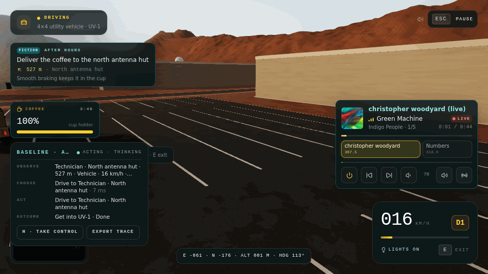
  <br />
  <sub><i>Real capture from this repo: an agent at the wheel, driving the coffee run through the same controls and physics you use. This is the labelled scripted baseline (<code>?controller=mock</code>): <a href="https://geotwn.vercel.app/?controller=mock">watch it live</a>, no key needed, by pressing <b>After Hours</b>. Jev's own run is <a href="#watch-an-agent-finish-the-whole-mission">below</a>.</i></sub>
</p>

---

## The idea in one sentence

> **The agent chooses what to try. The simulation decides what happens.**

It's easy to make an agent look capable: give it an API that teleports it, a peek at the answer, a scorer that takes its word. This project does the opposite. **Jev** (an agent from TypeSafe) sees what a player could see, picks one legal intention, and a deterministic controller carries it out with **the same stick, pedals and E key a person uses**. If the coffee spills, it spills. If the truck hits a fence, that is a collision in the trace.

<table>
  <tr>
    <td width="33%" valign="top">
      <h3>One world</h3>
      A playable reconstruction of Pine Gap in Australia's Northern Territory: walk it, drive it, fly over it. Published antenna survey coordinates are the factual anchor; everything the game adds is labelled fiction.
    </td>
    <td width="33%" valign="top">
      <h3>One set of rules</h3>
      People, Jev, a scripted baseline, a random agent and a replay all go through the same input path, the same 120&nbsp;Hz physics and the same collision world. The agent layer <b>cannot</b> move the player, touch the coffee or mark a task done, and tests enforce that.
    </td>
    <td width="33%" valign="top">
      <h3>Every action on record</h3>
      Each session exports as <code>svs-agent-trace/v1</code>: every observation hash, choice, confidence, latency, outcome and control handover. Human and agent runs are measured by the same code, so they can be compared directly.
    </td>
  </tr>
</table>

**You stay in charge.** Press **H**, move, look or click and control comes back to you in the same frame. You'll be in the same seat at the same speed with the same coffee; nothing resets or teleports. Switch on **Co-pilot** and Jev only suggests the next move; nothing happens until you accept it.

### Who it's for

- **Teams evaluating agents** that want something harder to fake than a text benchmark: a timed, physical, multi-stage task where success comes only from the game's own rules, with a trace you can audit line by line.
- **Product and game teams** looking for a working pattern for putting an agent into a real-time 3D world: provider-neutral contracts, a server-side credential boundary, instant human takeover and a co-pilot mode.
- **Digital-twin and 3D-web builders** who want to see how far a browser can go: a reconstruction built from public sources, with 120 Hz physics, procedural audio and a 0.05 ms gameplay update.

> [!NOTE]
> **What it is today:** a working reference integration with **one environment** (Pine Gap) and **one task** (After Hours). It is not yet an environment-authoring tool, a multiplayer server or a sandbox for untrusted code. See the [architecture, contracts and limits](docs/AGENT_RUNTIME.md).

---

## Try it now

**In your browser, nothing to install:** open **[geotwn.vercel.app](https://geotwn.vercel.app)** and press **Deploy** or **After Hours**. To watch an agent play instead, open **[geotwn.vercel.app/?controller=mock](https://geotwn.vercel.app/?controller=mock)** and press **After Hours**.

**On your machine, in about a minute:**

```sh
git clone https://github.com/topherchris420/satellite-vision-scape.git
cd satellite-vision-scape
bun install && bun run dev      # then open the URL Vite prints
```

<sub>Needs [Bun](https://bun.sh) 1.3+ and Node 20.19+ or 22.12+ (Vite 8 runs on Node). Where IPv6 is unavailable, use <code>bun run dev --host 127.0.0.1</code>.</sub>

Then pick how you want to meet it (the same choices work on the live site):

| I want to…                             | Do this                                                                                                              |
| :------------------------------------- | :------------------------------------------------------------------------------------------------------------------- |
| **Explore the world myself**           | Press **Deploy** on the briefing card. `WASD`, mouse, `E` to get into a vehicle.                                     |
| **Play the mystery**                   | Press **After Hours**. It starts at dusk with a coffee order.                                                        |
| **Watch an agent play it, no API key** | Open `/?controller=mock` and press **After Hours**. The clearly labelled scripted baseline drives the whole journey. |
| **Hand the controls to Jev**           | Set `TYPESAFE_API_KEY` on the server, then press **Jev After Hours** (or **Co-pilot**).                              |
| **Fly over the site**                  | Keys `2` Explore · `3` Tour · `4` Plan. Click any structure for its source dossier.                                  |

> [!TIP]
> No key? Everything except Jev works out of the box. Without `TYPESAFE_API_KEY` the Jev buttons say **Unavailable on this deployment** and nothing else changes. The public demo runs this way, so to hand the controls to Jev, deploy your own copy with a key.

---

## Watch an agent finish the whole mission

In a recorded live run, Jev played **Pine Gap: After Hours** from the first step to the last with no help: it picked up the coffee, drove it across the site, decoded a hidden frequency from a numbers station, tuned four terminals by ear and eye, and started the midnight concert.

<p align="center">
  
</p>

**When Jev is at the wheel, the agent panel reads like this:**

```text
JEV · AUTONOMOUS                            ACTING · THINKING
OBSERVE   Technician · North antenna hut · 438 m · Vehicle · 34 km/h · Coffee · 91%
CHOOSE    Drive to Technician · North antenna hut · 93% · 296 ms
ACT       Drive to Technician · North antenna hut
OUTCOME   Get into UV-1 · Done
[ H · TAKE CONTROL ]  [ EXPORT TRACE ]
```

It shows the intention, Jev's own confidence, the round-trip latency and the **measured** outcome. It never shows or invents hidden reasoning.

| Live run B (`jev-latest` → `jev-1.13.0`)                                |                                                         Result |
| :---------------------------------------------------------------------- | -------------------------------------------------------------: |
| Completion                                                              | coffee → drive → delivery → clue → 420 → 4 terminals → concert |
| Decisions (executed · continued · rejected)                             |                                       212 (133 · 79 · 1 stale) |
| Decision latency, median / p95                                          |                                                289 ms / 397 ms |
| Coffee delivered                                                        |                                             **100%** in 84.1 s |
| Distance driven / walked                                                |                                                785 m / 1,114 m |
| Collisions · stuck recoveries · provider failures · human interventions |                                              **0 · 0 · 0 · 0** |

The full trace is in the repo: [`docs/traces/jev-after-hours-live-2026-09-27.json`](docs/traces/jev-after-hours-live-2026-09-27.json). The first attempt, the fix, and how to re-run it are in [docs/JEV_AFTER_HOURS.md](docs/JEV_AFTER_HOURS.md#live-jev).

<details>
<summary><b>Read the honest version: what the first attempt got wrong, and what changed</b></summary>
<br />

**Run A** got the coffee delivered and found the hidden frequency, then spent 473 decisions at the Harmony terminal alternating "dial up" / "dial down". A short hold was bigger than the narrow aligned zone, and when the panel said ALIGNED, Jev kept turning instead of waiting. It was stopped by hand.

**The fix changed what Jev is told, not what it's allowed to do.** The terminal panel now says what the last turn did ("Turning the dial up lowered the match from 99% to 86%: the reference lies the other way, down; you turned past it"), that an aligned dial locks if left alone, and how big each control is. In targeted live checks Jev then chose _Wait_ at ALIGNED 4/4 times and turned back after overshooting 3/3 times. **Run B** is the complete journey above.

One run is an existence proof, not a success rate. Latency and Jev's choices vary; the simulation itself is deterministic. The scripted baseline says nothing about Jev's ability. It proves the runtime can finish the task through ordinary controls (≈ 412 s, 93% coffee, 0 collisions).

</details>

<p align="center">
  <a href="docs/media/jev-after-hours-flier.svg">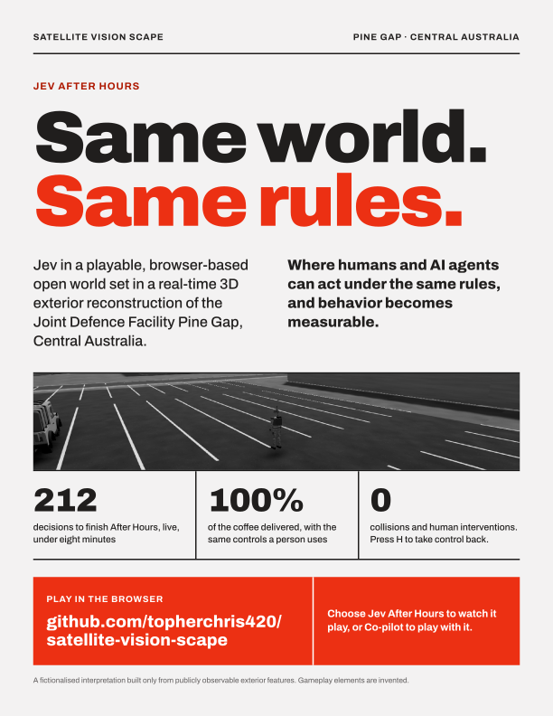</a>
</p>

---

## The world

<table>
  <tr>
    <td width="50%">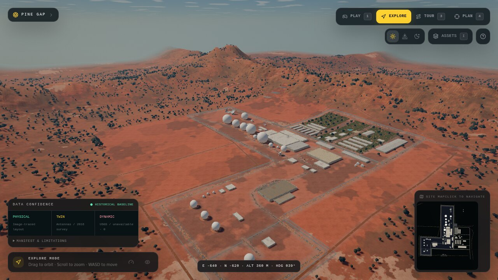</td>
    <td width="50%">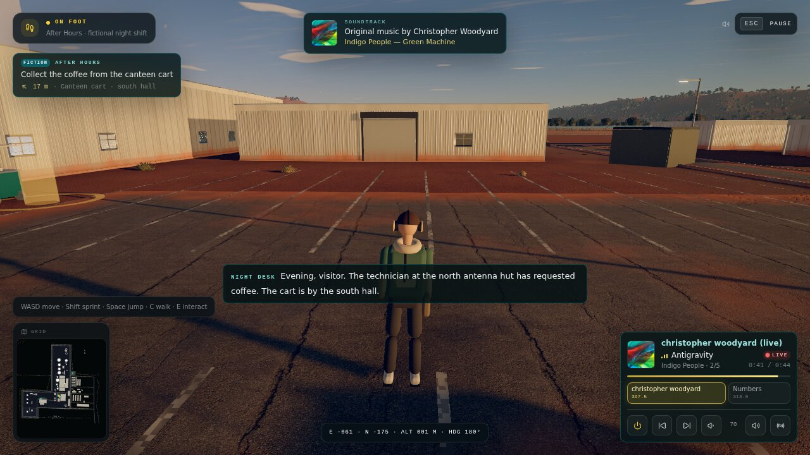</td>
  </tr>
  <tr>
    <td align="center"><sub><b>Explore.</b> Orbit the whole site. The data-confidence panel says what is image-traced, what is surveyed and what is live.</sub></td>
    <td align="center"><sub><b>The shift begins.</b> Objective, captions, minimap and a physical vehicle radio, all live HUD.</sub></td>
  </tr>
  <tr>
    <td width="50%">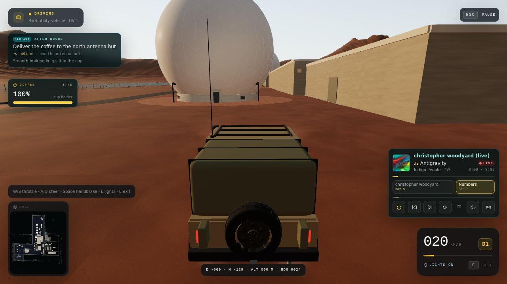</td>
    <td width="50%">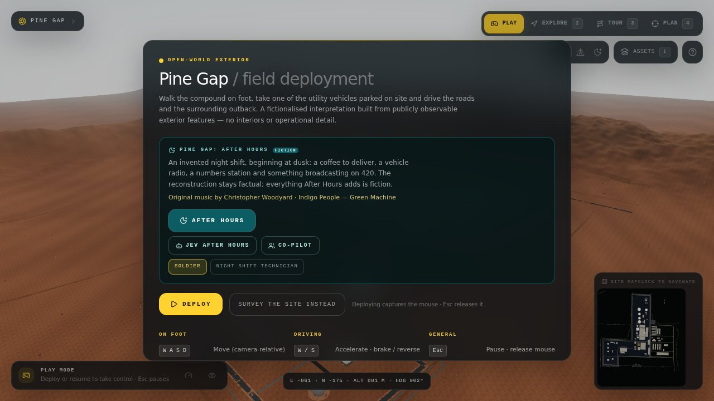</td>
  </tr>
  <tr>
    <td align="center"><sub><b>Behind the wheel.</b> The coffee rides in the cup holder; smooth braking keeps it there.</sub></td>
    <td align="center"><sub><b>The briefing card.</b> Play yourself, play the mystery, or hand it to Jev.</sub></td>
  </tr>
</table>

Walk out of the car park, climb into one of three right-hand-drive 4×4s and head out to the fence line without a loading screen:

- **On foot:** a third-person character with smooth acceleration, sprint, walk toggle, jump with coyote time, slopes, kerb and pad step-ups, and sliding along walls, fences and structures.
- **Vehicles:** walk to either door and press **E**. The door swings open, you climb (or slide across) into the driver's seat and the camera eases into the chase view. Press **E** again to brake, find a clear spot beside a door and step out.
- **Driving:** throttle, braking, automatic reverse, speed-sensitive steering, handbrake slides, drag and rolling resistance per surface, body squat / dive / roll on sprung suspension, crests that go light, working headlights and brake lights, dust on loose ground, and glancing hits that spin you.
- **A living site:** boom barriers that lift for an approaching vehicle and never drop onto anything beneath them, wind in the spinifex and trees, drifting dust and cloud, blinking obstruction beacons, and fully procedural audio (engine, tyres, footsteps per surface, doors, impacts, barrier motors, wind).
- **Day / dusk / night:** press **N**. Headlights come on by themselves after dark.
- **The original viewer, still here:** **Explore** (free orbit, click anything for its source dossier), **Tour** (a cinematic pass) and **Plan** (north-up orthographic to compare with the overhead reference). The playable world persists while you switch.

> [!NOTE]
> **What's real and what isn't.** Published antenna IDs, coordinates and dish diameters are historical factual anchors. Buildings, roads, fences and topography are approximate context traced from public overhead imagery. The character, vehicles, barrier gates and beacons are **fictional** game dressing, and so is everything in **After Hours**. No interiors, operational layouts, security procedures or non-public details are modelled or implied.

---

## Pine Gap: After Hours

> [!IMPORTANT]
> **Soundtrack.** Original music written by **Christopher Woodyard**, performing as **Indigo People**. Featured album: **_Green Machine_**. The recordings and cover art are used with the songwriter's permission and are **not** covered by this repository's software licence ([docs/SOUNDTRACK.md](docs/SOUNDTRACK.md)).

An ordinary night shift turns into a small musical mystery.

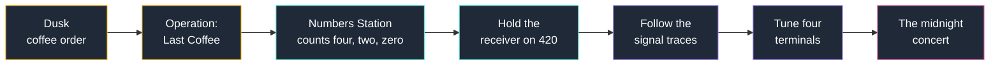
```mermaid
flowchart LR
  A["Dusk<br/>coffee order"] --> B["Operation:<br/>Last Coffee"]
  B --> C["Numbers Station<br/>counts four, two, zero"]
  C --> D["Hold the<br/>receiver on 420"]
  D --> E["Follow the<br/>signal traces"]
  E --> F["Tune four<br/>terminals"]
  F --> G["The midnight<br/>concert"]
  style A fill:#1f2937,stroke:#fbbf24,color:#fff
  style B fill:#1f2937,stroke:#fbbf24,color:#fff
  style C fill:#1f2937,stroke:#5eead4,color:#fff
  style D fill:#1f2937,stroke:#5eead4,color:#fff
  style E fill:#1f2937,stroke:#a78bfa,color:#fff
  style F fill:#1f2937,stroke:#a78bfa,color:#fff
  style G fill:#1f2937,stroke:#f472b6,color:#fff
```

<table>
  <tr>
    <td width="50%">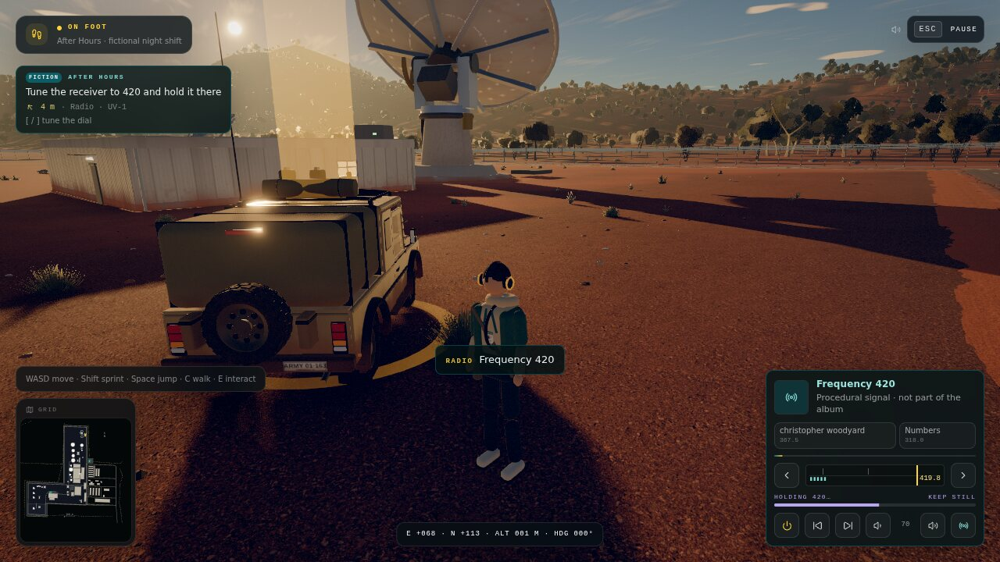</td>
    <td width="50%">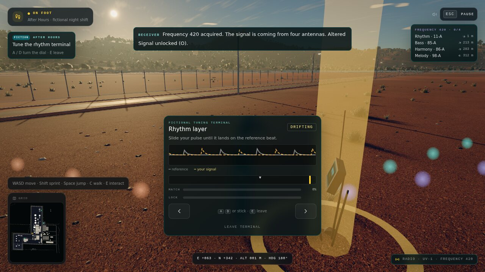</td>
  </tr>
  <tr>
    <td align="center"><sub><b>Frequency 420.</b> Sweep the dial with <code>[</code> <code>]</code> and hold it still for three seconds.</sub></td>
    <td align="center"><sub><b>The terminals.</b> Match your signal to the reference; follow the traces to the next one.</sub></td>
  </tr>
</table>

<p align="center">
  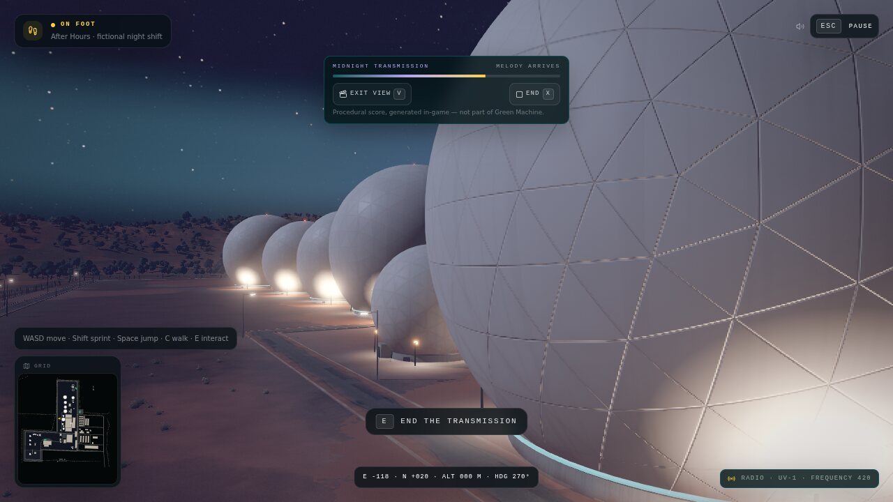
  <br />
  <sub><b>The midnight concert.</b> Beams, rings and a sky band driven by the score's own musical clock (<code>V</code> for the cinematic view).</sub>
</p>

1. **Operation: Last Coffee.** Pick up the cup at the canteen cart by the south hall and get it to the technician at the north antenna hut, about 620 m by road, within **4 minutes**. The coffee meter reacts to braking, launching, cornering and impacts, but never to speed alone, so smooth driving keeps nearly all of it. Delivery is scored on time and coffee remaining: _"Temperature acceptable. Seventy-three percent of the coffee remains. Promotion unlikely."_
2. **Frequency 420.** Leave the **Numbers Station** on. Its captioned transmission counts _four, two, zero_ (four pips, two pips, a long tone). Sweep the receiver to **420** and hold it there. That unlocks **Altered Signal** and reveals the terminals.
3. **Four terminals.** Rhythm, Bass, Harmony and Melody stand beside antennas 11-A, 85-A, 86-A and 98-A. Turn each dial until your signal matches the reference. Every cue is audible _and_ visual: waveforms, a dial with the target marked, a Match meter and a plain-text status (_Drifting · Close · Aligned, hold · Locked_). Each locked layer joins one shared composition.
4. **The midnight concert.** With all four locked, the listening point among the radomes opens for an ~83 s transmission: opening signal, rhythm and bass, harmony, melody, then a release back into the desert. **V** toggles a cinematic camera. It ends on _TRANSMISSION RECEIVED. SOURCE UNKNOWN._

<details>
<summary><b>The vehicle radio</b></summary>
<br />

The radio is physical: it lives in one vehicle at a time (the one parked nearest when After Hours starts, then whichever you last entered; the station and position carry over). Inside the cab it is clear; outside it plays from the parked vehicle with distance attenuation and a muffled sound that opens up while a door is open. Controls work in the cab or standing beside the vehicle.

|   Key   | Radio                                                            | Touch / mouse |
| :-----: | :--------------------------------------------------------------- | :------------ |
|   `R`   | Power (also retries if the browser blocked playback)             | ⏻             |
| `,` `.` | Previous · next track (album order; previous restarts after 3 s) | ⏮ ⏭         |
|   `T`   | Next station                                                     | ◉             |
| `[` `]` | Tune the receiver (tap to step, hold to sweep)                   | ◀ ▶ (hold)    |
| `-` `=` | Music volume (independent of effects)                            | 🔉 🔊         |

Stations (all fictional apart from the recordings): **christopher woodyard (live)**, the default, playing _Green Machine_ in album order; **Numbers Station**; and, once found, **Frequency 420** (the procedural score). The cover opens an album view with the songwriting credit and track list.

</details>

<details>
<summary><b>Mission details: retries, saving, replay</b></summary>
<br />

- **Start** from the briefing card (**After Hours**, or **Continue After Hours** once there is saved progress) or from the pause menu (**Esc**). **Deploy** still starts free exploration, and **Leave After Hours · free roam** (pause → Progress) returns to it at any time. Explore, Tour and Plan stay factual: entering them hides every After Hours prop and effect and pauses the radio.
- **The coffee is always with you:** in your hand on foot, in the cup holder of whichever vehicle you drive. Walking, exiting, re-entering and switching vehicles never disturb the mission.
- **If it goes cold or spills,** press **Y** (or **Retry**) to start again at the cart, or collect a fresh cup there. The mission is replayable; the reward is granted once.
- **Terminals:** leave with **E** at any time; completed terminals are saved. The radio ducks while you tune.
- **Concert:** **X** ends the transmission early. Afterwards the radio returns to your Indigo People selection at the position you left it. The concert can be replayed and Frequency 420 stays on your presets.
- **Saving:** progress and preferences live in versioned, zod-validated `localStorage` (`pine-gap.after-hours`). Damaged, outdated or unavailable storage falls back safely, and play resumes at safe checkpoints: a coffee run or a concert is never restored half-way. _Progress → Reset progress_ clears it (with confirmation; preferences are kept).

</details>

<details>
<summary><b>Accessibility, clean audio and Altered Signal</b></summary>
<br />

Pause (**Esc**) → **After Hours** → _Settings_:

- **Music volume** and **Effect intensity** sliders; **Altered Signal** on/off (off is immediate).
- **Reduced motion** freezes the colour drift, trace flow, star rotation and cinematic orbit (it defaults to the OS preference).
- **Clean audio** removes the only processing applied to the album (Altered Signal's slow, shallow high-shelf) and the ambient layer. Volume, cabin/outside placement and door muffling still apply, since they are the radio itself.
- **Signal guidance** lists every signal with its distance and direction, so the puzzle never depends on the visual effects.
- Every audio clue has a visual equivalent (captions for radio, numbers and announcements; waveforms and text status at terminals), so **the whole journey can be completed muted** (**M**).
- Everything is playable with keyboard, mouse or touch.

**Altered Signal** is an optional presentation mode: slow teal / violet / amber colour shifts, lavender tyre dust, faint star arcs around the south celestial pole, breathing terminal beacons, glowing traces towards each untuned terminal and a restrained ambient layer (never while the album or the score is playing). It never flashes, blurs or distorts, and it only touches presentation: movement, physics, collision and every site coordinate are unchanged.

</details>

<details>
<summary><b>Soundtrack and procedural score</b></summary>
<br />

<p align="center">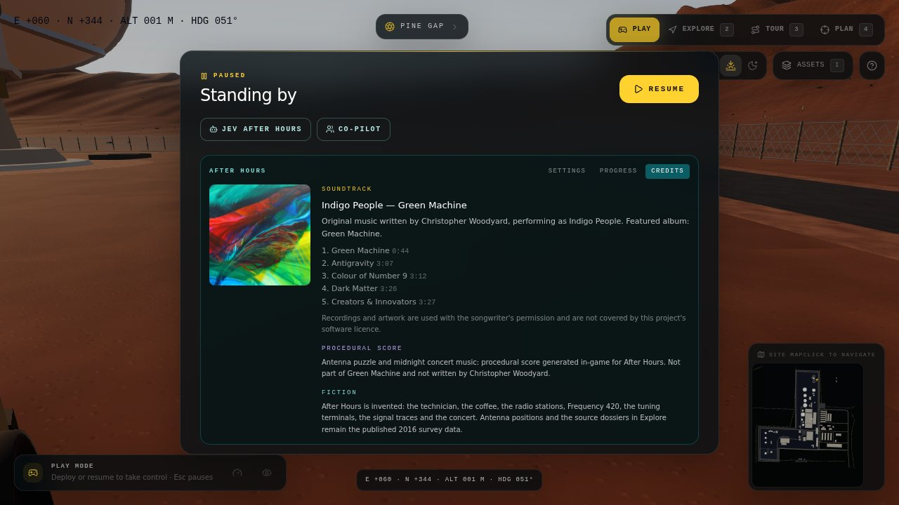</p>

- **_Green Machine_** by **Indigo People**, written by **Christopher Woodyard**: five tracks streamed one at a time from `public/music/indigo-people/green-machine/`, byte-identical to the supplied files (no re-encoding). Nothing is downloaded until After Hours starts, and then only the track that plays.
- The **puzzle and concert music is a procedural score generated in-game** (A minor, 92 BPM, four layers on one clock). It is not part of _Green Machine_, is not written by Christopher Woodyard, and never plays over the album.
- **Adding a track:** copy the file under `public/music/…` with a URL-safe name and append an entry (id, number, title, `src`, measured duration) to `GREEN_MACHINE.tracks` in [`src/game/afterhours/soundtrack.ts`](src/game/afterhours/soundtrack.ts). The radio, credits, album view and HUD all read from that manifest.

</details>

---

## How the agent plays

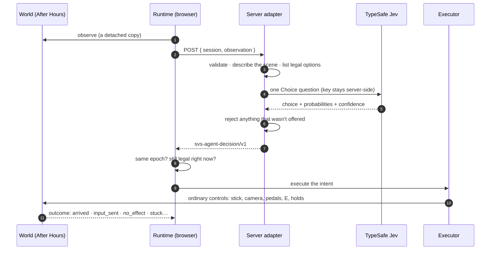
```mermaid
sequenceDiagram
  autonumber
  participant W as World (After Hours)
  participant R as Runtime (browser)
  participant S as Server adapter
  participant J as TypeSafe Jev
  participant X as Executor
  R->>W: observe (a detached copy)
  R->>S: POST { session, observation }
  S->>S: validate · describe the scene · list legal options
  S->>J: one Choice question (key stays server-side)
  J-->>S: choice + probabilities + confidence
  S->>S: reject anything that wasn't offered
  S-->>R: svs-agent-decision/v1
  R->>R: same epoch? still legal right now?
  R->>X: execute the intent
  X->>W: ordinary controls: stick, camera, pedals, E, holds
  W-->>R: outcome: arrived · input_sent · no_effect · stuck…
```

**Two speeds.** Slow intelligence chooses; fast deterministic control executes.

| Loop     | Rate                                                     | Decides                                           |
| :------- | :------------------------------------------------------- | :------------------------------------------------ |
| Semantic | ≤ 4 requests/s, one in flight, travel reviewed every 3 s | _what_ next: the technician, the receiver, a dial |
| Motor    | every rendered frame, before gameplay reads input        | _how_: stick, camera, pedals, keys                |
| World    | fixed 120 Hz physics step                                | _what actually happened_                          |

**What Jev is shown.** The same things a player can perceive, in plain language: the on-screen objective, captions it has heard, meters, dial position, distances and directions. It is **never told a hidden answer**. It doesn't learn "420" until the Numbers Station has said it, and it never learns a terminal's target, only the panel's status.

**What Jev can do.** Pick exactly one option from the legal intents on offer at that moment, for example:

```text
NAVIGATE_TO__COFFEE_CART  "Walk to Canteen cart · south hall (38 m ahead and to the left)…"
DRIVE_TO__TECHNICIAN      "Drive this vehicle to Technician · North antenna hut (438 m ahead)…"
TUNE_RECEIVER__UP__LONG   "A long hold turning the radio receiver dial up: about 40 on the dial."
WAIT                      "Do nothing for about 1.5 seconds and watch…"
```

**What Jev cannot do,** and what the tests enforce:

- Mutate the player or vehicle position, velocity, physics or collisions; the coffee; After Hours progress; the radio's solution; terminals; the concert; barriers; save state; or the factual site data.
- The core runtime, loop, contracts and providers import **nothing** from `src/game/`, and a static test rejects any write to positions, velocities or physics anywhere under `src/agent/`.
- A test plays the whole journey and records the call stack of every coffee pickup, delivery and concert start. Each one comes from `InteractionManager` handling an **E press**, never from the runtime, a provider or the executor.

<details>
<summary><b>Providers, security and trace format</b></summary>
<br />

| Provider         | Try it                       | What it is                                                          |
| :--------------- | :--------------------------- | :------------------------------------------------------------------ |
| `JevProvider`    | `?controller=jev`            | TypeSafe Jev through `/api/agent/jev/decision` on the same origin   |
| `MockProvider`   | `?controller=mock`           | The labelled **scripted After Hours baseline** (never shown as Jev) |
| `RandomProvider` | `?controller=random&seed=42` | Seeded uniform choice among legal intents                           |
| `ReplayProvider` | `?controller=replay`         | Re-issues a trace's intents through the same validation             |

Adding a provider (a local model, another hosted model, a scripted agent) means implementing one `decide()` method. Add `&copilot=1` for suggestion-only mode or `?agentHud=1` to show the panel in human play.

**Security.** `TYPESAFE_API_KEY` / `TYPESAFE_MODEL` are server-only (never `VITE_`). The browser sends `{ session, observation }` and nothing else; the server writes every word of the question, quotes game text as data, and accepts only an offered option with valid probabilities. Requests are same-origin, JSON-only, size-capped and rate-limited; the upstream body is never relayed. `bun run verify:secrets` builds production with a canary key and fails if it, or anything key-shaped, reaches client assets.

**Traces** (`svs-agent-trace/v1`) record segments, decisions (observation hash, legal set, intent, confidence, alternatives, latency, disposition, outcome, actor state), 30+ event types and an evaluation block. They are bounded, stay in memory until you press **Export trace**, and contain no credentials, prompts or provider reasoning.

Full detail: [docs/AGENT_RUNTIME.md](docs/AGENT_RUNTIME.md) · Jev walkthrough: [docs/JEV_AFTER_HOURS.md](docs/JEV_AFTER_HOURS.md)

</details>

---

## Built for the next model, measured on this one

Agent products age with the model underneath them. Build around today's weaknesses and the product is stale by the next release. Build for a model nobody has yet and it is broken today. This repo does neither: **it ships the question today's model needs, keeps the question next quarter's model should need ready beside it, and lets measurements decide when to switch.**

**We have already lived through one upgrade.** Run A gave Jev the terminal meters as bare facts, and it spent 473 decisions turning a dial back and forth. Run B spelled out the conclusions a player draws from those meters ("that turn raised the match: the reference lies further up", "keep still and it locks") and finished the mission. Those sentences are real help, and they are also a bet on today's model. So each one is now a **named, switchable assist**, stored with the failure that justified it and the probes that can retire it:

| `JEV_ASSISTS`    | Jev is told                                                                          | Role                                                         | Question size |
| :--------------- | :----------------------------------------------------------------------------------- | :----------------------------------------------------------- | ------------: |
| `full` (default) | Run B's question, **byte for byte** (checked on 155 real observations)               | What today's model needs                                     |       4,917 B |
| `lean`           | Facts, not conclusions: what's on screen, how the controls feel, directions in words | **The bet** on the next model                                |         −5.7% |
| `none`           | Raw numbers only                                                                     | A ceiling probe to show where the frontier is; never shipped |         −9.9% |

**Ten probes measure the gap instead of guessing it.** Each probe is one decision captured deterministically from the real game, with an answer any player would agree on: "ALIGNED, lock meter 16%: do you keep still?", "that long turn took the match from 86% to 25%: which way now?". Each has a chance floor (5–33%, confirmed over 1,000 seeded random trials), and the scripted baseline passes 9 of 10 cold. An assist is retired only when its probes clear a **Wilson 95% lower bound of 0.80** without it, over at least 10 trials, and lose no more than 5 points. 19/20 doesn't qualify; 20/20 does.

```sh
bun run probes -- --provider random --repeats 1000                         # chance floor, free
AGENT_LIVE_TEST=1 bun run probes -- --provider jev --profiles full,lean,none # 300 billable calls, ~3 min
AGENT_LIVE_TEST=1 bun run probes -- --provider jev --ablate                  # full vs full-minus-each assist
```

**The trace shows where the calls go, so we fixed what it showed.** In run B, 37% of Jev's calls were mid-route reviews (0 of 79 changed the plan) and 23% were Wait in the concert stage. On the current build the scripted baseline spent **57 of 212 calls choosing Wait while the transmission played**. A task can now declare that it is playing itself out, and the runtime waits without asking: **212 → 155 calls (−27%)**, with the same 411.9 s mission, 93% coffee and 0 collisions.

**Bigger bets wait for their tripwire.** We have not built them, and each one names the number that would change that:

| Not built yet                  | Build when                                                                                |
| :----------------------------- | :---------------------------------------------------------------------------------------- |
| `lean` as the default          | Every assist it drops gets `retire` on the live model, and a `lean` journey matches run B |
| Reviews every 6 s, not 3 s     | Reviews change the plan < 1% over ≥ 5 live runs (run B: 0/79)                             |
| Several intents per call       | Every probe ≥ 95% at `lean`                                                               |
| Screenshots instead of text    | Text probes ≥ 95% at `none`, so the remaining gap is perception                           |
| Coordinates, exact dial values | Never. It's a design boundary, not a capability gap                                       |

The live Jev probe matrix **has not been run yet**; the ledger has a row waiting for it. Method, numbers and ledger: [docs/NEXT_MODEL.md](docs/NEXT_MODEL.md).

---

## Engineering

<table>
  <tr>
    <td align="center" width="25%"><h2>0.05&nbsp;ms</h2><sub>median gameplay update per frame<br />(input, 120 Hz physics, collision, animation, camera, HUD)</sub></td>
    <td align="center" width="25%"><h2>−53%</h2><sub>draw calls on the site overview<br />(1,783 → 846)</sub></td>
    <td align="center" width="25%"><h2>213</h2><sub>tests across 20 suites<br />121,309 assertions in ~5 s</sub></td>
    <td align="center" width="25%"><h2>0</h2><sub>per-frame allocations<br />in gameplay loops</sub></td>
  </tr>
</table>

The gameplay layer is plain TypeScript under `src/game/`, independent of React. React Three Fiber mounts the scene and calls one method per frame; tests drive the exact same code headless.

```text
SiteScene (React)                          Game.frame(dt)                     (src/game/Game.ts)
 ├─ <Canvas> … Terrain, Roads, Structures   ├─ InteractionManager.update   state machine, prompts
 │   └─ <GameRuntime>  ── useFrame(-1) ──▶  ├─ fixed 120 Hz steps (accumulator, max 12/frame)
 ├─ HUD (viewer)                            │    ├─ PlayerController.fixedStep
 └─ GameHUD (play) ◀── HudModel ────────────│    ├─ VehicleManager.fixedStep → VehiclePhysics
                                            │    └─ WorldManager.fixedStep  (barriers)
                                            └─ presentation (interpolated between steps)
                                                 vehicles → character pose → world → dust
                                                 → ThirdPersonCamera → audio → HUD readouts
```

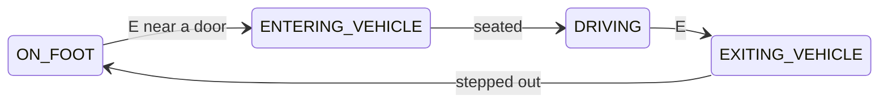
```mermaid
stateDiagram-v2
  direction LR
  ON_FOOT --> ENTERING_VEHICLE: E near a door
  ENTERING_VEHICLE --> DRIVING: seated
  DRIVING --> EXITING_VEHICLE: E
  EXITING_VEHICLE --> ON_FOOT: stepped out
```

One `InteractionManager` owns every transition (validated by `canTransition`), decides who has authority over the character (the physics controller or a scripted door choreography), which vehicle receives input, and which prompt the HUD shows. There are no scattered `isDriving` flags.

**Why it's fast:**

- **Instancing** for radome vents, vestibules, doors, floodlights, parapets, parking lines, fence posts, barrier hardware and beacons: one draw call per kind.
- **Merged static assemblies.** Each dish antenna (≈ 40 parts) and each vehicle body is merged per material; only doors, wheels and the steering wheel stay separate.
- **Player-following shadows.** A 220 m shadow box centred on the player and snapped to whole texels, so there's no shimmer.
- **Constant light count.** One shared headlight follows whichever vehicle is driven, so toggling lights never recompiles shaders.
- **Spatial hashing.** Colliders and ground surfaces live in 16 m grids; parked vehicles sleep; distant barriers aren't simulated.
- **GPU-side wind.** Vegetation sway is a vertex-shader patch on one uniform, so ~7,000 spinifex tufts cost zero CPU.
- **Throttled DOM.** HUD readouts write at 12 Hz only when text changes; React re-renders only on discrete state changes.

<details>
<summary><b>Module map</b></summary>
<br />

| Area            | Module                                                                                    | Responsibility                                                                                      |
| :-------------- | :---------------------------------------------------------------------------------------- | :-------------------------------------------------------------------------------------------------- |
| Core            | `game/Game.ts`                                                                            | Owns and orders all systems; fixed-step loop with render interpolation                              |
|                 | `game/config.ts`                                                                          | Every tunable: speeds, accelerations, camera framing, interaction timings, gate behaviour           |
|                 | `game/core/Input.ts`, `DomInput.ts`                                                       | Device-independent actions; keyboard, pointer-lock mouse, drag and touch bindings                   |
|                 | `game/core/EventBus.ts`, `events.ts`                                                      | Typed gameplay events consumed by audio, HUD and effects                                            |
|                 | `game/core/MeshBatcher.ts`                                                                | Merges static part assemblies per material (vehicles, antennas)                                     |
| World           | `game/world/CollisionWorld.ts`                                                            | Spatial-hash broadphase, circle/box/sphere narrowphase, sphere-cast raycasts, layers                |
|                 | `game/world/GroundQuery.ts`                                                               | Exact rendered-terrain height plus roads, pads, lawns and aprons; surface kinds                     |
|                 | `game/world/buildSiteWorld.ts`                                                            | Builds gameplay colliders and surfaces from the Pine Gap layout data                                |
|                 | `game/world/BarrierGate.ts`, `GateVisuals.ts`, `WorldManager.ts`                          | Boom barriers: sensors, manual control, safety, instanced visuals                                   |
|                 | `lib/terrain/mesh-grid.ts`                                                                | Shared terrain grid: the render mesh and gameplay ground use identical triangles                    |
|                 | `lib/site-fences.ts`                                                                      | Fence runs and openings where roads cross fences steeply                                            |
| Player          | `game/player/PlayerController.ts`                                                         | Kinematic capsule: acceleration, sprint, jump buffer/coyote time, slopes, steps, wall sliding       |
|                 | `game/player/CharacterVisual.ts`, `CharacterAnimator.ts`                                  | Procedural soldier rig; distance-driven gait, idle, airborne and seated pose blending               |
| Vehicles        | `game/vehicles/VehiclePhysics.ts`                                                         | Slip-angle tyre model, load transfer, 4WD, brakes, handbrake, drag, sprung body, impulses           |
|                 | `game/vehicles/VehicleVisual.ts`, `VehicleMaterials.ts`                                   | Procedural RHD military 4×4 with doors, interior, lamps, steering and spinning wheels               |
|                 | `game/vehicles/Vehicle.ts`, `VehicleController.ts`, `VehicleManager.ts`, `VehicleSpec.ts` | Entity, input → controls (auto gearbox), fleet + shared headlight, specs and variants               |
| Camera          | `game/camera/ThirdPersonCamera.ts`                                                        | Orbit camera, collision, on-foot/vehicle profile blend, auto-recentre, shake, intro glide           |
| Interaction     | `game/interaction/InteractionManager.ts`                                                  | State machine, door choreography, safe-exit search, barrier use                                     |
| Effects / audio | `game/effects/DustSystem.ts`, `game/audio/GameAudio.ts`                                   | Pooled particles; procedural Web Audio                                                              |
| UI              | `game/hud/HudModel.ts`, `components/game/GameHUD.tsx`                                     | Discrete HUD state via `useSyncExternalStore`; throttled direct-DOM readouts                        |
| Bridge          | `components/game/GameRuntime.tsx`, `hooks/use-play-session.ts`                            | R3F mounting and frame driving; pointer-lock session (briefing / running / paused)                  |
| After Hours     | `game/afterhours/AfterHours.ts`                                                           | Orchestrator: session lifecycle, interactables, captions, objective, audio/visual/HUD presentation  |
|                 | `game/afterhours/progress.ts`                                                             | Progression model, preferences, versioned zod-validated storage with safe fallbacks                 |
|                 | `game/afterhours/radio.ts`, `soundtrack.ts`, `numbers.ts`                                 | Radio logic (dial, presets, ownership, 420 hold), album manifest, Numbers Station script            |
|                 | `game/afterhours/coffee.ts`                                                               | Mission state machine and frame-rate-independent spill model                                        |
|                 | `game/afterhours/puzzle.ts`, `composition.ts`, `concert.ts`                               | Terminal tuning, the procedural score's notes and chord grid, concert timeline and mix              |
|                 | `game/afterhours/AfterHoursVisuals.ts`, `AfterHoursHud.ts`                                | Fictional props, beacons, traces, concert accents; HUD store and throttled DOM readouts             |
|                 | `game/audio/RadioAudio.ts`, `ProceduralScore.ts`, `AfterHoursAudio.ts`                    | One streamed media element through the shared context (cabin/exterior paths); score scheduler; cues |
|                 | `components/game/AfterHoursHUD.tsx`, `SpectralGrade.tsx`                                  | Objective, captions, radio, meters, tuning and settings UI; Altered Signal grade                    |
| Agent           | `agent/runtime.ts`, `loop.ts`, `contract.ts`, `observation.ts`                            | Modes, takeover, co-pilot; one-in-flight decision loop; action and observation contracts            |
|                 | `agent/executor.ts`, `navigation.ts`, `driving.ts`, `control.ts`                          | Intent → controls; A\* routes; driving profiles; `ControlArbiter` and `SyntheticInput`              |
|                 | `agent/trace.ts`, `evaluation.ts`, `providers/`                                           | `svs-agent-trace/v1`; shared metrics; Jev, mock, random and replay providers                        |
|                 | `server/agent/`                                                                           | Server-side Jev adapter: credential, question, answer validation, rate limits                       |

</details>

<details>
<summary><b>Collision layers</b></summary>
<br />

| Layer       | Contents                                                                 | Blocks character | Blocks vehicle |          Blocks camera          |
| :---------- | :----------------------------------------------------------------------- | :--------------: | :------------: | :-----------------------------: |
| `Structure` | Buildings, radome plinths and spherical shells, tanks, antenna pedestals |        ✓         |       ✓        |                ✓                |
| `Prop`      | Floodlight poles, vestibules, tree trunks, barrier housings              |        ✓         |       ✓        |                                 |
| `Fence`     | Fence runs between openings                                              |        ✓         |       ✓        |                                 |
| `Vehicle`   | Vehicle bodies (dynamic)                                                 |        ✓         |       ✓        | ✓ (except the one being driven) |
| `Gate`      | Lowered barrier booms (dynamic)                                          |        ✓         |       ✓        |                                 |

Gameplay collision uses analytic shapes, separate from render meshes. Radome shells are true spheres, so a walker's head meets the bulge and the camera slides round it.

</details>

<details>
<summary><b>Performance measurements</b></summary>
<br />

Measured with a WebGL draw-call counter in headless Chromium (software rendering, so draw calls rather than frame time are the comparable metric):

| View                                                                         |                   Before | After |
| :--------------------------------------------------------------------------- | -----------------------: | ----: |
| Site overview (Explore)                                                      | 1,783 draw calls / frame |   846 |
| Ground level (old walk mode → Play on foot, now with character and vehicles) |                    1,157 |   438 |

**After Hours**, measured back to back against the previous commit (Bun, headless; Chromium 141 with SwiftShader at 640×360):

| Measurement                                   |                                     Before |                          After · free roam |                        After · After Hours |
| :-------------------------------------------- | -----------------------------------------: | -----------------------------------------: | -----------------------------------------: |
| `Game.frame` median, idle / walking / driving | 0.015–0.019 / 0.016–0.017 / 0.029–0.031 ms | 0.018–0.020 / 0.016–0.017 / 0.028–0.030 ms | 0.021–0.030 / 0.018–0.019 / 0.030–0.035 ms |
| Draw calls, Play walking                      |                                        449 |                                        450 |                                        494 |
| Draw calls, Explore overview                  |                                        849 |                                        849 |                       857 (technician rig) |

- The fiction is a bounded set of unlit meshes: no lights, no shadows except the cart, a fixed 144-point trace buffer, ≤ 320 star arcs (none at the low tier) and four radome accent rings. The grade is one extra effect inside the existing post-processing pass (a CSS wash at the low tier).
- The album streams one track at a time (`preload="none"`). Score voices are scheduled on the audio clock ~0.3 s ahead and disconnected when they end; persistent nodes are built once.
- The whole gameplay update (`Game.frame`) measured headless over 600 frames costs a median **0.05 ms** (p95 ≈ 0.12 ms) whether walking or driving: well under 1% of a 60 fps budget, leaving the rest to rendering.
- Existing adaptive quality (PerformanceMonitor tiers, DPR caps, optional N8AO) is preserved. R3F pointer raycasting is disabled during play, so mouse-look never raycasts the site.

</details>

### Extend it

- **A new vehicle:** add a `VehicleSpec` (dimensions, mass, engine, tyres, seats, doors) and a `VehicleVariant` in `VehicleSpec.ts`, then spawn it in `world/spawns.ts`. Physics, interaction, camera and HUD read everything from the spec.
- **A GLTF vehicle or character:** the procedural visuals are replaceable. Any class exposing `root`, `update(physics, doorOpen)` / `setLights` / `dispose` (vehicles) or `root`, `applyPose` / `dispose` (character) can wrap a loaded model.
- **New interactables:** add a finder alongside `nearestGateControl` in `WorldManager` and a branch in `InteractionManager.updateOnFoot`. Solid parts register colliders in `CollisionWorld` on the right layer.
- **Missions:** subscribe to the typed `EventBus` (`vehicleEnter`, `stateChange`, `impact`, `gateMove`, …). After Hours is the worked example: it registers an `InteractableProvider`, hooks `Game.frame` / `fixedStep`, holds the player with `Game.lockMovement` and publishes its own HUD store.
- **A new agent:** implement `AgentProvider.decide()`. For a remote model, keep the credential and the question on the server, as the Jev adapter does.
- **A new environment:** write an `AgentSession`-style bridge and a task adapter. The runtime, contracts, loop, providers, traces and evaluation don't change.
- **Tuning:** every feel parameter lives in `game/config.ts` and the vehicle spec.

---

## Controls

The briefing card lists these on first load; **Esc** pauses and shows them again.

|  On foot  |                                 |  Driving  |                              |  General  |                              |
| :-------: | :------------------------------ | :-------: | :--------------------------- | :-------: | :--------------------------- |
| `W A S D` | Move (camera-relative)          | `W` / `S` | Accelerate · brake / reverse |   `Esc`   | Pause · release mouse        |
|   Mouse   | Look                            | `A` / `D` | Steer                        |   Wheel   | Camera distance              |
|  `Shift`  | Sprint                          |  `Space`  | Handbrake                    |    `M`    | Mute                         |
|    `C`    | Toggle walk                     |    `L`    | Headlights                   |    `N`    | Day / dusk / night           |
|  `Space`  | Jump                            |    `E`    | Exit vehicle                 |  `1`–`4`  | Play · Explore · Tour · Plan |
|    `E`    | Enter vehicle · operate barrier |           |                              | `H` / `I` | Shortcuts · asset index      |

**After Hours** adds `E` (cart, hand-over, terminals, listening point), `A` `D` / `←` `→` (turn a terminal dial), `V` · `X` (concert camera · end), `O` (Altered Signal), `Y` (retry the delivery), plus the [radio keys](#pine-gap-after-hours). While an agent is driving, **H** takes control back.

Play uses **Pointer Lock**; where the browser refuses it (embedded frames, touch screens), click-drag or touch-drag look is used instead. Touch devices get an on-screen stick plus sprint, jump/handbrake and interact buttons.

---

## Tests and verification

```sh
bun run test            # 213 tests · 20 suites · unit + headless gameplay integration
bun run test:agent      # just the agent suites
bun run typecheck       # TypeScript
bun run lint            # ESLint
bun run build           # production build (bun run preview to serve it)
bun run verify:secrets  # production build with a canary key, scanned for leaks
```

The suites don't mock the game. They **play** it:

- **`game-integration`** walks to a vehicle, enters, drives, steers, reverses, brakes, exits, repeats ten enter/exit cycles checking for leaks, and verifies exits are refused when both doors are walled in.
- **`after-hours-journey`** plays the whole expansion through the real input path: collects the coffee, drives 620 m with an analog autopilot, delivers, tunes 420, locks four terminals, interrupts and replays the concert, reloads, fails and retries.
- **`agent-journey`** runs the full mission end to end through the real agent runtime and real vehicle physics (≈ 412 s simulated, 93% of the coffee delivered, 0 collisions), and the **`agent-authority`** suite proves every milestone came from an E press.
- **`agent-motor`** compares driving profiles on the same coffee run: smooth keeps **100%** of the coffee with 2 abrupt control changes; aggressive keeps **11%** with 16.
- **`agent-assists`** proves the default question is run B's, byte for byte; that every assist changes the question on its own probes; that `none` drops the coaching but keeps every on-screen fact; that the captured probes still validate and match; and that the runtime makes **zero** model calls while the transmission plays.

Beyond CI: `node scripts/verify-after-hours.mjs` (with the dev server running) checks the same journey in Chromium against the real media element and Web Audio graph; `scripts/perf-gameplay.ts` and `scripts/perf-browser.mjs` measure CPU cost and draw calls; `AGENT_LIVE_TEST=1 bun scripts/verify-agent-live.ts` is the opt-in, billable live Jev check, and `bun run probes` scores any provider on the capability probes ([docs/NEXT_MODEL.md](docs/NEXT_MODEL.md)).

---

## Project structure

```text
├── docs/                   # Agent runtime, next-model method, Jev run + trace, spatial reference, provenance, terrain
├── evals/                  # Capability probes (captured observations) and probe results
├── public/music/           # Indigo People, Green Machine (streamed; not under the software licence)
├── scripts/                # Browser checks, perf, live agent check, probe capture + runner, thesis recorder, builders
├── src/
│   ├── game/               # Gameplay: world, player, vehicles, camera, interaction, audio, HUD, After Hours
│   ├── agent/              # Agent runtime: contracts, providers, loop, executor, traces, evaluation
│   ├── server/agent/       # Server-side Jev adapter (credential, question, assists, validation, rate limits)
│   ├── components/game/    # R3F bridge (GameRuntime), play-mode HUD and agent panel
│   ├── components/site/    # Scene components (terrain, structures, roads, lighting, viewer HUD)
│   ├── hooks/              # use-play-session (pointer lock lifecycle), use-after-hours, use-mobile
│   ├── lib/                # Pine Gap manifest, layout traces, fences, terrain, textures, wind
│   └── routes/             # `/` (world), `/thesis` and `/api/agent/jev/decision`
└── tests/                  # bun:test suites
```

---

## Evidence and reference boundary

```text
┌─────────────────────────────────────────────────────────────────────────────┐
│                       PUBLIC HISTORICAL REFERENCE                           │
│     Factual anchor: 2016 Ball, Robinson & Tanter antenna coordinates        │
└──────────────────────────────────────┬──────────────────────────────────────┘
                                       ▼
┌─────────────────────────────────────────────────────────────────────────────┐
│                        CONTEXT RECONSTRUCTION                               │
│   Approximate footprints, roads, fences and synthetic relief traced from    │
│   public overhead imagery                                                   │
└──────────────────────────────────────┬──────────────────────────────────────┘
                                       ▼
┌─────────────────────────────────────────────────────────────────────────────┐
│                        FICTIONAL GAME LAYER                                 │
│   Character, vehicles, barrier gates at road/fence crossings, beacons;      │
│   all of After Hours (technician, coffee, radio stations, 420, terminals,   │
│   signal traces, concert)                                                   │
└─────────────────────────────────────────────────────────────────────────────┘
```

The historical survey records antenna `98-A` longitude as `33.732769`; the model restores it to `133.732769` and flags the correction in the asset dossier. Further notes:
[Pine Gap reference](docs/PINE_GAP_REFERENCE.md) · [Terrain architecture](docs/TERRAIN_ARCHITECTURE.md) · [Vertical datums](docs/VERTICAL_DATUMS.md) · [Provenance](docs/PROVENANCE.md) · [Layer providers](docs/LAYER_PROVIDERS.md) · [Offline terrain pipeline](docs/OFFLINE_TERRAIN_PIPELINE.md)

<details>
<summary><b>Digital twin thesis (<code>/thesis</code>)</b></summary>
<br />

A 35-second motion piece arguing that modern web graphics plus public OSINT can render high-fidelity interactive digital twins without classified data. Append `?chrome=0` to hide the UI for capture.

<p align="center">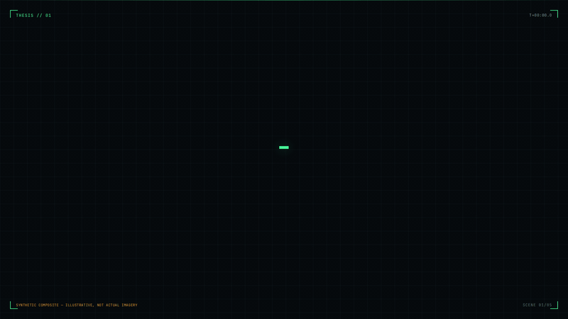</p>

</details>

## FAQ

<details>
<summary><b>Is any of this the real facility?</b></summary>
<br />

Only the published anchors: antenna IDs, positions and dish diameters from a 2016 academic survey. Buildings, roads, fences and terrain are approximate context traced from public overhead imagery. The character, vehicles, gates, beacons and all of After Hours are invented. No interiors, operational layouts or security procedures are modelled, and no private or restricted information was used. See [Evidence and reference boundary](#evidence-and-reference-boundary).

</details>

<details>
<summary><b>Can I plug in my own model or agent?</b></summary>
<br />

Yes. Implement one `decide()` method on the `AgentProvider` interface. It receives a validated, detached copy of the observation and returns an intent, which the runtime checks against what is legal right now. Everything else (validation, execution, takeover, traces, evaluation) is shared, so your agent is measured exactly like Jev, the baseline and a person. For a hosted model, keep the key and the prompt on the server, as the Jev adapter does. Start at [docs/AGENT_RUNTIME.md §3](docs/AGENT_RUNTIME.md#3-provider-interface).

</details>

<details>
<summary><b>Do I need an API key or a GPU?</b></summary>
<br />

No key is needed to explore, drive, play After Hours or watch the scripted baseline (`?controller=mock`). Only Jev needs a server-side `TYPESAFE_API_KEY`. Any WebGL browser will do: every screenshot in this README was captured in headless Chromium on software rendering. Quality adapts automatically (performance tiers, DPR caps) and touch is supported. Frame rate on real GPUs hasn't been formally measured yet; see [Known limitations](#known-limitations).

</details>

<details>
<summary><b>How do I compare two runs?</b></summary>
<br />

Press **Export trace** after each run. Every trace carries the same `svs-agent-evaluation/v1` block (completion, time, distance, collisions, interventions, latency, coffee remaining, tuning inputs and more), computed by the same code for people and agents. Put two evaluation blocks side by side, or load a trace with `?controller=replay` to re-issue its decisions against the current world.

</details>

## Known limitations

- **Exterior only.** Buildings have no interiors; structure doors are not enterable.
- **Stylised vehicle dynamics.** A single-track model with a sprung body rather than full rigid-body simulation; pitch and roll are limited, so vehicles can't roll over.
- **Simple collision shapes.** Vertical extrusions plus spheres, so characters can't climb onto roofs or structures. After Hours props have no colliders by design (collision geometry is unchanged), so you can walk through the cart, terminals and technician.
- **One character.** There are no other people or traffic.
- **Measured on software rendering.** Real-GPU frame rate wasn't measurable in the development container; optimisation was verified with draw-call counts and CPU timing.
- **Audio scheduling.** The procedural score schedules ~0.3 s ahead from the render loop; at very low frame rates beats can be skipped (visuals stay in sync with the audio clock). Spatial radio uses equal-power panning, not HRTF.
- **One environment, one task.** The agent runtime's navigation is a bounded grid planner with local recovery, its metrics are client-reported, and the Jev endpoint's rate limits are per server instance ([details](docs/AGENT_RUNTIME.md#15-limitations)).

## Built with

**React 19** + **TanStack Start / Router** · **Three.js** + **React Three Fiber** + **Drei** + **@react-three/postprocessing** · **Tailwind CSS v4** · **Vite 8** · **Bun** · **TypeScript** · **zod**

Music: **Indigo People**, _Green Machine_, written by **Christopher Woodyard** (used with permission; see [docs/SOUNDTRACK.md](docs/SOUNDTRACK.md)). Architectural references and data attributions: [ATTRIBUTIONS.md](ATTRIBUTIONS.md) · [DATA_SOURCES.md](DATA_SOURCES.md) · [NOTICE](NOTICE).

## Disclaimer

> [!WARNING]
> This project is an independent public-source visualisation and a fictionalised game interpretation. It is built strictly from published 2016 academic surveys, public overhead imagery, synthetic relief and approximate geometric modelling. Gameplay elements are invented and do not depict real procedures, access arrangements or operations.
>
> **No private, operational, security-restricted, classified or current operational data was used, inferred or distributed.**
