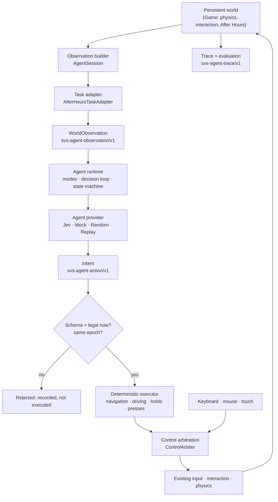
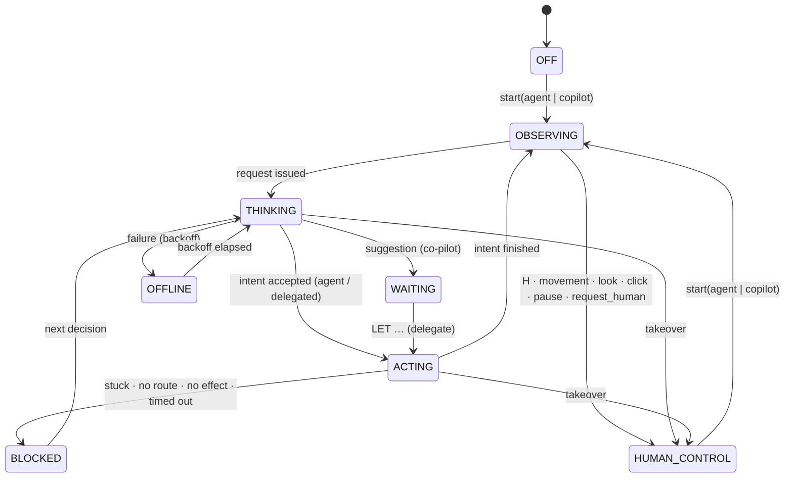

# Agent runtime

> **The agent decides what it wants to do. Satellite Vision Scape decides whether it succeeds.**

Satellite Vision Scape is becoming a browser-native simulation environment where humans and AI agents can inhabit the same persistent 3D worlds, act under the same rules, and be evaluated by what they actually do. This document describes the runtime that makes that possible today: what it is, how the pieces fit, what an agent may see and do, and what it cannot.

It is an experimental reference implementation with one environment (Pine Gap), one multi-stage task (After Hours) and one external provider (Jev, through TypeSafe). It is **not** a general environment-authoring platform, a multiplayer server or a sandbox for untrusted code. The Jev-specific walkthrough is in [JEV_AFTER_HOURS.md](JEV_AFTER_HOURS.md).

---

## 1. The loop



Two timescales:

| Loop     | Rate                                                                       | Owner                                      | Decides                            |
| :------- | :------------------------------------------------------------------------- | :----------------------------------------- | :--------------------------------- |
| Semantic | at most 4 requests/s; one in flight; a travel intent is reviewed every 3 s | `AgentRuntime` + `DecisionLoop` + provider | _what_ to do next                  |
| Motor    | every rendered frame, before gameplay reads input                          | `IntentExecutor`                           | _how_: stick, camera, pedals, keys |

Slow intelligence chooses. Fast deterministic control executes. The simulation's own fixed 120 Hz step decides what happens.

## 2. Separable pieces

```text
Environment      src/agent/session.ts            AgentSession (Pine Gap), the only module that reads Game
Task             src/agent/tasks/afterHours.ts   AfterHoursTaskAdapter: read-only view of After Hours
                 src/agent/tasks/afterHoursSchema.ts   its observation payload schema (data only)
Provider         src/agent/provider.ts           AgentProvider interface, typed results
                 src/agent/providers/jev.ts      JevProvider (HTTP to this deployment's server)
                 src/agent/providers/local.ts    MockProvider, RandomProvider, ReplayProvider
Observation      src/agent/observation.ts        WorldObservation schema, bounds, hashing
Action contract  src/agent/contract.ts           intents, decisions, legality
Execution        src/agent/runtime.ts            state machine, modes, takeover, co-pilot
                 src/agent/loop.ts               one-in-flight decision loop, epochs, backoff
                 src/agent/executor.ts           intent → controls
                 src/agent/navigation.ts         A* route planning, on-foot steering
                 src/agent/driving.ts            driving profiles and control
Control          src/agent/control.ts            ControlArbiter, SyntheticInput
Trace            src/agent/trace.ts              svs-agent-trace/v1
Evaluation       src/agent/evaluation.ts         generic metrics + task metrics + episode windows
Server           src/server/agent/               Jev adapter: handler, question, assists, rate limits
Probes           src/agent/probes/afterHours.ts  capability probes: situations, grading, chance floor
UI               src/components/game/AgentHUD.tsx, AgentLaunch.tsx, src/lib/agent-ui.ts
```

`runtime.ts`, `loop.ts`, `contract.ts`, `observation.ts`, the providers and the scripted baseline import nothing from `src/game/`. A test enforces it (`tests/agent-authority.test.ts`). There is no `if (provider === "jev")` in the core loop: provider behaviour lives in adapters.

## 3. Provider interface

```ts
interface AgentProvider {
  readonly id: string; // "jev", "mock", "random", "replay"
  readonly label: string; // shown to people; never another provider's name
  readonly source: "agent" | "replay" | "test";
  decide(request: {
    sequence: number;
    observation: WorldObservation; // a detached, validated copy
    signal: AbortSignal;
  }): Promise<ProviderResult>;
}

type ProviderResult =
  | { ok: true; decision: { intent: unknown; model; confidence; alternatives; serverLatencyMs } }
  | {
      ok: false;
      failure:
        | "timeout"
        | "unavailable"
        | "rate_limited"
        | "network"
        | "http_error"
        | "invalid"
        | "aborted";
      detail;
      retryAfterMs;
    };
```

Providers never throw at the runtime and never receive the game. The returned intent is untrusted until validated.

| Provider         | Id       | Source | What it is                                                                                         |
| :--------------- | :------- | :----- | :------------------------------------------------------------------------------------------------- |
| `JevProvider`    | `jev`    | agent  | TypeSafe Jev through `/api/agent/jev/decision`                                                     |
| `MockProvider`   | `mock`   | test   | A policy function. In the app: the labelled **scripted After Hours baseline** (`?controller=mock`) |
| `RandomProvider` | `random` | agent  | Seeded uniform choice among legal intents (`?controller=random&seed=42`)                           |
| `ReplayProvider` | `replay` | replay | Re-issues a trace's intents, in order, through the same validation                                 |

Adding a provider (a local model, another hosted model, a scripted agent) means implementing this interface. For a remote model, keep the credential and the question on the server, as the Jev adapter does.

## 4. Observation contract — `svs-agent-observation/v1`

```ts
interface WorldObservation<TaskState> {
  schema: "svs-agent-observation/v1";
  sequence: number;
  timestampMs: number; // simulation time
  environment: { id; timeOfDay; nearbyEntities: NearbyEntity[] }; // vehicles, barriers
  controller: { mode: "agent" | "copilot"; provider: string };
  actor: {
    locomotion: "on_foot" | "entering_vehicle" | "driving" | "exiting_vehicle";
    position: [x, y, z];
    headingDeg;
    speedMps;
    busy;
  };
  vehicle: null | { id; label; speedMps; headingDeg; headlights };
  navigation: { targets: NavigationTarget[]; stuckSeconds }; // id, label, kind, reach, distanceM, bearingDeg, position
  task: { id; stage; objective; complete; state: TaskState }; // task-owned payload
  execution: null | { intent; elapsedS }; // what the executor is doing now
  previousOutcome: null | { intent; outcome; durationS }; // how the last intent ended
  legal: AgentIntent[]; // what may be chosen now (≤ 64)
}
```

- **Generic vs task.** The generic runtime never reads `task.state`. After Hours' payload (coffee meter and timer, radio readouts, captions, signal guidance, terminal panel, concert) is defined in `afterHoursSchema.ts` and validated by the task's own schema, looked up by task id in `tasks/registry.ts`.
- **Bounded.** Every object is strict (no extra keys), every number finite, every string length-bounded with no control characters, every list capped, and the serialised observation is at most 16 KiB. Observations are validated in the browser before sending and again on the server.
- **Deterministic.** Building an observation has no side effects: the same world yields the same observation and the same FNV-1a hash (traces reference observations by hash). Trends ("rising since your last action") are measured against a baseline taken when an action starts, not when observing.
- **Relative directions.** Bearings are relative to the actor's facing (+right, −left) and distances are in metres, so a provider never has to do geometry.

### No omniscience

The observation is what a player can perceive — HUD, prompts, captions, minimap, signal guidance — not what exists in the simulation.

| Hidden in the simulation                                        | What the agent gets instead                                                                                                                                           |
| :-------------------------------------------------------------- | :-------------------------------------------------------------------------------------------------------------------------------------------------------------------- |
| The hidden station's frequency (station table)                  | The dial readout, signal bars, the Numbers Station captions ("Four. Two. Zero. …") and, only after the clue has been heard, the objective line the HUD shows everyone |
| Each terminal's target dial position                            | The panel's status word (Drifting · Close · Aligned — hold · Locked), match meter, lock meter and the dial's own position                                             |
| Terminal and listening-point locations before they are revealed | Nothing; they appear with the signal guidance / objective                                                                                                             |
| The spill model                                                 | The coffee meter and timer                                                                                                                                            |

The task adapter does not import the station table or the terminal definitions, and tests check that the answers never appear (`tests/agent-contract.test.ts`, `tests/agent-authority.test.ts`).

## 5. Action contract — `svs-agent-action/v1`

| Intent                                                                             | Arguments                                               | Executed as                                                                                                 |
| :--------------------------------------------------------------------------------- | :------------------------------------------------------ | :---------------------------------------------------------------------------------------------------------- |
| `wait`                                                                             | —                                                       | Hold still ~1.5 s (brake gently if driving); ends early when something observable changes                   |
| `request_human`                                                                    | —                                                       | Hand control back to the person                                                                             |
| `navigate_to`                                                                      | `target`                                                | Walk a planned route to a known target and stop within reach                                                |
| `drive_to`                                                                         | `target`                                                | Drive a planned route, park near the target                                                                 |
| `stop_vehicle`                                                                     | —                                                       | Brake to a standstill                                                                                       |
| `enter_vehicle`                                                                    | `target`                                                | Press E at that vehicle's door (only offered when the prompt is for it)                                     |
| `exit_vehicle`                                                                     | —                                                       | Press E while driving (the game brakes and steps out); with the coffee aboard, brake gently to a stop first |
| `interact`                                                                         | `target`                                                | Press E (only offered when the on-screen prompt is for that target)                                         |
| `start_concert`                                                                    | —                                                       | Press E at the listening point                                                                              |
| `radio_power` · `radio_next_station` · `radio_next_track` · `radio_previous_track` | —                                                       | The radio keys                                                                                              |
| `tune_receiver`                                                                    | `direction: up \| down`, `amount: tap \| short \| long` | Tap or hold `[` / `]` (0.8 s or 2.5 s)                                                                      |
| `tune_terminal`                                                                    | `direction`, `amount`                                   | Tap or hold A / D on the terminal dial (0.35 s or 0.9 s)                                                    |
| `leave_terminal`                                                                   | —                                                       | X                                                                                                           |
| `retry`                                                                            | —                                                       | Y after a failed delivery                                                                                   |

Least privilege: tuning is a tap or a hold of the same keys a player uses — there is no way to name a frequency or a dial value. Navigation takes a target id from the observation's list — never coordinates. Every intent passes the schema, then must equal one of the observation's `legal` intents, then must still be legal in the **current** world when it is applied (otherwise it is recorded as stale). Validation happens on the server (for Jev), in the provider client, and in the runtime.

Legal sets follow the world: interactions are offered only where the game's own prompt offers them (via a read-only `InteractionManager.promptTarget`), driving intents only while driving, terminal intents only while a terminal panel is open, and nothing but waiting during vehicle transitions and while the task plays itself out (`TaskAdapter.passive()`: the concert, a locked panel closing). A wait-only legal set costs no provider call; before `passive()` existed, the concert alone cost 57 of the scripted baseline's 212 calls.

## 6. Runtime state machine



The runtime owns its state explicitly: sequence number, epoch, active intent, co-pilot suggestion, last outcome, last failure and control source. Provider answers never act on arrival: they wait in an inbox and are applied (or rejected) at the next tick, inside the frame.

### Decision lifecycle (`loop.ts`)

- one request in flight, no queue; at most one request per 250 ms;
- monotonically increasing sequence numbers across providers;
- an `AbortController` per request and a 6 s timeout, measured on a simulation clock (deterministic in tests);
- **epochs**: takeover, a mode change or a task-stage change moves the epoch on, so any answer still in flight is stale — however late it arrives;
- stale answers (abandoned, superseded, older epoch, too old, after a timeout) and duplicate answers are recorded and discarded;
- failures back off deterministically: 500 ms → 8 s exponential for network/invalid, 1 s for rate limits unless the server says `retryAfterMs`, 8 s for "unavailable";
- a provider that throws, rejects or returns a malformed decision is a failure, never a decision;
- when the only legal intents are waiting or handing back, the runtime waits without spending a provider call.

## 7. Control arbitration and takeover

```text
Keyboard / mouse / touch ─▶ human InputState ──┐
                                               ├─▶ ControlArbiter.input ─▶ gameplay (unchanged)
Agent executor / replay ──▶ SyntheticInput ────┘       .source = human | agent | replay | test
```

- Gameplay reads exactly one `InputState` per frame — the arbiter's. No DOM events are synthesised and no keyboard events are faked. `SyntheticInput` has the same interface, so the interaction state machine, vehicle controller, radio and terminals behave identically for a person and an agent.
- `source` answers "who generated this control?" at any moment, and every trace record carries it.
- Presentation controls (mute, music volume, Altered Signal, the concert's cinematic camera, zoom) stay with the person and never take control.
- **Takeover.** H, any meaningful movement, mouse/touch look, any gameplay key, or a click anywhere outside the agent panel hands control back **in the same frame**: the executor stops, every synthetic control is released, the request in flight is aborted and the epoch moves on. Nothing is reset or moved: position, vehicle, momentum, coffee, radio, terminal progress and saved progress are exactly as they were. Pausing, leaving After Hours or switching to a factual viewer mode also returns control.
- **Co-pilot.** The person keeps control; the agent only suggests. **LET JEV DRIVE/WALK/…** delegates one intent. Any movement, look or interaction cancels the delegation (co-pilot stays on). The agent never seizes control.
- In human mode the runtime makes no requests and the arbiter passes the person's own `InputState` straight through: no extra latency.

## 8. Authority boundary

The agent layer cannot mutate: player or vehicle position, velocity or physics, collisions, coffee amount or delivery, After Hours progression, the radio's solution state, terminal completion, the concert, barrier gates, save state, or the factual site data.

How that is enforced:

1. **Capabilities.** Providers receive a detached JSON copy (mutating it changes nothing). The executor's only world interface (`MotorWorld`) is read-only sensors, target and route queries, and a caution factor; its only output is `SyntheticInput`. The runtime talks to the world only through `AgentEnvironment` (observe, legal, stage, signature, summary).
2. **One reader.** Only `session.ts` and `tasks/afterHours.ts` import the game, and neither assigns to world, task or save state nor calls a task-mutating method (static test).
3. **Progress through gameplay.** A test plays the whole journey with the scripted baseline and records the call stack of every coffee collection, delivery and concert start: each comes from `InteractionManager` inside `Game.handleFrameInput` — the E press — never from the runtime, a provider, the executor or the bridge.
4. **No hidden physics.** A static test rejects any write to positions, velocities, yaw, physics or collision state anywhere under `src/agent/`.

This is an application architecture boundary for first-party code, not a security sandbox for arbitrary third-party JavaScript running in the page.

## 9. Deterministic executor

- **On foot.** A\* over the collision world (3 m grid, bounded), pulled taut; the camera turns towards travel at a mouse-like rate and the stick is pushed camera-relative, exactly as a player's WASD + mouse. Sprints on long legs unless carrying the coffee; slows on arrival and stops within the target's interaction range.
- **Driving.** A\* for the vehicle's clearance (6 m grid; barrier booms are planned through because they lift for driven vehicles). Steering towards the route, target speed limited by profile, upcoming turn angle, proximity to barriers and a braking curve to park short of the destination. A reversing turn when the route starts behind the vehicle. Brake is never used as reverse at walking pace.
- **Recovery.** No progress for 1.4 s (foot) / 2 s (vehicle) triggers a bounded back-off (reverse with the wheel turned towards the route first), then a replan; after four recoveries the intent ends as `stuck`, and the agent decides what next.
- **Profiles.** `smooth` (carrying coffee: 9 m/s cruise, gentle pedal and steering rates, early braking), `standard`, and `aggressive` (tests and comparison only). A profile is a driving style, not a physics change.
- **Presses and holds.** One edge for E and radio keys; a bounded hold for tuning, released at the end; terminal holds stop at once if the panel closes.

Navigation never teleports, never writes a velocity and never chooses a destination.

## 10. Traces — `svs-agent-trace/v1`

Provider-neutral; the same format for Jev, the baseline, random, replay and human segments.

```jsonc
{
  "schema": "svs-agent-trace/v1",
  "observationSchema": "svs-agent-observation/v1",
  "actionContract": "svs-agent-action/v1",
  "environment": "pine-gap", "task": "after-hours",
  "session": "32 hex", "build": "VITE_BUILD_ID or development",
  "startedAt": "…", "provider": "jev", "model": "jev-1.13.0", "controlMode": "agent",
  "segments": [ { "t": 0, "mode": "agent", "provider": "jev", "label": "Jev" } ],
  "decisions": [ {
    "t": 12345, "sequence": 7, "observationHash": "9f2c…", "mode": "agent",
    "provider": "jev", "model": "jev-1.13.0", "source": "agent",
    "legal": ["wait", "navigate_to:coffee_cart", …], "intent": {…}, "target": "coffee_cart",
    "confidence": 0.93, "alternatives": [ { "intent": "…", "probability": 0.93 } ],
    "latencyMs": 296, "serverLatencyMs": 293,
    "disposition": "executed | continued | suggested | delegated | rejected", "rejection": null,
    "actionStart": 12345, "actionEnd": 26010, "outcome": "arrived",
    "stage": "coffee",
    "actor": { "locomotion": "on_foot", "position": [x, z], "speedMps": 0 },
    "vehicle": null,
    "task": { "coffee": "available", "coffeePercent": null, "station": "…", "frequency": 367.5, … }
  } ],
  "events": [ { "t": …, "type": "coffee_collected", "source": "agent" }, … ],
  "observations": { "9f2c…": { /* the last 40 distinct observations, by hash */ } },
  "pathFormat": ["t", "x", "z", "locomotion", "source"],
  "path": [[1000, -52.3, 118.4, "on_foot", "agent"], …],   // one route sample a second, for people too
  "dropped": { "decisions": 0, "events": 0 },
  "evaluation": { … }
}
```

Event types include `mode`, `human_takeover`, `human_input`, `human_ui`, `paused`, `timeout`, `stale_response`, `duplicate_response`, `invalid_response`, `network_failure`, `rate_limited`, `provider_unavailable`, `request_aborted`, `stuck_recovery`, `blocked`, `collision`, `vehicle_entry`, `vehicle_exit`, `coffee_collected`, `coffee_delivered`, `coffee_failed`, `radio_event`, `frequency_clue_discovered`, `receiver_locked`, `terminal_completed`, `concert_started`, `concert_completed`, `suggestion`, `delegated`, `delegation_cancelled`, `dismissed`, `interaction_outcome`.

Traces are bounded (4,000 decisions, 6,000 events; overflow is counted), live in memory and are exported only by **Export trace**. They contain no credentials, prompts or provider reasoning. **Replay** re-issues a trace's intents through the same validation against the current world; it is not a state restore, and timing or world differences can make a replayed intent illegal (it is then rejected, not forced).

## 11. Evaluation

```ts
interface EvaluationResult {
  schema: "svs-agent-evaluation/v1";
  environment: string; task: string; providers: string[];
  generic: GenericMetrics;                 // same for every task and controller
  taskMetrics: Record<string, number | string | boolean | null>;
  windows: Record<string, Record<string, …>>;   // named episodes, e.g. last_coffee
}
```

Generic: task completion, elapsed time, distance travelled / walked / driven, collisions (vehicle impacts > 1.2 m/s), provider requests, stuck recoveries, human interventions, agent decisions, mean / median / p95 decision latency, provider failures, stale and invalid responses, interactions with no effect, hard braking and hard acceleration events, and seconds under each control source.

After Hours adds: coffee delivered, coffee remaining, mission time, collections and failures, radio commands, receiver and terminal tuning inputs (counted from the input gameplay actually read — the same for people and agents), terminal overshoots (the panel read ALIGNED, then stopped reading it without locking; each is also a `terminal_alignment_lost` event), time at terminal panels, frequency found, terminals completed, concert reached and completed. The `last_coffee` window records, for the latest run, time, coffee remaining, distance, collisions, hard braking/acceleration, interventions and which source was in control.

Human, Jev, random, baseline and replay runs are measured by the same code under the same world rules. There is no score and no winner: the numbers are there to be compared.

## 12. Security

- `TYPESAFE_API_KEY` and `TYPESAFE_MODEL` are **server** environment variables, read only by `src/server/agent/jev.server.ts`. Never use a `VITE_` prefix.
- `JEV_ASSISTS` (server, not secret) sets how much the question coaches: `full` (default; run B's question, byte for byte), `lean` (facts, not conclusions) or `none`. The status `GET` reports the profile in force. See [NEXT_MODEL.md](NEXT_MODEL.md).
- The browser sends `{ session, observation }` only; unknown fields are refused. The server builds every word of the TypeSafe question; displayed game text is quoted as data and the context says it is not an instruction. The endpoint cannot be used as a prompt proxy: its only output is one of the offered intents.
- Requests: same-origin only, JSON only, ≤ 16.9 KiB, strict schema, `controller.provider === "jev"`.
- Answers: an offered option only, confidence and probabilities in [0, 1], probabilities over offered options summing to 1 within rounding, the choice the most probable; otherwise 502 — never a decision.
- Upstream: 4.5 s timeout, 64 KiB answer cap, the upstream body never relayed, errors carry codes not details, logs carry codes and sequence numbers only.
- Pacing (per instance, in memory): per-client token bucket, 200 ms per session, a global bucket and at most 12 upstream calls in flight. These are brakes, not a wall: several instances or a restart each start fresh. Put durable limits and spend controls in front of a public deployment.
- `GET /api/agent/jev/decision` reports whether Jev is configured without calling TypeSafe. The page calls it only when someone presses **Jev After Hours** or **Co-pilot**.
- `tests/agent-secret-boundary.test.ts` checks the source tree; `bun run verify:secrets` builds the production app with a canary key and fails if the canary, any key-shaped string, the upstream endpoint or the variable name appears in client assets, or if the key was inlined into the server bundle.

Observations are client-reported. Nothing here is a server-attested benchmark: a modified client can send any valid observation.

## 13. Development entry points

| Query                        | Effect (after After Hours starts)      |
| :--------------------------- | :------------------------------------- |
| `?controller=human`          | Default                                |
| `?controller=jev`            | Probe, then Jev in agent mode          |
| `?controller=jev&copilot=1`  | Probe, then Jev as co-pilot            |
| `?controller=mock`           | The labelled scripted baseline         |
| `?controller=random&seed=42` | Seeded random baseline                 |
| `?controller=replay`         | Opens the panel to choose a trace file |
| `?agentHud=1`                | Shows the agent panel in human play    |

None of these provides a world mutation.

## 14. Testing

```sh
bun run test:agent        # all agent suites (contract, loop, runtime, motor, authority, journey, server, secrets)
bun test                  # everything
bun run typecheck && bun run lint
bun run verify:secrets    # production build with a canary key, then scan
AGENT_LIVE_TEST=1 bun scripts/verify-agent-live.ts [--decisions N | --journey --minutes 30 --trace out.json]
bun run probes:capture    # re-capture the capability probes (deterministic)
bun run probes -- --provider random|baseline            # free reference points
AGENT_LIVE_TEST=1 bun run probes -- --provider jev [--profiles full,lean,none | --ablate]
```

The live scripts are billable, opt-in and never part of CI; they run the real handler (and, for the journey, the real runtime), headless. `JEV_ASSISTS` applies to both.

## 15. Limitations

- One environment and one task. A second environment needs its own `AgentSession`-style bridge (observation builder, `MotorWorld`, legal intents) and a task adapter + schema; the runtime, contracts, loop, providers, traces and evaluation do not change. There is no environment-authoring tool.
- Navigation is a bounded grid planner with local recovery, not a general driving AI. Unusual parking spots or crowded vehicles can still need several recoveries.
- The simulation is deterministic for a given sequence of inputs, but live provider latency is not, so live runs are not reproducible frame for frame.
- Metrics are session-local and client-reported.
- Replay re-issues intentions; it does not restore state.
- Rate limits are per server instance.

## 16. Future providers and environments

Designed-for, not built: `OpenAIProvider`, `AnthropicProvider`, `LocalModelProvider` (each an `AgentProvider`, with remote credentials behind a server adapter like Jev's), a `ScriptedProvider` library, benchmark suites that run many seeded episodes headless and compare `EvaluationResult`s, human-vs-agent leaderboards built on traces, and new environments (Lop Nur, a fictional city) that implement the same environment and task interfaces.

Which of these gets built next is decided by measurement, not by roadmap: [NEXT_MODEL.md](NEXT_MODEL.md) lists each bet with the probe or trace number that would trigger it.

---

All agent behaviour is fictional gameplay inside the simulation layer. It changes neither the historical source anchors nor the approximate reconstruction, and says nothing about real activity at Pine Gap.
