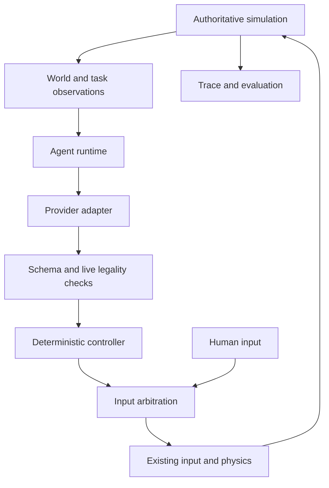

# Satellite Vision Scape agent runtime

Satellite Vision Scape is developing into a browser-native simulation environment where humans and AI agents can inhabit persistent 3D worlds, interact under the same rules, and be evaluated by what they actually do. Pine Gap is the first environment, After Hours the first task, and Jev the first external provider. This implementation is an experimental reference integration, not an environment-authoring platform or a claim of general autonomous competence.

The provider chooses an intention. The simulation decides whether it succeeds.



## Boundaries and modules

| Module                                       | Responsibility                                                                        |
| -------------------------------------------- | ------------------------------------------------------------------------------------- |
| `src/agent/contract.ts`                      | Strict, finite, size-bounded observation and intention schemas                        |
| `provider.ts`, `providers/`                  | Provider interface; Jev, seeded Random, Mock and intent Replay                        |
| `runtime.ts`                                 | Control modes, request lifecycle, co-pilot suggestions and delegation                 |
| `control.ts`                                 | Separate human and synthetic input channels, explicit source                          |
| `executor.ts`, `navigation.ts`, `driving.ts` | Collision-aware routing, walking, steering, braking, bounded recovery and input edges |
| `tasks/task.ts`, `tasks/afterHours.ts`       | Task interface and read-only After Hours adapter                                      |
| `session.ts`                                 | Pine Gap composition root and read-only sensor bridge                                 |
| `trace.ts`, `evaluation.ts`                  | Bounded in-memory recording and common measurements                                   |
| `src/server/agent/`                          | Server-owned TypeSafe question, credential, admission and HTTP handling               |

The reusable runtime does not import Game, AfterHours, physics, puzzle solutions or save storage. Providers receive copied serializable observations and return intentions. The executor receives copied motor sensors, a collision-query callback and a synthetic input channel. It has no teleport, velocity, progression, save, or completion setter. The environment composition root reads Game and connects these capabilities. This is an application architecture boundary, not a security sandbox for arbitrary third-party JavaScript.

## Provider and task interfaces

```ts
interface AgentProvider {
  readonly id: string;
  decide(input: {
    sequence: number;
    observation: WorldObservation;
    signal: AbortSignal;
  }): Promise<AgentDecisionResult>;
}
```

A `TaskAdapter` provides an ID, observations, known targets, currently legal intentions and task evaluation. After Hours retains ownership of all progress. Its adapter does not reproduce the mission state machine.

A future provider implements this interface without changing the core loop. A second environment would replace `AgentSession`'s sensor, collision and task bindings. Generic world authoring, multiplayer persistence and remote authoritative simulation are not implemented. Persistence currently means the existing After Hours browser save/checkpoint system; traces are exported explicitly.

## Observation and actions

`svs-agent-observation/v1` separates actor, vehicle, environment, navigation, task and previous outcome. Observations contain at most 24 targets, 80 legal intentions and 12 recent player-visible captions, with a 24 KB serialized cap. Numbers must be finite, string lengths are bounded and object keys are strict. The generic task envelope has bounded scalar facts, clues, stage and objective, so coffee-specific measurements do not enter the generic evaluator.

The adapter reveals mission destinations from the ordinary briefing, nearby vehicles within 65 m, terminal locations only when the ordinary HUD reveals them, and the listening point when unlocked. Receiver frequency, signal bars, terminal dial, alignment percentage and status are player-visible feedback. Neither the station table's hidden answer nor terminal target values are exported. When the normal objective reveals a frequency after the clue, the agent can read it too. Recent captions are retained as observed memory, not inferred facts.

`svs-agent-action/v1` includes wait, request human, walk/drive to a known target, interact, enter/exit/stop vehicle, radio power/station/track controls, one receiver or terminal dial nudge, leave terminal and start concert. Navigation does not implicitly interact. Tuning does not snap to a solution. Legal intentions are finite concrete candidates, validated by the server and rechecked against a fresh client observation before execution.

The server uses TypeSafe's Choice primitive with these candidate intentions, using the current `POST /v1/systemone` contract. No prose parsing, browser-supplied system prompt or generated code is involved. The selected intention is a choice, not hidden reasoning.

## Controller arbitration and lifecycle

Human is the default, with no provider requests during ordinary play. Human device input remains in `game.input`; synthetic controls use a distinct `AgentInputState`. Exactly one is selected for gameplay. `source` is `human`, `agent`, `replay` or `test`.

Agent mode delegates control. Co-pilot mode only suggests until the user clicks **LET AGENT ACT**; delegation lasts for one intention. H, meaningful human movement/look/interaction during delegated control, pause, leaving gameplay and disposal clear synthetic controls and invalidate requests. Human movement while simply receiving co-pilot suggestions remains ordinary gameplay. Pointer and accessibility command buttons also cancel delegated control before they act. Takeover never resets world or mission state.

The state vocabulary is OFF, OBSERVING, THINKING, ACTING, BLOCKED, WAITING, HUMAN CONTROL and OFFLINE. There is one primary request in flight, a monotonic sequence, generation invalidation, an AbortController, a five-second timeout, stage-change invalidation and bounded exponential retry delay. Rate-limit retry delays are honored. Late responses cannot regain control. No fallback is silently represented as Jev.

Decisions are scheduled outside the render stack. The runtime requests a new intention after the current bounded action finishes, with a minimum 350 ms interval; it does not continually replace a route at 1–4 Hz. Long travel goals therefore make fewer model calls. The existing fixed-step physics remains unchanged.

## Motor controller

The local navigator uses bounded A\* over the existing collision query, followed by collision-checked route simplification. Walking converts a world direction into normal camera-relative movement. Driving follows waypoints with smoothed existing vehicle dynamics and early braking. Coffee carrying selects a gentler speed/pedal profile. Neither profile changes physics or spill rules.

Static route planning uses the scene's collision geometry; that geometric assistance is supplied by code, not inferred by Jev from pixels. Dynamic gates are planned through their lanes, then opened or blocked by normal proximity sensors and physics. Stalls trigger bounded reverse/side recovery, then a blocked outcome. A route has a 180-second execution deadline. It does not teleport, select another task goal, or auto-complete an interaction.

## Traces, replay and comparison

**EXPORT TRACE** downloads `svs-agent-trace/v1` JSON. Header fields identify observation/action versions, environment, task, session, build and timestamp. Set public `VITE_BUILD_ID` to a commit/build identifier when deploying; otherwise it is explicitly `development`.

Decision records retain the observation, a deterministic non-cryptographic hash, legal actions, selected intention, provider/model, sequence and latency. Action start/end, mode changes, takeover, provider failures, stale responses, collision, recovery, vehicle and task changes are separate events. `input_submitted` means a control was issued, not that an interaction succeeded; subsequent world task events are the evidence. Records cap at 10,000 and report dropped entries. No trace is uploaded automatically.

Replay reissues validated intentions in order against the current world. It is **not** deterministic full-world restoration: save state, timing, physics and provider versions can differ. Imported traces are size/schema checked. There is no replay path for arbitrary world mutations.

Generic evaluation reports completion, elapsed simulation time, distance walked/driven, collisions, recovery, interventions, decision counts, latency distribution, provider failures and abrupt acceleration/braking durations. After Hours adds coffee integrity/time, receiver and terminal attempts, terminal completion and concert reach. Compare Human, Jev, Random and Replay using these measurements; there is no winner score. Human sessions also use the same world event/metric collector.

## Server and deployment

The TanStack Start server route is `/api/agent/jev/decision`, available in the existing Nitro server build. Configure only server environment variables:

```text
TYPESAFE_API_KEY=<private credential>
TYPESAFE_MODEL=jev-latest
```

Do not use a `VITE_` prefix for secrets. GET reports configuration without calling TypeSafe; POST accepts only session and observation. The server rejects cross-origin browser requests, excessive bodies, invalid schemas and unknown choices. Upstream requests have a four-second timeout and a 32 KB response cap. Error bodies do not reflect upstream text or exceptions.

Pacing is in memory per process: minimum 350 ms per session, at most four concurrent calls and 120 requests/minute per instance. These are not global quotas or authentication. Before exposing a heavily used public deployment, apply deployment-level access/rate limits and spending controls. Browser observations are untrusted reports, not server-attested benchmark results.

## Validation and limitations

Run `bun run test:agent`, `bun test`, `bun run typecheck`, `bun run lint`, and `bun run build`. Build with a fake `TYPESAFE_API_KEY=svs-secret-boundary-canary-2026`, then run `bun run scan:agent-secrets` to verify client artifacts. No CI test calls TypeSafe. `AGENT_LIVE_TEST=1 bun run agent:live` is an explicit live, billable one-decision smoke test with a separately configured server key.

The deterministic mock test traverses the complete After Hours journey with normal input, real collision/vehicle physics and the gameplay camera, without teleporting or writing task progress. The scripted **test policy** is not the production Jev provider. A successful mock journey establishes the integration and motor path; it does not establish Jev's ability to choose the entire sequence. Live Jev completion remains unverified.

Navigation is a bounded geometric controller, not a general driving planner; difficult dynamic obstructions can still block it. Per-frame physics is deterministic for a fixed initial state and inputs, but live async decision timing is not. Traces are in-memory until exported. Episode metrics are for the current session and are not authenticated scientific benchmark claims.

All agent behavior is fictional gameplay. It changes neither historical source anchors nor reconstruction evidence and says nothing about actual Pine Gap activity.
