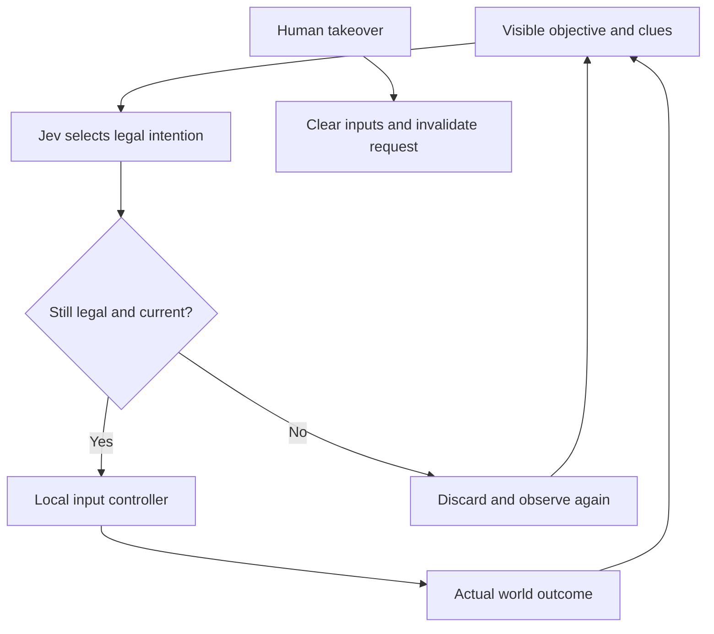

# Jev After Hours

The first reference task for Satellite Vision Scape's provider-neutral agent runtime. Jev selects bounded intentions; the existing world handles the consequences.

## Play

Choose **Jev After Hours** or **Co-pilot** from the briefing or pause screen to start with a free cursor. The original **After Hours** button keeps normal human pointer-lock play. The **AFTER HOURS · CONTROL** panel then offers:

- **PLAY YOURSELF**: normal controls, current world preserved.
- **JEV AFTER HOURS**: delegate control to the configured Jev provider.
- **CO-PILOT**: receive a suggestion and explicitly delegate one action when wanted.

**H · TAKE CONTROL**, movement, mouse look or an interaction immediately cancels active delegation. You stay where you are, in your current vehicle if driving, with your coffee, radio, terminal and saved progress intact. Closing the control panel does not silently change its selected mode; H still works. Pause returns to human control.

If the server is not configured, Jev is labelled unavailable and remains idle; human gameplay stays usable. Opening the panel performs only a no-cost configuration probe. Ordinary human play performs no agent network requests.

## What Jev can attempt

The existing Last Coffee mission, vehicle journey, Numbers Station clue, receiver tuning, four terminals and midnight concert are all available through the same legal input paths as human play. The task adapter describes the current objective and observed state. It does not encode the full sequence into the motor controller.



Coffee transport activates a smooth driving profile without changing spill rules. Receiver and terminal tuning are individual input nudges chosen by the provider; the motor controller never reads the answer. Waiting lets the ordinary hold-to-lock logic complete. The normal objective may reveal the receiver frequency after the Numbers Station clue, just as it does for a human.

## Development entry points

Add a query to the home route, then start After Hours:

| Query                        | Behavior                                                  |
| ---------------------------- | --------------------------------------------------------- |
| `?controller=human`          | Default human control                                     |
| `?controller=jev`            | Probe and start Jev when configured                       |
| `?copilot=1`                 | Probe and start suggestion-only co-pilot                  |
| `?controller=random&seed=42` | Explicitly labelled seeded Random baseline                |
| `?controller=mock`           | Explicitly labelled deterministic wait-only test provider |
| `?agentHud=1`                | Open the control panel                                    |

Replay is selected by importing a downloaded trace with the **REPLAY** control. It repeats intentions through current legality and physics, not snapshots or hidden mutations. The complete journey policy lives only in `tests/agent-journey.test.ts`; production mock mode does not pretend to be autonomous Jev.

## Recorded deterministic verification

The headless real-physics test with the gameplay camera completed one fresh journey:

| Measurement                             |                        Mock policy result |
| --------------------------------------- | ----------------------------------------: |
| Completion                              | Coffee, receiver, four terminals, concert |
| Simulation time                         |                                   553.1 s |
| Driven distance                         |                                   546.1 m |
| Walked distance                         |                                 1,331.1 m |
| Coffee delivered                        |                                       99% |
| Coffee mission time                     |                                    86.3 s |
| Collisions / recoveries / interventions |                                 0 / 0 / 0 |
| Decisions                               |                                       469 |
| Receiver nudges / terminal nudges       |                                 204 / 170 |

These measure the deterministic test policy plus the local controller, not Jev. The test uses no teleport or direct task-completion writes. Live verification was not completed in the implementation environment: automatic approval review blocked sending the supplied credential to the external API. No full autonomous Jev completion is claimed.

## Run and inspect

```sh
bun install --frozen-lockfile
bun run test:agent
bun test
bun run typecheck
bun run lint
TYPESAFE_API_KEY=svs-secret-boundary-canary-2026 bun run build
bun run scan:agent-secrets
```

For an explicitly authorized live check, supply `TYPESAFE_API_KEY` privately in the shell/deployment environment and run `AGENT_LIVE_TEST=1 bun run agent:live`. The script prints the model, selected intention, latency and observed execution; it never prints the credential. CI stays offline.

The soundtrack, clean-audio and reduced-motion options, touch controls, saved progress and factual Explore/Tour/Plan modes remain in the original After Hours/game systems. This task and every agent action are fictional, not representations of real Pine Gap operations.

See [AGENT_RUNTIME.md](AGENT_RUNTIME.md) for contracts, security, trace semantics, evaluation and limitations.
