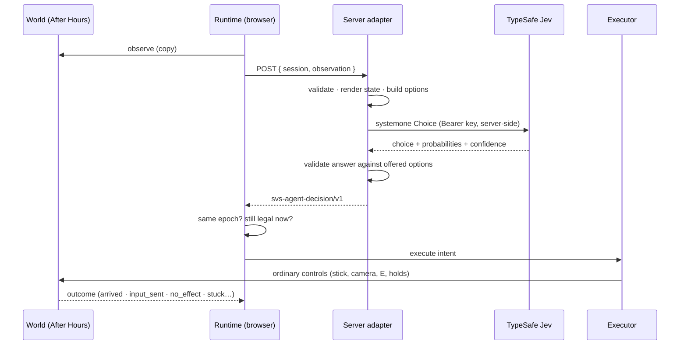

# Jev After Hours

The first reference configuration of the [agent runtime](AGENT_RUNTIME.md):

```text
Environment  Pine Gap / Satellite Vision Scape
Agent        TypeSafe Jev (server-side adapter, jev-latest)
Task         After Hours
Evaluation   navigation + interaction + completion metrics
```

Jev plays the fictional night shift in the same world, with the same controls and under the same rules as a person — and a person can take the controller back at any moment.

## Playing with Jev

On the briefing card (or in the pause menu) the After Hours section offers:

| Button                                     | What happens                                                                                                                        |
| :----------------------------------------- | :---------------------------------------------------------------------------------------------------------------------------------- |
| **After Hours** / **Continue After Hours** | Play yourself, exactly as before. No agent requests are made.                                                                       |
| **Jev After Hours**                        | Checks the server is configured (a GET that costs no model call), starts After Hours with a free mouse, and hands Jev the controls. |
| **Co-pilot**                               | You play; Jev suggests one move at a time.                                                                                          |

If the deployment has no TypeSafe key, the buttons say **Jev After Hours · Unavailable on this deployment** and nothing starts; playing yourself is unaffected.

While Jev plays, a small panel shows:

```text
JEV · AUTONOMOUS                            ACTING · THINKING
OBSERVE   Technician · North antenna hut · 438 m · Vehicle · 34 km/h · Coffee · 91%
CHOOSE    Drive to Technician · North antenna hut · 93% · 296 ms
ACT       Drive to Technician · North antenna hut
OUTCOME   Get into UV-1 · Done
[ H · TAKE CONTROL ]  [ EXPORT TRACE ]
```

It shows the chosen intent, Jev's own confidence, latency and the measured outcome — never hidden reasoning. When control changes hands a banner says so (**JEV CONNECTED · Control delegated · H · Take control**, then **HUMAN CONTROL · Jev standing by**).

**Taking over.** Press **H**, move, look, press any gameplay key or click anything outside the panel. Control returns in the same frame: you are where Jev left you, in the same vehicle at the same speed, with the same coffee, radio, terminal progress and saved progress. Nothing resets or teleports.

**Co-pilot.** The panel shows **JEV SUGGESTS · Walk to Canteen cart · south hall** with **LET JEV WALK** (or DRIVE, TUNE…) and **DISMISS**. Letting Jev act delegates exactly one intent; any input of yours cancels it. Jev never takes control on its own.

**Traces.** **Export trace** downloads `svs-agent-trace/v1` JSON for the session: decisions, events, measurements. **Replay** (in the panel, in human mode) re-issues a trace's intents through the same validation.

## What Jev sees

A structured observation of what a player can perceive, rendered by the server into plain language (TypeSafe's guidance: semantic descriptions, relative directions, no arithmetic). For example, at a terminal:

```json
{
  "objective_on_screen": "\"Tune the harmony terminal\"",
  "you": "On foot, standing still (busy with a control panel).",
  "last_action": "Turn the terminal dial up (a short hold): done after 0.6 s.",
  "after_hours": {
    "terminal_panel": {
      "terminal": "Harmony terminal",
      "instruction": "\"Turn until your wave matches the reference and the wobble stops.\"",
      "status": "CLOSE to the reference",
      "match_meter": "86%",
      "lock_meter": "15%",
      "dial_position": "79% of its range",
      "feedback": "Turning the dial up lowered the match from 99% to 86%: the reference lies the other way, down — you turned past it.",
      "controls": "A click moves the dial about 1%, a short hold about 5%, a long hold about 20%. The aligned zone is narrow (a few percent): near it, use clicks."
    }
  }
}
```

It is never told a hidden answer. Before the Numbers Station clue it hears only captions like _"Attention. Four. Two. Zero. Four. Two. Zero. Hold the dial."_ and sees the receiver's readout and signal bars; only once the clue has been heard does the objective line — the one every player sees — say "Tune the receiver to 420". It never learns a terminal's target, only the panel's status, meters and dial position.

## What Jev can do

One Choice question per decision: _which offered option next?_ The options are exactly the legal intents at that moment, each with a server-written description, e.g.

```text
NAVIGATE_TO__COFFEE_CART "Walk to Canteen cart · south hall (38 m ahead and to the left). A local controller walks the route and stops there."
DRIVE_TO__TECHNICIAN     "Drive this vehicle to Technician · North antenna hut (438 m ahead). A local controller steers and brakes, and parks nearby; you step out and walk the last metres."
INTERACT__COFFEE_CART    "Press E for the on-screen prompt "Collect the coffee" at Canteen cart · south hall."
TUNE_RECEIVER__UP__LONG  "A long hold turning the radio receiver dial up (higher): moves it about 40 on the dial."
WAIT                     "Do nothing for about 1.5 seconds and watch. Use it to keep a dial still while a hold meter fills…"
```

Jev chooses; the deterministic executor walks, steers, brakes, presses E or holds a tuning key; the game decides what that achieves. Semantic choice belongs to Jev (it decides the technician is next, that the receiver needs tuning, which terminal to visit); mechanical execution belongs to the controller (how to get there without hitting the fence). The controller never picks a destination and never completes an interaction on Jev's behalf.

While carrying the coffee the controller drives with the smooth profile — gentler pedal, lower corner speed, earlier braking — as a careful player would. It does not change the spill model.



## Configuration

Server environment only:

```text
TYPESAFE_API_KEY=<private credential>
TYPESAFE_MODEL=jev-latest        # optional; a pinned version such as jev-1.13.0 also works
JEV_ASSISTS=full                 # optional; full (default) · lean · none — see docs/NEXT_MODEL.md
```

Never prefix these with `VITE_`. The browser talks only to `/api/agent/jev/decision` on its own origin.

## Development entry points

`?controller=jev`, `?controller=jev&copilot=1`, `?controller=mock` (the labelled scripted baseline — **not Jev**), `?controller=random&seed=42`, `?controller=replay`, `?agentHud=1`. See [AGENT_RUNTIME.md §13](AGENT_RUNTIME.md#13-development-entry-points).

## Verification

### Deterministic (CI)

`bun run test:agent` runs 85 tests across eight suites. The end-to-end test plays the whole journey through the real runtime with the scripted baseline — a hand-written policy that reads only the observation, labelled as such and never presented as Jev — using ordinary controls, real collisions and vehicle physics:

| Measurement (scripted baseline, headless, this build) |                                                                Result |
| :---------------------------------------------------- | --------------------------------------------------------------------: |
| Completion                                            | coffee → vehicle → delivery → clue → receiver → 4 terminals → concert |
| Simulated time                                        |                                                               ≈ 426 s |
| Decisions                                             |                                                                   164 |
| Distance driven / walked                              |                                                     ≈ 1,340 m / 593 m |
| Coffee delivered                                      |                                                        100% in 82.2 s |
| Collisions · stuck recoveries · interventions         |                                                             0 · 0 · 0 |
| Receiver / terminal tuning inputs                     |                                                               10 / 20 |

Earlier builds delivered 93%: the missing 7 points were the game's hard stop when the baseline got out while still rolling, found by the [`travel-review-interval`](../experiments/results/travel-review-interval/report.md) experiment; the executor now stops gently first while the coffee is aboard. The smooth driving profile, compared with an aggressive test profile on the same coffee run: **2 vs 16** abrupt control changes, **100% vs 11%** coffee remaining.

### Live Jev

Measured with `scripts/verify-agent-live.ts`: real TypeSafe calls (`jev-latest`, which reported `jev-1.13.0`) through the real server handler and the real runtime, headless, with the simulation paced to wall-clock time as in a browser. No scripted help: Jev chose every intent from the observation.

**Run A — first attempt.** Jev collected and delivered the coffee (33 decisions), listened to the Numbers Station and locked the receiver on the hidden channel (35 decisions), then spent 473 decisions at the Harmony terminal alternating "dial up (short hold)" / "dial down (short hold)". A short hold is larger than the narrow aligned zone, and when the panel said ALIGNED Jev kept turning instead of waiting. Stopped by hand.

**What changed** — the observation and feedback, not Jev's authority. The terminal panel now states what the last turn did to the match meter and what that implies ("Turning the dial up lowered the match from 99% to 86%: the reference lies the other way, down — you turned past it"), says plainly that an aligned dial locks if kept still, and gives the size of each control; the question context adds "when a meter is filling because a dial is where it needs to be, choose Wait". Targeted live check: at ALIGNED Jev chose Wait 4/4 (confidence 1.0); after overshooting it turned back down 3/3, mostly with single clicks.

**Run B — the complete journey, autonomously.** Recorded trace: [`docs/traces/jev-after-hours-live-2026-09-27.json`](traces/jev-after-hours-live-2026-09-27.json).

| Measurement (live Jev, run B)                                           |                                                                    Result |
| :---------------------------------------------------------------------- | ------------------------------------------------------------------------: |
| Completion                                                              | **coffee → vehicle → delivery → clue → receiver → 4 terminals → concert** |
| Wall-clock / simulated time                                             |                                                           458 s / 457.8 s |
| Decisions (executed · continued · rejected)                             |                                                  212 (133 · 79 · 1 stale) |
| Decision latency, median / p95 (TypeSafe round trip via the server)     |                                                           289 ms / 397 ms |
| Jev confidence, median                                                  |                                                                      0.76 |
| Coffee delivered                                                        |                                 **100%** in 84.1 s (1 hard-braking event) |
| Distance driven / walked                                                |                                                           785 m / 1,114 m |
| Collisions · stuck recoveries · provider failures · human interventions |                                                             0 · 0 · 0 · 0 |
| Receiver / terminal tuning inputs                                       |                                                                   20 / 20 |
| Presses with no effect                                                  |  2 (leaving a terminal panel that was already closing; no longer offered) |

|                         t (s) | What happened                         |
| ----------------------------: | :------------------------------------ |
|                           5.8 | collected the coffee at the cart      |
|                          15.5 | got into UV-1                         |
|                          89.9 | delivered the coffee — 100%, 84.1 s   |
|                          99.4 | the Numbers Station clue was heard    |
|                         141.1 | receiver locked on the hidden channel |
| 180.5 · 204.7 · 248.2 · 305.6 | terminals 1–4 locked                  |
|                         374.4 | began the midnight transmission       |
|                         457.8 | transmission received — task complete |

One run is an existence proof, not a success rate: latency and Jev's choices vary between runs. Re-run with `AGENT_LIVE_TEST=1 bun scripts/verify-agent-live.ts --journey --minutes 30 --trace run.json` (billable) and compare the evaluation blocks.

## Limits and honesty

- Live runs depend on network latency and on Jev's choices; they are not reproducible frame for frame. The simulation is.
- The scripted baseline proves the runtime, the executor and the task adapter can complete the task through ordinary controls. It says nothing about Jev's ability; the live results above do — one complete autonomous run so far, not a measured success rate.
- Everything here — the technician, the coffee, the stations, Frequency 420, the terminals, the concert and every agent action — is fictional gameplay. It does not describe, simulate or imply real operations at Pine Gap.
